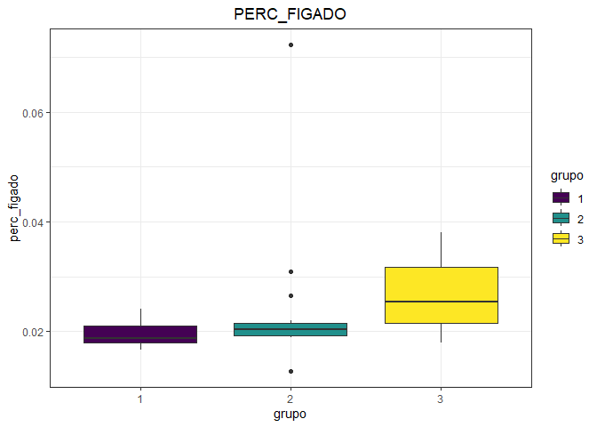
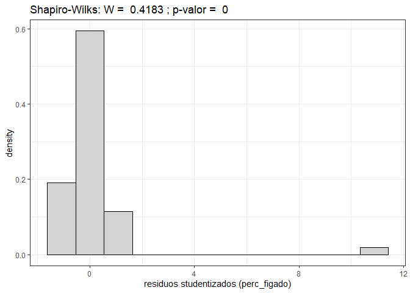
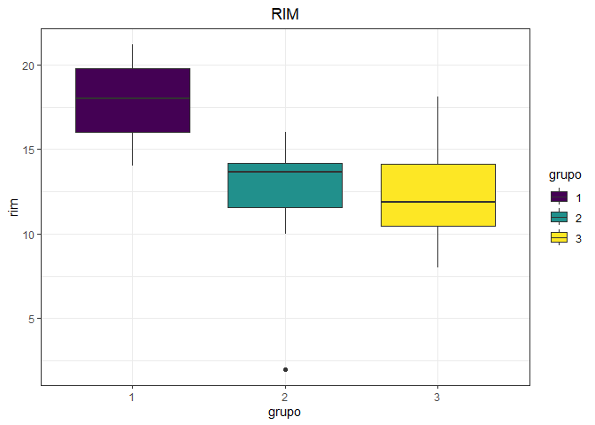
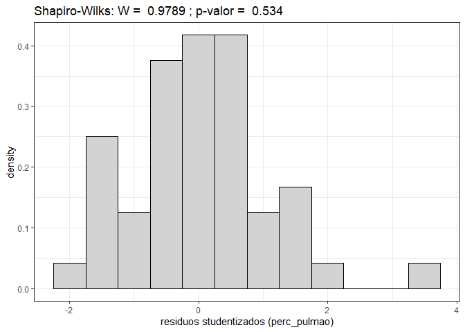
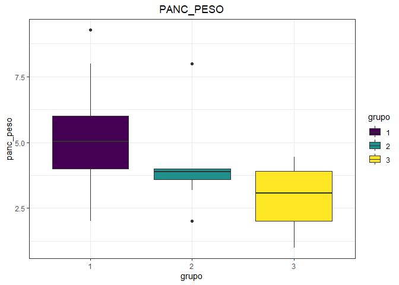
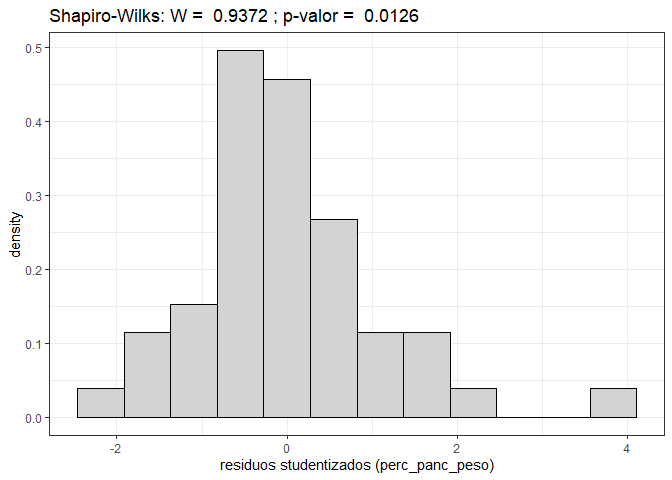
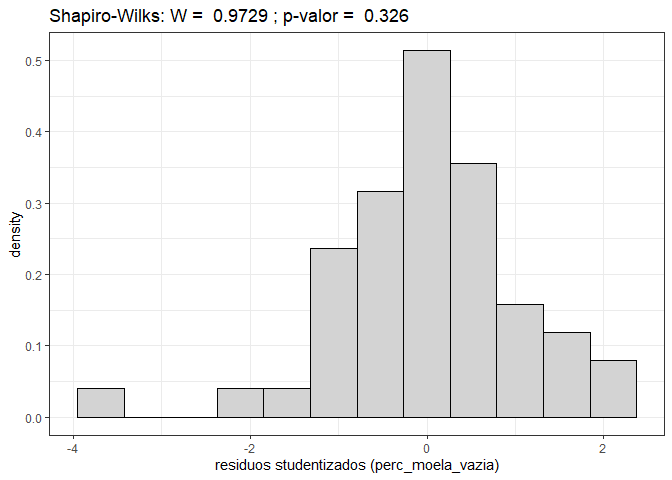
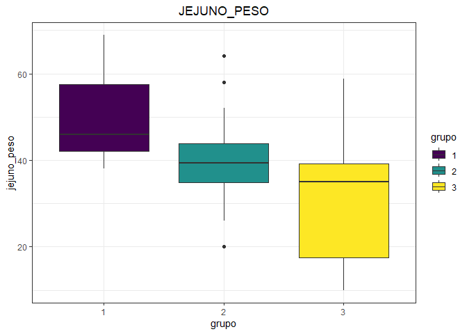

<!-- README.md is generated from README.Rmd. Please edit that file -->

# Carregando pacotes

``` r
library(agricolae)
library(tidyverse)
library(readxl)
library(janitor)
```

# Coletas - 27-07.xlsx

``` r
dados <- read_xlsx("data/Coletas - 27-07.xlsx",na="NA") %>% 
  clean_names()
glimpse(dados)
#> Rows: 48
#> Columns: 36
#> $ grupo             <dbl> 1, 1, 1, 1, 1, 1, 1, 1, 1, 1, 1, 1, 1, 1, 1, 1, 2, 2~
#> $ repeticao         <dbl> 1, 2, 3, 4, 5, 6, 7, 8, 9, 10, 11, 12, 13, 14, 15, 1~
#> $ sexo              <chr> "Macho", "Macho", "Macho", "Macho", "Macho", "Macho"~
#> $ linhagem          <chr> "Ross", "Ross", "Ross", "Ross", "Cobb", "Cobb", "Cob~
#> $ peso              <dbl> 3.140, 3.340, 3.186, 2.668, 3.070, 2.580, 2.900, 2.6~
#> $ tamanho           <dbl> 58, 55, 54, 51, 56, 49, 53, 50, 44, 49, 48, 50, 47, ~
#> $ m_peito           <dbl> 960.000, 905.000, 875.000, 810.000, 960.000, 760.000~
#> $ m_gast_peso       <dbl> 14.93, 17.62, 15.40, 16.00, 16.00, 10.00, 12.00, 14.~
#> $ m_gast_comp       <dbl> 9.0, 9.0, 12.0, 8.0, 8.0, 6.0, 6.0, 9.0, 8.0, 8.0, 7~
#> $ m_gast_diam       <dbl> 6.0, 9.0, 9.0, 7.0, 8.0, 9.0, 8.0, 8.0, 8.0, 7.0, 8.~
#> $ m_sart_peso       <dbl> 19.50, 20.51, 17.30, 16.00, 12.00, 14.00, 10.00, 10.~
#> $ m_sart_tam        <dbl> 6.0, 15.0, 8.0, 10.0, 10.0, 10.0, 9.0, 10.0, 11.0, 9~
#> $ m_sart_diametro   <dbl> 6.0, 8.0, 7.0, 7.0, 7.0, 8.0, 5.0, 5.0, 6.0, 6.0, 7.~
#> $ figado            <dbl> 52.19, 57.06, 54.00, 62.00, 58.00, 54.00, 70.00, 56.~
#> $ coracao           <dbl> 10.51, 12.44, 12.00, 10.51, 14.00, 10.00, 16.00, 12.~
#> $ baco              <dbl> 2.99, 3.02, 4.00, 4.00, 2.00, 4.00, 4.00, 4.00, 2.00~
#> $ rim               <dbl> 15.82, 19.55, 19.75, 18.00, 20.00, 14.00, 16.00, 18.~
#> $ pulmao            <dbl> 14.30, 22.84, 16.34, 24.00, 16.00, 16.00, 18.00, 16.~
#> $ panc_peso         <dbl> 2.94, 2.59, 5.86, 8.00, 6.00, 4.00, 4.00, 2.00, 6.00~
#> $ panc_tamanho      <dbl> 13, 12, 14, 13, 17, 14, 12, 11, 13, 10, 13, 14, 13, ~
#> $ moela_cheia       <dbl> 44.16, 42.30, 40.00, 50.00, 56.00, 48.00, 54.00, 36.~
#> $ moela_vazia       <dbl> 35.98, 36.84, 30.02, 36.00, 40.00, 30.00, 34.00, 28.~
#> $ porov_peso        <dbl> 7.19, 10.51, 15.00, 12.00, 14.00, 6.00, 8.00, 8.00, ~
#> $ prov_tamanho      <dbl> 5.0, 5.0, 6.3, 5.0, 6.0, 4.0, 5.0, 5.0, 6.0, 4.0, 5.~
#> $ prov_diametro     <dbl> 6.00, 9.03, 7.50, 7.00, 7.00, 5.00, 7.00, 6.00, 7.00~
#> $ esofago_peso      <dbl> 19.17, 11.43, 15.00, 20.00, 16.00, 7.00, 8.00, 18.00~
#> $ esofago_tamanho   <dbl> 18, 21, 22, 13, 14, 13, 14, 23, 16, 20, 25, 16, 23, ~
#> $ duod_peso         <dbl> 11.78, 14.07, 11.51, 18.00, 14.00, 11.03, 10.00, 12.~
#> $ duod_tamanho      <dbl> 31.00, 33.00, 30.00, 33.00, 30.00, 29.00, 26.00, 31.~
#> $ ileo_peso         <dbl> 12.92, 13.00, 6.70, 4.00, 6.00, 6.00, 6.00, 6.00, 8.~
#> $ ileo_tamanho      <dbl> 23.00, 24.00, 22.00, 22.00, 18.00, 18.00, 21.00, 20.~
#> $ jejuno_peso       <dbl> 41.03, 42.11, 44.00, 48.00, 44.00, 48.00, 46.00, 40.~
#> $ jejuno_tamanho    <dbl> 145, 148, 135, 130, 135, 131, 123, 126, 122, 160, 14~
#> $ al_cecais_peso    <dbl> 13.04, 16.57, 12.94, 18.00, 12.00, 18.00, 12.00, 14.~
#> $ al_cecais_tamanho <dbl> 33.0, 33.0, 31.0, 31.0, 29.0, 39.0, 27.0, 29.0, 40.0~
#> $ gordura           <dbl> 66.18, 68.90, 41.15, 46.00, 68.00, 50.00, 56.00, 48.~
```

``` r
variaveis <- dados[5:length(dados)] %>% names()
grupo <-dados %>% pull(grupo) %>% as_factor()
```

## Anova

``` r
for(i in seq_along(variaveis)){
  nome_var <- variaveis[i]
  da <- dados %>% select(grupo, nome_var) %>% drop_na()
  grupo <- da  %>% pull(grupo) %>% as_factor()
  y <- da %>% pull(nome_var)
  my_boxplot <- tibble(grupo, y) %>% 
    ggplot(aes(grupo, y, fill=grupo)) +
    geom_boxplot() +
    theme_bw()+
    labs(y=nome_var, title = str_to_upper(nome_var)) +
    scale_fill_viridis_d()+
    theme(plot.title = element_text(hjust=.5))
  print(my_boxplot)
  
  modelo <- aov(y ~grupo)
  print(anova(modelo))
  
  teste_t <- LSD.test(modelo,"grupo",console = TRUE)
  print(teste_t)
  rs <- rstudent(modelo)
  my_hist <- tibble(rs) %>% 
    ggplot(aes(x=rs, y=..density..)) +
    geom_histogram(bins=12,color="black",fill="lightgray") +
    theme_bw() +
    labs(title= paste("Shapiro-Wilks: W = ", 
                      shapiro.test(rs)$statistic %>% round(digits = 4),
                      "; p-valor = ",
                      shapiro.test(rs)$p.value %>% round(digits = 4)
                      ),
         x=paste0("residuos studentizados (",nome_var,")"))
  print(my_hist)
}
```

<!-- -->

    #> Analysis of Variance Table
    #> 
    #> Response: y
    #>           Df  Sum Sq Mean Sq F value    Pr(>F)    
    #> grupo      2 17.2471  8.6235  100.53 < 2.2e-16 ***
    #> Residuals 45  3.8602  0.0858                      
    #> ---
    #> Signif. codes:  0 '***' 0.001 '**' 0.01 '*' 0.05 '.' 0.1 ' ' 1
    #> 
    #> Study: modelo ~ "grupo"
    #> 
    #> LSD t Test for y 
    #> 
    #> Mean Square Error:  0.08578296 
    #> 
    #> grupo,  means and individual ( 95 %) CI
    #> 
    #>          y       std  r      LCL      UCL   Min   Max
    #> 1 2.956562 0.3650282 16 2.809086 3.104039 2.268 3.672
    #> 2 2.090187 0.2866680 16 1.942711 2.237664 1.356 2.420
    #> 3 1.496750 0.2047553 16 1.349274 1.644226 1.200 1.812
    #> 
    #> Alpha: 0.05 ; DF Error: 45
    #> Critical Value of t: 2.014103 
    #> 
    #> least Significant Difference: 0.208563 
    #> 
    #> Treatments with the same letter are not significantly different.
    #> 
    #>          y groups
    #> 1 2.956562      a
    #> 2 2.090187      b
    #> 3 1.496750      c
    #> $statistics
    #>      MSerror Df     Mean       CV  t.value      LSD
    #>   0.08578296 45 2.181167 13.42801 2.014103 0.208563
    #> 
    #> $parameters
    #>         test p.ajusted name.t ntr alpha
    #>   Fisher-LSD      none  grupo   3  0.05
    #> 
    #> $means
    #>          y       std  r      LCL      UCL   Min   Max     Q25   Q50   Q75
    #> 1 2.956562 0.3650282 16 2.809086 3.104039 2.268 3.672 2.66350 2.985 3.192
    #> 2 2.090187 0.2866680 16 1.942711 2.237664 1.356 2.420 1.94225 2.162 2.340
    #> 3 1.496750 0.2047553 16 1.349274 1.644226 1.200 1.812 1.31600 1.507 1.672
    #> 
    #> $comparison
    #> NULL
    #> 
    #> $groups
    #>          y groups
    #> 1 2.956562      a
    #> 2 2.090187      b
    #> 3 1.496750      c
    #> 
    #> attr(,"class")
    #> [1] "group"

<!-- --><!-- -->

    #> Analysis of Variance Table
    #> 
    #> Response: y
    #>           Df Sum Sq Mean Sq F value    Pr(>F)    
    #> grupo      2 567.04 283.521  21.492 2.806e-07 ***
    #> Residuals 45 593.63  13.192                      
    #> ---
    #> Signif. codes:  0 '***' 0.001 '**' 0.01 '*' 0.05 '.' 0.1 ' ' 1
    #> 
    #> Study: modelo ~ "grupo"
    #> 
    #> LSD t Test for y 
    #> 
    #> Mean Square Error:  13.19167 
    #> 
    #> grupo,  means and individual ( 95 %) CI
    #> 
    #>         y      std  r      LCL      UCL Min Max
    #> 1 50.6875 3.646345 16 48.85868 52.51632  44  58
    #> 2 43.6250 3.593976 16 41.79618 45.45382  37  50
    #> 3 43.1875 3.655475 16 41.35868 45.01632  34  49
    #> 
    #> Alpha: 0.05 ; DF Error: 45
    #> Critical Value of t: 2.014103 
    #> 
    #> least Significant Difference: 2.586346 
    #> 
    #> Treatments with the same letter are not significantly different.
    #> 
    #>         y groups
    #> 1 50.6875      a
    #> 2 43.6250      b
    #> 3 43.1875      b
    #> $statistics
    #>    MSerror Df     Mean       CV  t.value      LSD
    #>   13.19167 45 45.83333 7.924437 2.014103 2.586346
    #> 
    #> $parameters
    #>         test p.ajusted name.t ntr alpha
    #>   Fisher-LSD      none  grupo   3  0.05
    #> 
    #> $means
    #>         y      std  r      LCL      UCL Min Max   Q25  Q50   Q75
    #> 1 50.6875 3.646345 16 48.85868 52.51632  44  58 48.75 50.0 53.25
    #> 2 43.6250 3.593976 16 41.79618 45.45382  37  50 41.00 43.5 46.00
    #> 3 43.1875 3.655475 16 41.35868 45.01632  34  49 41.50 43.5 45.00
    #> 
    #> $comparison
    #> NULL
    #> 
    #> $groups
    #>         y groups
    #> 1 50.6875      a
    #> 2 43.6250      b
    #> 3 43.1875      b
    #> 
    #> attr(,"class")
    #> [1] "group"

<!-- --><!-- -->

    #> Analysis of Variance Table
    #> 
    #> Response: y
    #>           Df  Sum Sq Mean Sq F value   Pr(>F)   
    #> grupo      2  753296  376648  6.3939 0.003597 **
    #> Residuals 45 2650849   58908                    
    #> ---
    #> Signif. codes:  0 '***' 0.001 '**' 0.01 '*' 0.05 '.' 0.1 ' ' 1
    #> 
    #> Study: modelo ~ "grupo"
    #> 
    #> LSD t Test for y 
    #> 
    #> Mean Square Error:  58907.75 
    #> 
    #> grupo,  means and individual ( 95 %) CI
    #> 
    #>          y       std  r      LCL      UCL    Min Max
    #> 1 655.7786 396.60212 16 533.5682 777.9889   1.01 970
    #> 2 605.0625 122.70097 16 482.8521 727.2729 362.00 782
    #> 3 368.3281  66.13992 16 246.1178 490.5385 270.00 506
    #> 
    #> Alpha: 0.05 ; DF Error: 45
    #> Critical Value of t: 2.014103 
    #> 
    #> least Significant Difference: 172.8315 
    #> 
    #> Treatments with the same letter are not significantly different.
    #> 
    #>          y groups
    #> 1 655.7786      a
    #> 2 605.0625      a
    #> 3 368.3281      b
    #> $statistics
    #>    MSerror Df     Mean       CV  t.value      LSD
    #>   58907.75 45 543.0564 44.69318 2.014103 172.8315
    #> 
    #> $parameters
    #>         test p.ajusted name.t ntr alpha
    #>   Fisher-LSD      none  grupo   3  0.05
    #> 
    #> $means
    #>          y       std  r      LCL      UCL    Min Max      Q25   Q50    Q75
    #> 1 655.7786 396.60212 16 533.5682 777.9889   1.01 970 541.8053 842.5 918.50
    #> 2 605.0625 122.70097 16 482.8521 727.2729 362.00 782 555.5000 591.0 720.25
    #> 3 368.3281  66.13992 16 246.1178 490.5385 270.00 506 335.0000 353.5 393.50
    #> 
    #> $comparison
    #> NULL
    #> 
    #> $groups
    #>          y groups
    #> 1 655.7786      a
    #> 2 605.0625      a
    #> 3 368.3281      b
    #> 
    #> attr(,"class")
    #> [1] "group"

<!-- --><!-- -->

    #> Analysis of Variance Table
    #> 
    #> Response: y
    #>           Df Sum Sq Mean Sq F value    Pr(>F)    
    #> grupo      2 553.89 276.943  45.416 1.602e-11 ***
    #> Residuals 45 274.41   6.098                      
    #> ---
    #> Signif. codes:  0 '***' 0.001 '**' 0.01 '*' 0.05 '.' 0.1 ' ' 1
    #> 
    #> Study: modelo ~ "grupo"
    #> 
    #> LSD t Test for y 
    #> 
    #> Mean Square Error:  6.097896 
    #> 
    #> grupo,  means and individual ( 95 %) CI
    #> 
    #>           y      std  r       LCL       UCL  Min   Max
    #> 1 13.973125 2.585121 16 12.729722 15.216528 9.68 17.62
    #> 2  8.757500 2.470305 16  7.514097 10.000903 4.00 13.00
    #> 3  5.750625 2.347005 16  4.507222  6.994028 2.00 11.80
    #> 
    #> Alpha: 0.05 ; DF Error: 45
    #> Critical Value of t: 2.014103 
    #> 
    #> least Significant Difference: 1.758437 
    #> 
    #> Treatments with the same letter are not significantly different.
    #> 
    #>           y groups
    #> 1 13.973125      a
    #> 2  8.757500      b
    #> 3  5.750625      c
    #> $statistics
    #>    MSerror Df    Mean       CV  t.value      LSD
    #>   6.097896 45 9.49375 26.01071 2.014103 1.758437
    #> 
    #> $parameters
    #>         test p.ajusted name.t ntr alpha
    #>   Fisher-LSD      none  grupo   3  0.05
    #> 
    #> $means
    #>           y      std  r       LCL       UCL  Min   Max     Q25    Q50    Q75
    #> 1 13.973125 2.585121 16 12.729722 15.216528 9.68 17.62 12.0000 14.465 16.000
    #> 2  8.757500 2.470305 16  7.514097 10.000903 4.00 13.00  7.1375  8.600 10.325
    #> 3  5.750625 2.347005 16  4.507222  6.994028 2.00 11.80  4.4575  5.590  7.000
    #> 
    #> $comparison
    #> NULL
    #> 
    #> $groups
    #>           y groups
    #> 1 13.973125      a
    #> 2  8.757500      b
    #> 3  5.750625      c
    #> 
    #> attr(,"class")
    #> [1] "group"

<!-- --><!-- -->

    #> Analysis of Variance Table
    #> 
    #> Response: y
    #>           Df Sum Sq Mean Sq F value   Pr(>F)   
    #> grupo      2 25.035 12.5175  7.4356 0.001621 **
    #> Residuals 45 75.755  1.6834                    
    #> ---
    #> Signif. codes:  0 '***' 0.001 '**' 0.01 '*' 0.05 '.' 0.1 ' ' 1
    #> 
    #> Study: modelo ~ "grupo"
    #> 
    #> LSD t Test for y 
    #> 
    #> Mean Square Error:  1.683444 
    #> 
    #> grupo,  means and individual ( 95 %) CI
    #> 
    #>        y       std  r      LCL      UCL Min Max
    #> 1 8.0625 1.4818344 16 7.409187 8.715813   6  12
    #> 2 7.3125 1.4818344 16 6.659187 7.965813   5  10
    #> 3 6.3000 0.8115828 16 5.646687 6.953313   4   7
    #> 
    #> Alpha: 0.05 ; DF Error: 45
    #> Critical Value of t: 2.014103 
    #> 
    #> least Significant Difference: 0.9239238 
    #> 
    #> Treatments with the same letter are not significantly different.
    #> 
    #>        y groups
    #> 1 8.0625      a
    #> 2 7.3125      a
    #> 3 6.3000      b
    #> $statistics
    #>    MSerror Df  Mean       CV  t.value       LSD
    #>   1.683444 45 7.225 17.95815 2.014103 0.9239238
    #> 
    #> $parameters
    #>         test p.ajusted name.t ntr alpha
    #>   Fisher-LSD      none  grupo   3  0.05
    #> 
    #> $means
    #>        y       std  r      LCL      UCL Min Max  Q25 Q50  Q75
    #> 1 8.0625 1.4818344 16 7.409187 8.715813   6  12 7.75 8.0 9.00
    #> 2 7.3125 1.4818344 16 6.659187 7.965813   5  10 6.00 7.0 8.25
    #> 3 6.3000 0.8115828 16 5.646687 6.953313   4   7 6.00 6.5 7.00
    #> 
    #> $comparison
    #> NULL
    #> 
    #> $groups
    #>        y groups
    #> 1 8.0625      a
    #> 2 7.3125      a
    #> 3 6.3000      b
    #> 
    #> attr(,"class")
    #> [1] "group"

<!-- --><!-- -->

    #> Analysis of Variance Table
    #> 
    #> Response: y
    #>           Df Sum Sq Mean Sq F value   Pr(>F)    
    #> grupo      2 35.020 17.5098  16.431 4.39e-06 ***
    #> Residuals 45 47.955  1.0657                     
    #> ---
    #> Signif. codes:  0 '***' 0.001 '**' 0.01 '*' 0.05 '.' 0.1 ' ' 1
    #> 
    #> Study: modelo ~ "grupo"
    #> 
    #> LSD t Test for y 
    #> 
    #> Mean Square Error:  1.065663 
    #> 
    #> grupo,  means and individual ( 95 %) CI
    #> 
    #>          y       std  r      LCL      UCL Min Max
    #> 1 7.437500 1.2093387 16 6.917705 7.957295   5 9.0
    #> 2 7.000000 0.9486833 16 6.480205 7.519795   5 8.0
    #> 3 5.446875 0.9135040 16 4.927080 5.966670   4 7.5
    #> 
    #> Alpha: 0.05 ; DF Error: 45
    #> Critical Value of t: 2.014103 
    #> 
    #> least Significant Difference: 0.7351006 
    #> 
    #> Treatments with the same letter are not significantly different.
    #> 
    #>          y groups
    #> 1 7.437500      a
    #> 2 7.000000      a
    #> 3 5.446875      b
    #> $statistics
    #>    MSerror Df     Mean       CV  t.value       LSD
    #>   1.065663 45 6.628125 15.57469 2.014103 0.7351006
    #> 
    #> $parameters
    #>         test p.ajusted name.t ntr alpha
    #>   Fisher-LSD      none  grupo   3  0.05
    #> 
    #> $means
    #>          y       std  r      LCL      UCL Min Max  Q25  Q50 Q75
    #> 1 7.437500 1.2093387 16 6.917705 7.957295   5 9.0 6.75 8.00   8
    #> 2 7.000000 0.9486833 16 6.480205 7.519795   5 8.0 6.00 7.00   8
    #> 3 5.446875 0.9135040 16 4.927080 5.966670   4 7.5 5.00 5.25   6
    #> 
    #> $comparison
    #> NULL
    #> 
    #> $groups
    #>          y groups
    #> 1 7.437500      a
    #> 2 7.000000      a
    #> 3 5.446875      b
    #> 
    #> attr(,"class")
    #> [1] "group"

<!-- --><!-- -->

    #> Analysis of Variance Table
    #> 
    #> Response: y
    #>           Df Sum Sq Mean Sq F value    Pr(>F)    
    #> grupo      2 345.04 172.521  9.9027 0.0002729 ***
    #> Residuals 45 783.98  17.422                      
    #> ---
    #> Signif. codes:  0 '***' 0.001 '**' 0.01 '*' 0.05 '.' 0.1 ' ' 1
    #> 
    #> Study: modelo ~ "grupo"
    #> 
    #> LSD t Test for y 
    #> 
    #> Mean Square Error:  17.42168 
    #> 
    #> grupo,  means and individual ( 95 %) CI
    #> 
    #>          y      std  r       LCL       UCL  Min   Max
    #> 1 12.28813 4.907862 16 10.186444 14.389806 4.18 20.51
    #> 2  8.37625 4.226494 16  6.274569 10.477931 2.00 15.16
    #> 3  5.76375 3.211645 16  3.662069  7.865431 2.40 15.54
    #> 
    #> Alpha: 0.05 ; DF Error: 45
    #> Critical Value of t: 2.014103 
    #> 
    #> least Significant Difference: 2.972225 
    #> 
    #> Treatments with the same letter are not significantly different.
    #> 
    #>          y groups
    #> 1 12.28813      a
    #> 2  8.37625      b
    #> 3  5.76375      b
    #> $statistics
    #>    MSerror Df     Mean       CV  t.value      LSD
    #>   17.42168 45 8.809375 47.38052 2.014103 2.972225
    #> 
    #> $parameters
    #>         test p.ajusted name.t ntr alpha
    #>   Fisher-LSD      none  grupo   3  0.05
    #> 
    #> $means
    #>          y      std  r       LCL       UCL  Min   Max     Q25   Q50     Q75
    #> 1 12.28813 4.907862 16 10.186444 14.389806 4.18 20.51 10.0000 12.00 15.5350
    #> 2  8.37625 4.226494 16  6.274569 10.477931 2.00 15.16  4.0825  8.50 11.5350
    #> 3  5.76375 3.211645 16  3.662069  7.865431 2.40 15.54  4.0000  4.84  6.7925
    #> 
    #> $comparison
    #> NULL
    #> 
    #> $groups
    #>          y groups
    #> 1 12.28813      a
    #> 2  8.37625      b
    #> 3  5.76375      b
    #> 
    #> attr(,"class")
    #> [1] "group"

<!-- --><!-- -->

    #> Analysis of Variance Table
    #> 
    #> Response: y
    #>           Df  Sum Sq Mean Sq F value  Pr(>F)   
    #> grupo      2  29.578 14.7890  6.1777 0.00426 **
    #> Residuals 45 107.727  2.3939                   
    #> ---
    #> Signif. codes:  0 '***' 0.001 '**' 0.01 '*' 0.05 '.' 0.1 ' ' 1
    #> 
    #> Study: modelo ~ "grupo"
    #> 
    #> LSD t Test for y 
    #> 
    #> Mean Square Error:  2.393931 
    #> 
    #> grupo,  means and individual ( 95 %) CI
    #> 
    #>         y      std  r      LCL       UCL Min Max
    #> 1 9.55000 1.887856 16 8.770928 10.329072 6.0  15
    #> 2 8.18750 1.181454 16 7.408428  8.966572 6.0  10
    #> 3 7.69375 1.490623 16 6.914678  8.472822 5.3  10
    #> 
    #> Alpha: 0.05 ; DF Error: 45
    #> Critical Value of t: 2.014103 
    #> 
    #> least Significant Difference: 1.101774 
    #> 
    #> Treatments with the same letter are not significantly different.
    #> 
    #>         y groups
    #> 1 9.55000      a
    #> 2 8.18750      b
    #> 3 7.69375      b
    #> $statistics
    #>    MSerror Df     Mean       CV  t.value      LSD
    #>   2.393931 45 8.477083 18.25195 2.014103 1.101774
    #> 
    #> $parameters
    #>         test p.ajusted name.t ntr alpha
    #>   Fisher-LSD      none  grupo   3  0.05
    #> 
    #> $means
    #>         y      std  r      LCL       UCL Min Max   Q25  Q50 Q75
    #> 1 9.55000 1.887856 16 8.770928 10.329072 6.0  15 8.925 9.75  10
    #> 2 8.18750 1.181454 16 7.408428  8.966572 6.0  10 7.000 8.50   9
    #> 3 7.69375 1.490623 16 6.914678  8.472822 5.3  10 6.375 8.00   9
    #> 
    #> $comparison
    #> NULL
    #> 
    #> $groups
    #>         y groups
    #> 1 9.55000      a
    #> 2 8.18750      b
    #> 3 7.69375      b
    #> 
    #> attr(,"class")
    #> [1] "group"

<!-- --><!-- -->

    #> Analysis of Variance Table
    #> 
    #> Response: y
    #>           Df Sum Sq Mean Sq F value   Pr(>F)   
    #> grupo      2 21.852 10.9258  6.5222 0.003256 **
    #> Residuals 45 75.383  1.6752                    
    #> ---
    #> Signif. codes:  0 '***' 0.001 '**' 0.01 '*' 0.05 '.' 0.1 ' ' 1
    #> 
    #> Study: modelo ~ "grupo"
    #> 
    #> LSD t Test for y 
    #> 
    #> Mean Square Error:  1.675181 
    #> 
    #> grupo,  means and individual ( 95 %) CI
    #> 
    #>         y      std  r      LCL      UCL Min Max
    #> 1 6.59375 1.267264 16 5.942043 7.245457 4.2 9.0
    #> 2 5.96875 1.396051 16 5.317043 6.620457 4.0 8.5
    #> 3 4.95625 1.212693 16 4.304543 5.607957 3.5 7.8
    #> 
    #> Alpha: 0.05 ; DF Error: 45
    #> Critical Value of t: 2.014103 
    #> 
    #> least Significant Difference: 0.9216533 
    #> 
    #> Treatments with the same letter are not significantly different.
    #> 
    #>         y groups
    #> 1 6.59375      a
    #> 2 5.96875      a
    #> 3 4.95625      b
    #> $statistics
    #>    MSerror Df     Mean       CV  t.value       LSD
    #>   1.675181 45 5.839583 22.16404 2.014103 0.9216533
    #> 
    #> $parameters
    #>         test p.ajusted name.t ntr alpha
    #>   Fisher-LSD      none  grupo   3  0.05
    #> 
    #> $means
    #>         y      std  r      LCL      UCL Min Max Q25  Q50   Q75
    #> 1 6.59375 1.267264 16 5.942043 7.245457 4.2 9.0   6 6.75 7.200
    #> 2 5.96875 1.396051 16 5.317043 6.620457 4.0 8.5   5 5.75 7.000
    #> 3 4.95625 1.212693 16 4.304543 5.607957 3.5 7.8   4 4.75 5.125
    #> 
    #> $comparison
    #> NULL
    #> 
    #> $groups
    #>         y groups
    #> 1 6.59375      a
    #> 2 5.96875      a
    #> 3 4.95625      b
    #> 
    #> attr(,"class")
    #> [1] "group"

<!-- --><!-- -->

    #> Analysis of Variance Table
    #> 
    #> Response: y
    #>           Df Sum Sq Mean Sq F value    Pr(>F)    
    #> grupo      2 2368.9 1184.47  9.0274 0.0005054 ***
    #> Residuals 45 5904.4  131.21                      
    #> ---
    #> Signif. codes:  0 '***' 0.001 '**' 0.01 '*' 0.05 '.' 0.1 ' ' 1
    #> 
    #> Study: modelo ~ "grupo"
    #> 
    #> LSD t Test for y 
    #> 
    #> Mean Square Error:  131.2094 
    #> 
    #> grupo,  means and individual ( 95 %) CI
    #> 
    #>          y       std  r      LCL      UCL Min   Max
    #> 1 57.02375  7.170713 16 51.25603 62.79147  44 70.00
    #> 2 47.28312 14.759924 16 41.51540 53.05085  30 98.00
    #> 3 39.86812 11.151395 16 34.10040 45.63585  22 60.86
    #> 
    #> Alpha: 0.05 ; DF Error: 45
    #> Critical Value of t: 2.014103 
    #> 
    #> least Significant Difference: 8.156788 
    #> 
    #> Treatments with the same letter are not significantly different.
    #> 
    #>          y groups
    #> 1 57.02375      a
    #> 2 47.28312      b
    #> 3 39.86812      b
    #> $statistics
    #>    MSerror Df     Mean       CV  t.value      LSD
    #>   131.2094 45 48.05833 23.83492 2.014103 8.156788
    #> 
    #> $parameters
    #>         test p.ajusted name.t ntr alpha
    #>   Fisher-LSD      none  grupo   3  0.05
    #> 
    #> $means
    #>          y       std  r      LCL      UCL Min   Max     Q25    Q50    Q75
    #> 1 57.02375  7.170713 16 51.25603 62.79147  44 70.00 53.5475 56.485 60.500
    #> 2 47.28312 14.759924 16 41.51540 53.05085  30 98.00 40.4425 44.225 47.075
    #> 3 39.86812 11.151395 16 34.10040 45.63585  22 60.86 33.9300 40.945 46.460
    #> 
    #> $comparison
    #> NULL
    #> 
    #> $groups
    #>          y groups
    #> 1 57.02375      a
    #> 2 47.28312      b
    #> 3 39.86812      b
    #> 
    #> attr(,"class")
    #> [1] "group"

<!-- --><!-- -->

    #> Analysis of Variance Table
    #> 
    #> Response: y
    #>           Df Sum Sq Mean Sq F value    Pr(>F)    
    #> grupo      2 114.42  57.210  8.2649 0.0008767 ***
    #> Residuals 45 311.49   6.922                      
    #> ---
    #> Signif. codes:  0 '***' 0.001 '**' 0.01 '*' 0.05 '.' 0.1 ' ' 1
    #> 
    #> Study: modelo ~ "grupo"
    #> 
    #> LSD t Test for y 
    #> 
    #> Mean Square Error:  6.921968 
    #> 
    #> grupo,  means and individual ( 95 %) CI
    #> 
    #>           y      std  r       LCL      UCL   Min   Max
    #> 1 13.353750 2.892701 16 12.028992 14.67851 10.00 19.45
    #> 2 10.880625 2.731265 16  9.555867 12.20538  6.00 14.76
    #> 3  9.639375 2.222247 16  8.314617 10.96413  5.99 14.86
    #> 
    #> Alpha: 0.05 ; DF Error: 45
    #> Critical Value of t: 2.014103 
    #> 
    #> least Significant Difference: 1.873491 
    #> 
    #> Treatments with the same letter are not significantly different.
    #> 
    #>           y groups
    #> 1 13.353750      a
    #> 2 10.880625      b
    #> 3  9.639375      b
    #> $statistics
    #>    MSerror Df     Mean      CV  t.value      LSD
    #>   6.921968 45 11.29125 23.3009 2.014103 1.873491
    #> 
    #> $parameters
    #>         test p.ajusted name.t ntr alpha
    #>   Fisher-LSD      none  grupo   3  0.05
    #> 
    #> $means
    #>           y      std  r       LCL      UCL   Min   Max     Q25    Q50     Q75
    #> 1 13.353750 2.892701 16 12.028992 14.67851 10.00 19.45 11.5075 12.220 15.7000
    #> 2 10.880625 2.731265 16  9.555867 12.20538  6.00 14.76  9.5975 11.060 12.7175
    #> 3  9.639375 2.222247 16  8.314617 10.96413  5.99 14.86  8.0000  9.735 10.7525
    #> 
    #> $comparison
    #> NULL
    #> 
    #> $groups
    #>           y groups
    #> 1 13.353750      a
    #> 2 10.880625      b
    #> 3  9.639375      b
    #> 
    #> attr(,"class")
    #> [1] "group"

<!-- --><!-- -->

    #> Analysis of Variance Table
    #> 
    #> Response: y
    #>           Df Sum Sq Mean Sq F value    Pr(>F)    
    #> grupo      2 12.140  6.0701  11.544 8.978e-05 ***
    #> Residuals 45 23.662  0.5258                      
    #> ---
    #> Signif. codes:  0 '***' 0.001 '**' 0.01 '*' 0.05 '.' 0.1 ' ' 1
    #> 
    #> Study: modelo ~ "grupo"
    #> 
    #> LSD t Test for y 
    #> 
    #> Mean Square Error:  0.5258204 
    #> 
    #> grupo,  means and individual ( 95 %) CI
    #> 
    #>          y       std  r      LCL      UCL Min  Max
    #> 1 3.067500 0.8968872 16 2.702376 3.432624   2 4.24
    #> 2 1.963750 0.5840534 16 1.598626 2.328874   1 3.72
    #> 3 2.041875 0.6572186 16 1.676751 2.406999   1 3.51
    #> 
    #> Alpha: 0.05 ; DF Error: 45
    #> Critical Value of t: 2.014103 
    #> 
    #> least Significant Difference: 0.5163634 
    #> 
    #> Treatments with the same letter are not significantly different.
    #> 
    #>          y groups
    #> 1 3.067500      a
    #> 3 2.041875      b
    #> 2 1.963750      b
    #> $statistics
    #>     MSerror Df     Mean       CV  t.value       LSD
    #>   0.5258204 45 2.357708 30.75591 2.014103 0.5163634
    #> 
    #> $parameters
    #>         test p.ajusted name.t ntr alpha
    #>   Fisher-LSD      none  grupo   3  0.05
    #> 
    #> $means
    #>          y       std  r      LCL      UCL Min  Max    Q25   Q50  Q75
    #> 1 3.067500 0.8968872 16 2.702376 3.432624   2 4.24 2.0000 3.005 4.00
    #> 2 1.963750 0.5840534 16 1.598626 2.328874   1 3.72 1.9000 2.000 2.00
    #> 3 2.041875 0.6572186 16 1.676751 2.406999   1 3.51 1.6575 2.000 2.52
    #> 
    #> $comparison
    #> NULL
    #> 
    #> $groups
    #>          y groups
    #> 1 3.067500      a
    #> 3 2.041875      b
    #> 2 1.963750      b
    #> 
    #> attr(,"class")
    #> [1] "group"

<!-- --><!-- -->

    #> Analysis of Variance Table
    #> 
    #> Response: y
    #>           Df Sum Sq Mean Sq F value   Pr(>F)    
    #> grupo      2 299.07 149.534  17.824 1.99e-06 ***
    #> Residuals 45 377.52   8.389                     
    #> ---
    #> Signif. codes:  0 '***' 0.001 '**' 0.01 '*' 0.05 '.' 0.1 ' ' 1
    #> 
    #> Study: modelo ~ "grupo"
    #> 
    #> LSD t Test for y 
    #> 
    #> Mean Square Error:  8.389266 
    #> 
    #> grupo,  means and individual ( 95 %) CI
    #> 
    #>          y      std  r      LCL      UCL Min   Max
    #> 1 17.81250 2.252150 16 16.35408 19.27092  14 21.17
    #> 2 12.53063 3.357004 16 11.07220 13.98905   2 16.00
    #> 3 12.50437 2.970883 16 11.04595 13.96280   8 18.13
    #> 
    #> Alpha: 0.05 ; DF Error: 45
    #> Critical Value of t: 2.014103 
    #> 
    #> least Significant Difference: 2.062523 
    #> 
    #> Treatments with the same letter are not significantly different.
    #> 
    #>          y groups
    #> 1 17.81250      a
    #> 2 12.53063      b
    #> 3 12.50437      b
    #> $statistics
    #>    MSerror Df    Mean       CV  t.value      LSD
    #>   8.389266 45 14.2825 20.27952 2.014103 2.062523
    #> 
    #> $parameters
    #>         test p.ajusted name.t ntr alpha
    #>   Fisher-LSD      none  grupo   3  0.05
    #> 
    #> $means
    #>          y      std  r      LCL      UCL Min   Max    Q25    Q50     Q75
    #> 1 17.81250 2.252150 16 16.35408 19.27092  14 21.17 16.000 18.000 19.7650
    #> 2 12.53063 3.357004 16 11.07220 13.98905   2 16.00 11.565 13.680 14.2000
    #> 3 12.50437 2.970883 16 11.04595 13.96280   8 18.13 10.480 11.885 14.1025
    #> 
    #> $comparison
    #> NULL
    #> 
    #> $groups
    #>          y groups
    #> 1 17.81250      a
    #> 2 12.53063      b
    #> 3 12.50437      b
    #> 
    #> attr(,"class")
    #> [1] "group"

<!-- --><!-- -->

    #> Analysis of Variance Table
    #> 
    #> Response: y
    #>           Df Sum Sq Mean Sq F value    Pr(>F)    
    #> grupo      2 499.16 249.580  44.154 2.443e-11 ***
    #> Residuals 45 254.36   5.652                      
    #> ---
    #> Signif. codes:  0 '***' 0.001 '**' 0.01 '*' 0.05 '.' 0.1 ' ' 1
    #> 
    #> Study: modelo ~ "grupo"
    #> 
    #> LSD t Test for y 
    #> 
    #> Mean Square Error:  5.652418 
    #> 
    #> grupo,  means and individual ( 95 %) CI
    #> 
    #>          y      std  r       LCL      UCL   Min   Max
    #> 1 17.26813 2.769292 16 16.071002 18.46525 13.28 24.00
    #> 2 11.68125 2.363613 16 10.484127 12.87837  8.00 14.95
    #> 3  9.63875 1.923957 16  8.441627 10.83587  6.32 13.38
    #> 
    #> Alpha: 0.05 ; DF Error: 45
    #> Critical Value of t: 2.014103 
    #> 
    #> least Significant Difference: 1.692988 
    #> 
    #> Treatments with the same letter are not significantly different.
    #> 
    #>          y groups
    #> 1 17.26813      a
    #> 2 11.68125      b
    #> 3  9.63875      c
    #> $statistics
    #>    MSerror Df     Mean       CV  t.value      LSD
    #>   5.652418 45 12.86271 18.48352 2.014103 1.692988
    #> 
    #> $parameters
    #>         test p.ajusted name.t ntr alpha
    #>   Fisher-LSD      none  grupo   3  0.05
    #> 
    #> $means
    #>          y      std  r       LCL      UCL   Min   Max    Q25    Q50     Q75
    #> 1 17.26813 2.769292 16 16.071002 18.46525 13.28 24.00 16.000 16.170 18.0000
    #> 2 11.68125 2.363613 16 10.484127 12.87837  8.00 14.95 10.000 12.195 13.8125
    #> 3  9.63875 1.923957 16  8.441627 10.83587  6.32 13.38  8.615  9.620 10.2625
    #> 
    #> $comparison
    #> NULL
    #> 
    #> $groups
    #>          y groups
    #> 1 17.26813      a
    #> 2 11.68125      b
    #> 3  9.63875      c
    #> 
    #> attr(,"class")
    #> [1] "group"

<!-- --><!-- -->

    #> Analysis of Variance Table
    #> 
    #> Response: y
    #>           Df Sum Sq Mean Sq F value    Pr(>F)    
    #> grupo      2 33.002 16.5012  8.1002 0.0009893 ***
    #> Residuals 45 91.672  2.0371                      
    #> ---
    #> Signif. codes:  0 '***' 0.001 '**' 0.01 '*' 0.05 '.' 0.1 ' ' 1
    #> 
    #> Study: modelo ~ "grupo"
    #> 
    #> LSD t Test for y 
    #> 
    #> Mean Square Error:  2.037145 
    #> 
    #> grupo,  means and individual ( 95 %) CI
    #> 
    #>          y      std  r    LCL     UCL Min  Max
    #> 1 4.999375 1.900075 16 4.2807 5.71805   2 9.27
    #> 2 3.926875 1.200398 16 3.2082 4.64555   2 8.00
    #> 3 2.969375 1.029657 16 2.2507 3.68805   1 4.44
    #> 
    #> Alpha: 0.05 ; DF Error: 45
    #> Critical Value of t: 2.014103 
    #> 
    #> least Significant Difference: 1.01636 
    #> 
    #> Treatments with the same letter are not significantly different.
    #> 
    #>          y groups
    #> 1 4.999375      a
    #> 2 3.926875      b
    #> 3 2.969375      b
    #> $statistics
    #>    MSerror Df     Mean       CV  t.value     LSD
    #>   2.037145 45 3.965208 35.99523 2.014103 1.01636
    #> 
    #> $parameters
    #>         test p.ajusted name.t ntr alpha
    #>   Fisher-LSD      none  grupo   3  0.05
    #> 
    #> $means
    #>          y      std  r    LCL     UCL Min  Max    Q25   Q50   Q75
    #> 1 4.999375 1.900075 16 4.2807 5.71805   2 9.27 4.0000 5.045 6.000
    #> 2 3.926875 1.200398 16 3.2082 4.64555   2 8.00 3.5875 3.885 4.000
    #> 3 2.969375 1.029657 16 2.2507 3.68805   1 4.44 2.0000 3.060 3.895
    #> 
    #> $comparison
    #> NULL
    #> 
    #> $groups
    #>          y groups
    #> 1 4.999375      a
    #> 2 3.926875      b
    #> 3 2.969375      b
    #> 
    #> attr(,"class")
    #> [1] "group"

<!-- --><!-- -->

    #> Analysis of Variance Table
    #> 
    #> Response: y
    #>           Df  Sum Sq Mean Sq F value    Pr(>F)    
    #> grupo      2  60.292 30.1458  8.8268 0.0005835 ***
    #> Residuals 45 153.687  3.4153                      
    #> ---
    #> Signif. codes:  0 '***' 0.001 '**' 0.01 '*' 0.05 '.' 0.1 ' ' 1
    #> 
    #> Study: modelo ~ "grupo"
    #> 
    #> LSD t Test for y 
    #> 
    #> Mean Square Error:  3.415278 
    #> 
    #> grupo,  means and individual ( 95 %) CI
    #> 
    #>         y      std  r       LCL      UCL Min Max
    #> 1 13.1875 1.558578 16 12.256961 14.11804  10  17
    #> 2 10.7500 2.435843 16  9.819461 11.68054   5  16
    #> 3 10.8750 1.372346 16  9.944461 11.80554   8  14
    #> 
    #> Alpha: 0.05 ; DF Error: 45
    #> Critical Value of t: 2.014103 
    #> 
    #> least Significant Difference: 1.315981 
    #> 
    #> Treatments with the same letter are not significantly different.
    #> 
    #>         y groups
    #> 1 13.1875      a
    #> 3 10.8750      b
    #> 2 10.7500      b
    #> $statistics
    #>    MSerror Df     Mean       CV  t.value      LSD
    #>   3.415278 45 11.60417 15.92572 2.014103 1.315981
    #> 
    #> $parameters
    #>         test p.ajusted name.t ntr alpha
    #>   Fisher-LSD      none  grupo   3  0.05
    #> 
    #> $means
    #>         y      std  r       LCL      UCL Min Max   Q25  Q50    Q75
    #> 1 13.1875 1.558578 16 12.256961 14.11804  10  17 12.75 13.0 14.000
    #> 2 10.7500 2.435843 16  9.819461 11.68054   5  16  9.75 10.5 12.250
    #> 3 10.8750 1.372346 16  9.944461 11.80554   8  14 10.00 11.0 11.125
    #> 
    #> $comparison
    #> NULL
    #> 
    #> $groups
    #>         y groups
    #> 1 13.1875      a
    #> 3 10.8750      b
    #> 2 10.7500      b
    #> 
    #> attr(,"class")
    #> [1] "group"

<!-- --><!-- -->

    #> Analysis of Variance Table
    #> 
    #> Response: y
    #>           Df Sum Sq Mean Sq F value    Pr(>F)    
    #> grupo      2 1741.9  870.95  11.854 7.321e-05 ***
    #> Residuals 45 3306.3   73.47                      
    #> ---
    #> Signif. codes:  0 '***' 0.001 '**' 0.01 '*' 0.05 '.' 0.1 ' ' 1
    #> 
    #> Study: modelo ~ "grupo"
    #> 
    #> LSD t Test for y 
    #> 
    #> Mean Square Error:  73.47244 
    #> 
    #> grupo,  means and individual ( 95 %) CI
    #> 
    #>          y       std  r      LCL      UCL Min   Max
    #> 1 48.23063 10.029761 16 43.91460 52.54665  30 68.00
    #> 2 40.25625  5.878393 16 35.94022 44.57228  28 50.00
    #> 3 33.49125  9.233942 16 29.17522 37.80728  20 51.49
    #> 
    #> Alpha: 0.05 ; DF Error: 45
    #> Critical Value of t: 2.014103 
    #> 
    #> least Significant Difference: 6.103782 
    #> 
    #> Treatments with the same letter are not significantly different.
    #> 
    #>          y groups
    #> 1 48.23063      a
    #> 2 40.25625      b
    #> 3 33.49125      c
    #> $statistics
    #>    MSerror Df     Mean      CV  t.value      LSD
    #>   73.47244 45 40.65937 21.0815 2.014103 6.103782
    #> 
    #> $parameters
    #>         test p.ajusted name.t ntr alpha
    #>   Fisher-LSD      none  grupo   3  0.05
    #> 
    #> $means
    #>          y       std  r      LCL      UCL Min   Max    Q25    Q50     Q75
    #> 1 48.23063 10.029761 16 43.91460 52.54665  30 68.00 41.725 50.000 54.0225
    #> 2 40.25625  5.878393 16 35.94022 44.57228  28 50.00 37.015 38.935 44.3650
    #> 3 33.49125  9.233942 16 29.17522 37.80728  20 51.49 26.905 32.000 39.6100
    #> 
    #> $comparison
    #> NULL
    #> 
    #> $groups
    #>          y groups
    #> 1 48.23063      a
    #> 2 40.25625      b
    #> 3 33.49125      c
    #> 
    #> attr(,"class")
    #> [1] "group"

<!-- --><!-- -->

    #> Analysis of Variance Table
    #> 
    #> Response: y
    #>           Df Sum Sq Mean Sq F value    Pr(>F)    
    #> grupo      2  937.0  468.50  13.081 3.324e-05 ***
    #> Residuals 45 1611.7   35.81                      
    #> ---
    #> Signif. codes:  0 '***' 0.001 '**' 0.01 '*' 0.05 '.' 0.1 ' ' 1
    #> 
    #> Study: modelo ~ "grupo"
    #> 
    #> LSD t Test for y 
    #> 
    #> Mean Square Error:  35.81452 
    #> 
    #> grupo,  means and individual ( 95 %) CI
    #> 
    #>          y      std  r      LCL      UCL Min   Max
    #> 1 34.54812 5.864218 16 31.53476 37.56149  24 45.18
    #> 2 29.56875 5.514589 16 26.55539 32.58211  22 38.00
    #> 3 23.73688 6.530224 16 20.72351 26.75024  12 34.30
    #> 
    #> Alpha: 0.05 ; DF Error: 45
    #> Critical Value of t: 2.014103 
    #> 
    #> least Significant Difference: 4.261538 
    #> 
    #> Treatments with the same letter are not significantly different.
    #> 
    #>          y groups
    #> 1 34.54812      a
    #> 2 29.56875      b
    #> 3 23.73688      c
    #> $statistics
    #>    MSerror Df     Mean       CV  t.value      LSD
    #>   35.81452 45 29.28458 20.43575 2.014103 4.261538
    #> 
    #> $parameters
    #>         test p.ajusted name.t ntr alpha
    #>   Fisher-LSD      none  grupo   3  0.05
    #> 
    #> $means
    #>          y      std  r      LCL      UCL Min   Max     Q25    Q50     Q75
    #> 1 34.54812 5.864218 16 31.53476 37.56149  24 45.18 30.0150 34.990 37.5350
    #> 2 29.56875 5.514589 16 26.55539 32.58211  22 38.00 25.3350 29.875 34.1775
    #> 3 23.73688 6.530224 16 20.72351 26.75024  12 34.30 19.4175 24.545 28.3650
    #> 
    #> $comparison
    #> NULL
    #> 
    #> $groups
    #>          y groups
    #> 1 34.54812      a
    #> 2 29.56875      b
    #> 3 23.73688      c
    #> 
    #> attr(,"class")
    #> [1] "group"

<!-- --><!-- -->

    #> Analysis of Variance Table
    #> 
    #> Response: y
    #>           Df Sum Sq Mean Sq F value  Pr(>F)  
    #> grupo      2  64.79  32.394  4.2663 0.02011 *
    #> Residuals 45 341.68   7.593                  
    #> ---
    #> Signif. codes:  0 '***' 0.001 '**' 0.01 '*' 0.05 '.' 0.1 ' ' 1
    #> 
    #> Study: modelo ~ "grupo"
    #> 
    #> LSD t Test for y 
    #> 
    #> Mean Square Error:  7.592948 
    #> 
    #> grupo,  means and individual ( 95 %) CI
    #> 
    #>          y      std  r      LCL       UCL Min   Max
    #> 1 10.33062 2.779457 16 8.943144 11.718106   6 15.00
    #> 2  7.72375 2.646517 16 6.336269  9.111231   4 14.00
    #> 3  8.03875 2.837149 16 6.651269  9.426231   4 13.91
    #> 
    #> Alpha: 0.05 ; DF Error: 45
    #> Critical Value of t: 2.014103 
    #> 
    #> least Significant Difference: 1.962194 
    #> 
    #> Treatments with the same letter are not significantly different.
    #> 
    #>          y groups
    #> 1 10.33062      a
    #> 3  8.03875      b
    #> 2  7.72375      b
    #> $statistics
    #>    MSerror Df     Mean       CV  t.value      LSD
    #>   7.592948 45 8.697708 31.68111 2.014103 1.962194
    #> 
    #> $parameters
    #>         test p.ajusted name.t ntr alpha
    #>   Fisher-LSD      none  grupo   3  0.05
    #> 
    #> $means
    #>          y      std  r      LCL       UCL Min   Max    Q25    Q50     Q75
    #> 1 10.33062 2.779457 16 8.943144 11.718106   6 15.00 8.0000 10.370 12.0000
    #> 2  7.72375 2.646517 16 6.336269  9.111231   4 14.00 5.9975  7.795  8.0650
    #> 3  8.03875 2.837149 16 6.651269  9.426231   4 13.91 5.8500  8.640  9.9825
    #> 
    #> $comparison
    #> NULL
    #> 
    #> $groups
    #>          y groups
    #> 1 10.33062      a
    #> 3  8.03875      b
    #> 2  7.72375      b
    #> 
    #> attr(,"class")
    #> [1] "group"

<!-- --><!-- -->

    #> Analysis of Variance Table
    #> 
    #> Response: y
    #>           Df Sum Sq Mean Sq F value  Pr(>F)  
    #> grupo      2  4.185 2.09250  4.3418 0.01887 *
    #> Residuals 45 21.688 0.48194                  
    #> ---
    #> Signif. codes:  0 '***' 0.001 '**' 0.01 '*' 0.05 '.' 0.1 ' ' 1
    #> 
    #> Study: modelo ~ "grupo"
    #> 
    #> LSD t Test for y 
    #> 
    #> Mean Square Error:  0.4819444 
    #> 
    #> grupo,  means and individual ( 95 %) CI
    #> 
    #>        y       std  r      LCL      UCL Min Max
    #> 1 5.3000 0.7071068 16 4.950441 5.649559 4.0 6.3
    #> 2 4.6250 0.6454972 16 4.275441 4.974559 3.0 5.5
    #> 3 4.7375 0.7274384 16 4.387941 5.087059 3.5 6.5
    #> 
    #> Alpha: 0.05 ; DF Error: 45
    #> Critical Value of t: 2.014103 
    #> 
    #> least Significant Difference: 0.4943508 
    #> 
    #> Treatments with the same letter are not significantly different.
    #> 
    #>        y groups
    #> 1 5.3000      a
    #> 3 4.7375      b
    #> 2 4.6250      b
    #> $statistics
    #>     MSerror Df   Mean       CV  t.value       LSD
    #>   0.4819444 45 4.8875 14.20403 2.014103 0.4943508
    #> 
    #> $parameters
    #>         test p.ajusted name.t ntr alpha
    #>   Fisher-LSD      none  grupo   3  0.05
    #> 
    #> $means
    #>        y       std  r      LCL      UCL Min Max   Q25 Q50 Q75
    #> 1 5.3000 0.7071068 16 4.950441 5.649559 4.0 6.3 5.000   5   6
    #> 2 4.6250 0.6454972 16 4.275441 4.974559 3.0 5.5 4.000   5   5
    #> 3 4.7375 0.7274384 16 4.387941 5.087059 3.5 6.5 4.375   5   5
    #> 
    #> $comparison
    #> NULL
    #> 
    #> $groups
    #>        y groups
    #> 1 5.3000      a
    #> 3 4.7375      b
    #> 2 4.6250      b
    #> 
    #> attr(,"class")
    #> [1] "group"

<!-- --><!-- -->

    #> Analysis of Variance Table
    #> 
    #> Response: y
    #>           Df Sum Sq Mean Sq F value   Pr(>F)   
    #> grupo      2 13.387  6.6935  6.6061 0.003051 **
    #> Residuals 45 45.595  1.0132                    
    #> ---
    #> Signif. codes:  0 '***' 0.001 '**' 0.01 '*' 0.05 '.' 0.1 ' ' 1
    #> 
    #> Study: modelo ~ "grupo"
    #> 
    #> LSD t Test for y 
    #> 
    #> Mean Square Error:  1.013227 
    #> 
    #> grupo,  means and individual ( 95 %) CI
    #> 
    #>          y       std  r      LCL      UCL Min  Max
    #> 1 6.908125 0.9741952 16 6.401280 7.414970   5 9.03
    #> 2 6.000000 0.7745967 16 5.493155 6.506845   5 7.00
    #> 3 5.656250 1.2209115 16 5.149405 6.163095   4 8.00
    #> 
    #> Alpha: 0.05 ; DF Error: 45
    #> Critical Value of t: 2.014103 
    #> 
    #> least Significant Difference: 0.7167871 
    #> 
    #> Treatments with the same letter are not significantly different.
    #> 
    #>          y groups
    #> 1 6.908125      a
    #> 2 6.000000      b
    #> 3 5.656250      b
    #> $statistics
    #>    MSerror Df     Mean       CV  t.value       LSD
    #>   1.013227 45 6.188125 16.26651 2.014103 0.7167871
    #> 
    #> $parameters
    #>         test p.ajusted name.t ntr alpha
    #>   Fisher-LSD      none  grupo   3  0.05
    #> 
    #> $means
    #>          y       std  r      LCL      UCL Min  Max   Q25 Q50   Q75
    #> 1 6.908125 0.9741952 16 6.401280 7.414970   5 9.03 6.000 7.0 7.125
    #> 2 6.000000 0.7745967 16 5.493155 6.506845   5 7.00 5.375 6.0 6.625
    #> 3 5.656250 1.2209115 16 5.149405 6.163095   4 8.00 5.000 5.5 6.625
    #> 
    #> $comparison
    #> NULL
    #> 
    #> $groups
    #>          y groups
    #> 1 6.908125      a
    #> 2 6.000000      b
    #> 3 5.656250      b
    #> 
    #> attr(,"class")
    #> [1] "group"

<!-- --><!-- -->

    #> Analysis of Variance Table
    #> 
    #> Response: y
    #>           Df Sum Sq Mean Sq F value    Pr(>F)    
    #> grupo      2 206.77 103.384  8.5959 0.0006891 ***
    #> Residuals 45 541.22  12.027                      
    #> ---
    #> Signif. codes:  0 '***' 0.001 '**' 0.01 '*' 0.05 '.' 0.1 ' ' 1
    #> 
    #> Study: modelo ~ "grupo"
    #> 
    #> LSD t Test for y 
    #> 
    #> Mean Square Error:  12.02705 
    #> 
    #> grupo,  means and individual ( 95 %) CI
    #> 
    #>          y      std  r       LCL      UCL  Min   Max
    #> 1 14.24625 4.628726 16 12.500021 15.99248 7.00 20.00
    #> 2 10.57188 2.899950 16  8.825646 12.31810 6.00 16.95
    #> 3  9.36625 2.499266 16  7.620021 11.11248 4.82 13.15
    #> 
    #> Alpha: 0.05 ; DF Error: 45
    #> Critical Value of t: 2.014103 
    #> 
    #> least Significant Difference: 2.469541 
    #> 
    #> Treatments with the same letter are not significantly different.
    #> 
    #>          y groups
    #> 1 14.24625      a
    #> 2 10.57188      b
    #> 3  9.36625      b
    #> $statistics
    #>    MSerror Df     Mean       CV  t.value      LSD
    #>   12.02705 45 11.39479 30.43499 2.014103 2.469541
    #> 
    #> $parameters
    #>         test p.ajusted name.t ntr alpha
    #>   Fisher-LSD      none  grupo   3  0.05
    #> 
    #> $means
    #>          y      std  r       LCL      UCL  Min   Max     Q25   Q50     Q75
    #> 1 14.24625 4.628726 16 12.500021 15.99248 7.00 20.00 11.0725 15.50 18.1825
    #> 2 10.57188 2.899950 16  8.825646 12.31810 6.00 16.95  8.7275 10.00 12.6075
    #> 3  9.36625 2.499266 16  7.620021 11.11248 4.82 13.15  7.9075  9.28 10.9725
    #> 
    #> $comparison
    #> NULL
    #> 
    #> $groups
    #>          y groups
    #> 1 14.24625      a
    #> 2 10.57188      b
    #> 3  9.36625      b
    #> 
    #> attr(,"class")
    #> [1] "group"

<!-- --><!-- -->

    #> Analysis of Variance Table
    #> 
    #> Response: y
    #>           Df Sum Sq Mean Sq F value   Pr(>F)   
    #> grupo      2 129.50   64.75  5.1186 0.009933 **
    #> Residuals 45 569.25   12.65                    
    #> ---
    #> Signif. codes:  0 '***' 0.001 '**' 0.01 '*' 0.05 '.' 0.1 ' ' 1
    #> 
    #> Study: modelo ~ "grupo"
    #> 
    #> LSD t Test for y 
    #> 
    #> Mean Square Error:  12.65 
    #> 
    #> grupo,  means and individual ( 95 %) CI
    #> 
    #>        y      std  r      LCL      UCL  Min Max
    #> 1 18.250 4.123106 16 16.45912 20.04088 13.0  25
    #> 2 15.875 3.612478 16 14.08412 17.66588 11.0  23
    #> 3 14.250 2.810694 16 12.45912 16.04088 10.5  20
    #> 
    #> Alpha: 0.05 ; DF Error: 45
    #> Critical Value of t: 2.014103 
    #> 
    #> least Significant Difference: 2.53269 
    #> 
    #> Treatments with the same letter are not significantly different.
    #> 
    #>        y groups
    #> 1 18.250      a
    #> 2 15.875     ab
    #> 3 14.250      b
    #> $statistics
    #>   MSerror Df   Mean       CV  t.value     LSD
    #>     12.65 45 16.125 22.05695 2.014103 2.53269
    #> 
    #> $parameters
    #>         test p.ajusted name.t ntr alpha
    #>   Fisher-LSD      none  grupo   3  0.05
    #> 
    #> $means
    #>        y      std  r      LCL      UCL  Min Max   Q25  Q50   Q75
    #> 1 18.250 4.123106 16 16.45912 20.04088 13.0  25 14.75 17.0 22.25
    #> 2 15.875 3.612478 16 14.08412 17.66588 11.0  23 13.00 15.5 17.25
    #> 3 14.250 2.810694 16 12.45912 16.04088 10.5  20 12.00 14.0 16.00
    #> 
    #> $comparison
    #> NULL
    #> 
    #> $groups
    #>        y groups
    #> 1 18.250      a
    #> 2 15.875     ab
    #> 3 14.250      b
    #> 
    #> attr(,"class")
    #> [1] "group"

<!-- --><!-- -->

    #> Analysis of Variance Table
    #> 
    #> Response: y
    #>           Df Sum Sq Mean Sq F value Pr(>F)
    #> grupo      2  44.53  22.263  1.7952 0.1778
    #> Residuals 45 558.05  12.401               
    #> 
    #> Study: modelo ~ "grupo"
    #> 
    #> LSD t Test for y 
    #> 
    #> Mean Square Error:  12.40109 
    #> 
    #> grupo,  means and individual ( 95 %) CI
    #> 
    #>          y      std  r       LCL      UCL Min   Max
    #> 1 12.46063 2.723183 16 10.687450 14.23380   6 18.00
    #> 2 10.79750 3.513258 16  9.024325 12.57068   6 20.78
    #> 3 10.18000 4.176669 16  8.406825 11.95318   4 17.41
    #> 
    #> Alpha: 0.05 ; DF Error: 45
    #> Critical Value of t: 2.014103 
    #> 
    #> least Significant Difference: 2.507649 
    #> 
    #> Treatments with the same letter are not significantly different.
    #> 
    #>          y groups
    #> 1 12.46063      a
    #> 2 10.79750      a
    #> 3 10.18000      a
    #> $statistics
    #>    MSerror Df     Mean       CV  t.value      LSD
    #>   12.40109 45 11.14604 31.59434 2.014103 2.507649
    #> 
    #> $parameters
    #>         test p.ajusted name.t ntr alpha
    #>   Fisher-LSD      none  grupo   3  0.05
    #> 
    #> $means
    #>          y      std  r       LCL      UCL Min   Max     Q25   Q50     Q75
    #> 1 12.46063 2.723183 16 10.687450 14.23380   6 18.00 11.3900 12.00 14.0175
    #> 2 10.79750 3.513258 16  9.024325 12.57068   6 20.78  8.7825 10.00 11.5275
    #> 3 10.18000 4.176669 16  8.406825 11.95318   4 17.41  7.5000 10.37 13.2325
    #> 
    #> $comparison
    #> NULL
    #> 
    #> $groups
    #>          y groups
    #> 1 12.46063      a
    #> 2 10.79750      a
    #> 3 10.18000      a
    #> 
    #> attr(,"class")
    #> [1] "group"

<!-- --><!-- -->

    #> Analysis of Variance Table
    #> 
    #> Response: y
    #>           Df  Sum Sq Mean Sq F value Pr(>F)
    #> grupo      2   41.82  20.909  0.6921 0.5057
    #> Residuals 45 1359.40  30.209               
    #> 
    #> Study: modelo ~ "grupo"
    #> 
    #> LSD t Test for y 
    #> 
    #> Mean Square Error:  30.20896 
    #> 
    #> grupo,  means and individual ( 95 %) CI
    #> 
    #>          y      std  r      LCL      UCL  Min Max
    #> 1 29.50000 3.949684 16 26.73249 32.26751 17.0  33
    #> 2 29.25313 4.622967 16 26.48561 32.02064 24.0  39
    #> 3 27.40812 7.324961 16 24.64061 30.17564  6.5  37
    #> 
    #> Alpha: 0.05 ; DF Error: 45
    #> Critical Value of t: 2.014103 
    #> 
    #> least Significant Difference: 3.913854 
    #> 
    #> Treatments with the same letter are not significantly different.
    #> 
    #>          y groups
    #> 1 29.50000      a
    #> 2 29.25313      a
    #> 3 27.40812      a
    #> $statistics
    #>    MSerror Df     Mean       CV  t.value      LSD
    #>   30.20896 45 28.72042 19.13715 2.014103 3.913854
    #> 
    #> $parameters
    #>         test p.ajusted name.t ntr alpha
    #>   Fisher-LSD      none  grupo   3  0.05
    #> 
    #> $means
    #>          y      std  r      LCL      UCL  Min Max   Q25 Q50     Q75
    #> 1 29.50000 3.949684 16 26.73249 32.26751 17.0  33 28.75  30 32.2500
    #> 2 29.25313 4.622967 16 26.48561 32.02064 24.0  39 26.75  27 31.2500
    #> 3 27.40812 7.324961 16 24.64061 30.17564  6.5  37 24.75  30 31.2725
    #> 
    #> $comparison
    #> NULL
    #> 
    #> $groups
    #>          y groups
    #> 1 29.50000      a
    #> 2 29.25313      a
    #> 3 27.40812      a
    #> 
    #> attr(,"class")
    #> [1] "group"

<!-- --><!-- -->

    #> Analysis of Variance Table
    #> 
    #> Response: y
    #>           Df  Sum Sq Mean Sq F value    Pr(>F)    
    #> grupo      2  92.155  46.077  8.8464 0.0005753 ***
    #> Residuals 45 234.387   5.209                      
    #> ---
    #> Signif. codes:  0 '***' 0.001 '**' 0.01 '*' 0.05 '.' 0.1 ' ' 1
    #> 
    #> Study: modelo ~ "grupo"
    #> 
    #> LSD t Test for y 
    #> 
    #> Mean Square Error:  5.208609 
    #> 
    #> grupo,  means and individual ( 95 %) CI
    #> 
    #>          y      std  r      LCL      UCL Min   Max
    #> 1 7.432500 3.181881 16 6.283334 8.581666   2 13.00
    #> 2 4.909375 1.755686 16 3.760209 6.058541   2  9.67
    #> 3 4.205000 1.555322 16 3.055834 5.354166   2  6.84
    #> 
    #> Alpha: 0.05 ; DF Error: 45
    #> Critical Value of t: 2.014103 
    #> 
    #> least Significant Difference: 1.625166 
    #> 
    #> Treatments with the same letter are not significantly different.
    #> 
    #>          y groups
    #> 1 7.432500      a
    #> 2 4.909375      b
    #> 3 4.205000      b
    #> $statistics
    #>    MSerror Df     Mean       CV  t.value      LSD
    #>   5.208609 45 5.515625 41.37768 2.014103 1.625166
    #> 
    #> $parameters
    #>         test p.ajusted name.t ntr alpha
    #>   Fisher-LSD      none  grupo   3  0.05
    #> 
    #> $means
    #>          y      std  r      LCL      UCL Min   Max    Q25   Q50    Q75
    #> 1 7.432500 3.181881 16 6.283334 8.581666   2 13.00 6.0000 6.230 8.8400
    #> 2 4.909375 1.755686 16 3.760209 6.058541   2  9.67 4.0000 4.305 6.0000
    #> 3 4.205000 1.555322 16 3.055834 5.354166   2  6.84 2.9525 4.535 5.1125
    #> 
    #> $comparison
    #> NULL
    #> 
    #> $groups
    #>          y groups
    #> 1 7.432500      a
    #> 2 4.909375      b
    #> 3 4.205000      b
    #> 
    #> attr(,"class")
    #> [1] "group"

<!-- --><!-- -->

    #> Analysis of Variance Table
    #> 
    #> Response: y
    #>           Df Sum Sq Mean Sq F value Pr(>F)
    #> grupo      2  82.24  41.122  1.8683 0.1664
    #> Residuals 44 968.46  22.010               
    #> 
    #> Study: modelo ~ "grupo"
    #> 
    #> LSD t Test for y 
    #> 
    #> Mean Square Error:  22.0104 
    #> 
    #> grupo,  means and individual ( 95 %) CI
    #> 
    #>          y      std  r      LCL      UCL Min   Max
    #> 1 19.31437 4.950014 16 16.95059 21.67816   6 24.00
    #> 2 16.06667 2.463060 15 13.62536 18.50797  12 22.00
    #> 3 17.50750 5.865063 16 15.14371 19.87129   8 36.05
    #> 
    #> Alpha: 0.05 ; DF Error: 44
    #> Critical Value of t: 2.015368 
    #> 
    #> Groups according to probability of means differences and alpha level( 0.05 )
    #> 
    #> Treatments with the same letter are not significantly different.
    #> 
    #>          y groups
    #> 1 19.31437      a
    #> 3 17.50750      a
    #> 2 16.06667      a
    #> $statistics
    #>   MSerror Df     Mean       CV
    #>   22.0104 44 17.66277 26.56166
    #> 
    #> $parameters
    #>         test p.ajusted name.t ntr alpha
    #>   Fisher-LSD      none  grupo   3  0.05
    #> 
    #> $means
    #>          y      std  r      LCL      UCL Min   Max  Q25 Q50     Q75
    #> 1 19.31437 4.950014 16 16.95059 21.67816   6 24.00 18.0  21 22.2500
    #> 2 16.06667 2.463060 15 13.62536 18.50797  12 22.00 14.5  16 17.0000
    #> 3 17.50750 5.865063 16 15.14371 19.87129   8 36.05 15.0  17 19.0125
    #> 
    #> $comparison
    #> NULL
    #> 
    #> $groups
    #>          y groups
    #> 1 19.31437      a
    #> 3 17.50750      a
    #> 2 16.06667      a
    #> 
    #> attr(,"class")
    #> [1] "group"

<!-- --><!-- -->

    #> Analysis of Variance Table
    #> 
    #> Response: y
    #>           Df Sum Sq Mean Sq F value   Pr(>F)    
    #> grupo      2 2703.7 1351.86  9.7902 0.000304 ***
    #> Residuals 44 6075.7  138.08                     
    #> ---
    #> Signif. codes:  0 '***' 0.001 '**' 0.01 '*' 0.05 '.' 0.1 ' ' 1
    #> 
    #> Study: modelo ~ "grupo"
    #> 
    #> LSD t Test for y 
    #> 
    #> Mean Square Error:  138.0835 
    #> 
    #> grupo,  means and individual ( 95 %) CI
    #> 
    #>          y       std  r      LCL      UCL Min   Max
    #> 1 49.36062  9.563324 16 43.44003 55.28122  38 68.88
    #> 2 40.44333 11.774701 15 34.32857 46.55810  20 64.14
    #> 3 30.97938 13.571556 16 25.05878 36.89997  10 58.88
    #> 
    #> Alpha: 0.05 ; DF Error: 44
    #> Critical Value of t: 2.015368 
    #> 
    #> Groups according to probability of means differences and alpha level( 0.05 )
    #> 
    #> Treatments with the same letter are not significantly different.
    #> 
    #>          y groups
    #> 1 49.36062      a
    #> 2 40.44333      b
    #> 3 30.97938      c
    #> $statistics
    #>    MSerror Df     Mean       CV
    #>   138.0835 44 40.25723 29.18952
    #> 
    #> $parameters
    #>         test p.ajusted name.t ntr alpha
    #>   Fisher-LSD      none  grupo   3  0.05
    #> 
    #> $means
    #>          y       std  r      LCL      UCL Min   Max     Q25    Q50     Q75
    #> 1 49.36062  9.563324 16 43.44003 55.28122  38 68.88 42.0825 46.000 57.4925
    #> 2 40.44333 11.774701 15 34.32857 46.55810  20 64.14 33.6300 38.670 45.7750
    #> 3 30.97938 13.571556 16 25.05878 36.89997  10 58.88 17.5175 34.995 39.2150
    #> 
    #> $comparison
    #> NULL
    #> 
    #> $groups
    #>          y groups
    #> 1 49.36062      a
    #> 2 40.44333      b
    #> 3 30.97938      c
    #> 
    #> attr(,"class")
    #> [1] "group"

<!-- --><!-- -->

    #> Analysis of Variance Table
    #> 
    #> Response: y
    #>           Df  Sum Sq Mean Sq F value    Pr(>F)    
    #> grupo      2  5928.3 2964.17  11.466 9.821e-05 ***
    #> Residuals 44 11375.3  258.53                      
    #> ---
    #> Signif. codes:  0 '***' 0.001 '**' 0.01 '*' 0.05 '.' 0.1 ' ' 1
    #> 
    #> Study: modelo ~ "grupo"
    #> 
    #> LSD t Test for y 
    #> 
    #> Mean Square Error:  258.529 
    #> 
    #> grupo,  means and individual ( 95 %) CI
    #> 
    #>          y      std  r       LCL      UCL Min Max
    #> 1 134.5625 11.36057 16 126.46131 142.6637 115 160
    #> 2 115.8000 17.95709 15 107.43313 124.1669  85 145
    #> 3 108.0625 18.11986 16  99.96131 116.1637  76 135
    #> 
    #> Alpha: 0.05 ; DF Error: 44
    #> Critical Value of t: 2.015368 
    #> 
    #> Groups according to probability of means differences and alpha level( 0.05 )
    #> 
    #> Treatments with the same letter are not significantly different.
    #> 
    #>          y groups
    #> 1 134.5625      a
    #> 2 115.8000      b
    #> 3 108.0625      b
    #> $statistics
    #>   MSerror Df     Mean       CV
    #>   258.529 44 119.5532 13.44911
    #> 
    #> $parameters
    #>         test p.ajusted name.t ntr alpha
    #>   Fisher-LSD      none  grupo   3  0.05
    #> 
    #> $means
    #>          y      std  r       LCL      UCL Min Max    Q25   Q50    Q75
    #> 1 134.5625 11.36057 16 126.46131 142.6637 115 160 128.25 133.5 141.25
    #> 2 115.8000 17.95709 15 107.43313 124.1669  85 145 105.50 114.0 126.50
    #> 3 108.0625 18.11986 16  99.96131 116.1637  76 135  94.50 110.0 122.50
    #> 
    #> $comparison
    #> NULL
    #> 
    #> $groups
    #>          y groups
    #> 1 134.5625      a
    #> 2 115.8000      b
    #> 3 108.0625      b
    #> 
    #> attr(,"class")
    #> [1] "group"

<!-- --><!-- -->

    #> Analysis of Variance Table
    #> 
    #> Response: y
    #>           Df Sum Sq Mean Sq F value Pr(>F)
    #> grupo      2  24.36  12.179  0.7506  0.478
    #> Residuals 44 713.88  16.225               
    #> 
    #> Study: modelo ~ "grupo"
    #> 
    #> LSD t Test for y 
    #> 
    #> Mean Square Error:  16.22463 
    #> 
    #> grupo,  means and individual ( 95 %) CI
    #> 
    #>          y      std  r      LCL      UCL Min   Max
    #> 1 15.29813 3.827079 16 13.26866 17.32759   8 22.36
    #> 2 14.92133 2.986610 15 12.82531 17.01736  10 22.54
    #> 3 13.63125 4.961908 16 11.60178 15.66072   6 22.12
    #> 
    #> Alpha: 0.05 ; DF Error: 44
    #> Critical Value of t: 2.015368 
    #> 
    #> Groups according to probability of means differences and alpha level( 0.05 )
    #> 
    #> Treatments with the same letter are not significantly different.
    #> 
    #>          y groups
    #> 1 15.29813      a
    #> 2 14.92133      a
    #> 3 13.63125      a
    #> $statistics
    #>    MSerror Df     Mean       CV
    #>   16.22463 44 14.61043 27.56922
    #> 
    #> $parameters
    #>         test p.ajusted name.t ntr alpha
    #>   Fisher-LSD      none  grupo   3  0.05
    #> 
    #> $means
    #>          y      std  r      LCL      UCL Min   Max     Q25   Q50    Q75
    #> 1 15.29813 3.827079 16 13.26866 17.32759   8 22.36 12.3450 15.00 18.000
    #> 2 14.92133 2.986610 15 12.82531 17.01736  10 22.54 13.2100 14.36 16.170
    #> 3 13.63125 4.961908 16 11.60178 15.66072   6 22.12 10.4425 12.23 17.305
    #> 
    #> $comparison
    #> NULL
    #> 
    #> $groups
    #>          y groups
    #> 1 15.29813      a
    #> 2 14.92133      a
    #> 3 13.63125      a
    #> 
    #> attr(,"class")
    #> [1] "group"

<!-- --><!-- -->

    #> Analysis of Variance Table
    #> 
    #> Response: y
    #>           Df Sum Sq Mean Sq F value    Pr(>F)    
    #> grupo      2 361.90 180.952  9.9397 0.0002742 ***
    #> Residuals 44 801.02  18.205                      
    #> ---
    #> Signif. codes:  0 '***' 0.001 '**' 0.01 '*' 0.05 '.' 0.1 ' ' 1
    #> 
    #> Study: modelo ~ "grupo"
    #> 
    #> LSD t Test for y 
    #> 
    #> Mean Square Error:  18.20502 
    #> 
    #> grupo,  means and individual ( 95 %) CI
    #> 
    #>          y      std  r      LCL      UCL Min  Max
    #> 1 32.37500 4.883646 16 30.22524 34.52476  24 43.0
    #> 2 29.66667 4.121662 15 27.44640 31.88693  22 35.5
    #> 3 25.68750 3.700788 16 23.53774 27.83726  18 31.0
    #> 
    #> Alpha: 0.05 ; DF Error: 44
    #> Critical Value of t: 2.015368 
    #> 
    #> Groups according to probability of means differences and alpha level( 0.05 )
    #> 
    #> Treatments with the same letter are not significantly different.
    #> 
    #>          y groups
    #> 1 32.37500      a
    #> 2 29.66667      a
    #> 3 25.68750      b
    #> $statistics
    #>    MSerror Df     Mean       CV
    #>   18.20502 44 29.23404 14.59509
    #> 
    #> $parameters
    #>         test p.ajusted name.t ntr alpha
    #>   Fisher-LSD      none  grupo   3  0.05
    #> 
    #> $means
    #>          y      std  r      LCL      UCL Min  Max   Q25  Q50   Q75
    #> 1 32.37500 4.883646 16 30.22524 34.52476  24 43.0 29.00 31.5 33.25
    #> 2 29.66667 4.121662 15 27.44640 31.88693  22 35.5 27.00 30.0 32.75
    #> 3 25.68750 3.700788 16 23.53774 27.83726  18 31.0 24.75 25.5 28.25
    #> 
    #> $comparison
    #> NULL
    #> 
    #> $groups
    #>          y groups
    #> 1 32.37500      a
    #> 2 29.66667      a
    #> 3 25.68750      b
    #> 
    #> attr(,"class")
    #> [1] "group"

<!-- --><!-- -->

    #> Analysis of Variance Table
    #> 
    #> Response: y
    #>           Df Sum Sq Mean Sq F value    Pr(>F)    
    #> grupo      2  11628  5813.9  18.774 1.179e-06 ***
    #> Residuals 45  13936   309.7                      
    #> ---
    #> Signif. codes:  0 '***' 0.001 '**' 0.01 '*' 0.05 '.' 0.1 ' ' 1
    #> 
    #> Study: modelo ~ "grupo"
    #> 
    #> LSD t Test for y 
    #> 
    #> Mean Square Error:  309.6818 
    #> 
    #> grupo,  means and individual ( 95 %) CI
    #> 
    #>          y      std  r      LCL      UCL   Min   Max
    #> 1 62.90125 18.15692 16 54.04031 71.76219 38.48 90.00
    #> 2 36.56063 11.57465 16 27.69969 45.42156 16.00 54.14
    #> 3 25.86188 21.57311 16 17.00094 34.72281  2.00 87.66
    #> 
    #> Alpha: 0.05 ; DF Error: 45
    #> Critical Value of t: 2.014103 
    #> 
    #> least Significant Difference: 12.53126 
    #> 
    #> Treatments with the same letter are not significantly different.
    #> 
    #>          y groups
    #> 1 62.90125      a
    #> 2 36.56063      b
    #> 3 25.86188      b
    #> $statistics
    #>    MSerror Df     Mean       CV  t.value      LSD
    #>   309.6818 45 41.77458 42.12556 2.014103 12.53126
    #> 
    #> $parameters
    #>         test p.ajusted name.t ntr alpha
    #>   Fisher-LSD      none  grupo   3  0.05
    #> 
    #> $means
    #>          y      std  r      LCL      UCL   Min   Max     Q25    Q50     Q75
    #> 1 62.90125 18.15692 16 54.04031 71.76219 38.48 90.00 47.5000 63.090 76.5825
    #> 2 36.56063 11.57465 16 27.69969 45.42156 16.00 54.14 30.3875 37.395 47.2275
    #> 3 25.86188 21.57311 16 17.00094 34.72281  2.00 87.66 11.7950 22.395 32.4450
    #> 
    #> $comparison
    #> NULL
    #> 
    #> $groups
    #>          y groups
    #> 1 62.90125      a
    #> 2 36.56063      b
    #> 3 25.86188      b
    #> 
    #> attr(,"class")
    #> [1] "group"

<!-- -->

# DXA - 29 -07 (2).xlsx

``` r
dados <- read_xlsx("data/DXA - 29 -07 (2).xlsx",na="NA") %>% 
  clean_names()
glimpse(dados)
#> Rows: 48
#> Columns: 9
#> $ grupo            <dbl> 1, 1, 1, 1, 1, 1, 1, 1, 1, 1, 1, 1, 1, 1, 1, 1, 2, 2,~
#> $ repeticao        <dbl> 1, 2, 3, 4, 5, 6, 7, 8, 9, 10, 11, 12, 13, 14, 15, 16~
#> $ sexo             <chr> "Macho", "Macho", "Macho", "Macho", "Macho", "Macho",~
#> $ linhagem         <chr> "Ross", "Ross", "Ross", "Ross", "Cobb", "Cobb", "Cobb~
#> $ peso             <dbl> 3.140, 3.342, 3.186, 2.668, 3.070, 2.586, 2.900, 2.64~
#> $ dmo              <dbl> 0.13, 0.15, 0.12, 0.13, 0.13, 0.15, 0.12, 0.15, 0.13,~
#> $ cont_min_ossea   <dbl> 44.30, 52.41, 38.52, 41.06, 36.70, 43.12, 33.50, 40.3~
#> $ massa_de_gordura <dbl> 642.8, 691.1, 649.9, 596.0, 451.6, 456.6, 417.2, 435.~
#> $ massa_magra      <dbl> 2554.5, 3391.0, 2584.8, 2517.4, 2161.6, 2554.6, 2518.~
```

``` r
variaveis <- dados[5:length(dados)] %>% names()
grupo <-dados %>% pull(grupo) %>% as_factor()
```

## Anova

``` r
for(i in seq_along(variaveis)){
  nome_var <- variaveis[i]
  da <- dados %>% select(grupo, nome_var) %>% drop_na()
  grupo <- da  %>% pull(grupo) %>% as_factor()
  y <- da %>% pull(nome_var)
  my_boxplot <- tibble(grupo, y) %>% 
    ggplot(aes(grupo, y, fill=grupo)) +
    geom_boxplot() +
    theme_bw()+
    labs(y=nome_var, title = str_to_upper(nome_var)) +
    scale_fill_viridis_d()+
    theme(plot.title = element_text(hjust=.5))
  print(my_boxplot)
  
  modelo <- aov(y ~grupo)
  print(anova(modelo))
  
  teste_t <- LSD.test(modelo,"grupo",console = TRUE)
  print(teste_t)
    rs <- rstudent(modelo)
  my_hist <- tibble(rs) %>% 
    ggplot(aes(x=rs, y=..density..)) +
    geom_histogram(bins=12,color="black",fill="lightgray") +
    theme_bw() +
    labs(title= paste("Shapiro-Wilks: W = ", 
                      shapiro.test(rs)$statistic %>% round(digits = 4),
                      "; p-valor = ",
                      shapiro.test(rs)$p.value %>% round(digits = 4)
                      ),
         x=paste0("residuos studentizados (",nome_var,")"))
  print(my_hist)
}
```

<!-- -->

    #> Analysis of Variance Table
    #> 
    #> Response: y
    #>           Df  Sum Sq Mean Sq F value    Pr(>F)    
    #> grupo      2 17.5045  8.7523  98.645 < 2.2e-16 ***
    #> Residuals 45  3.9926  0.0887                      
    #> ---
    #> Signif. codes:  0 '***' 0.001 '**' 0.01 '*' 0.05 '.' 0.1 ' ' 1
    #> 
    #> Study: modelo ~ "grupo"
    #> 
    #> LSD t Test for y 
    #> 
    #> Mean Square Error:  0.08872514 
    #> 
    #> grupo,  means and individual ( 95 %) CI
    #> 
    #>          y       std  r      LCL      UCL   Min   Max
    #> 1 2.957063 0.3647588 16 2.807078 3.107047 2.268 3.672
    #> 2 2.090187 0.2866680 16 1.940203 2.240172 1.356 2.420
    #> 3 1.485625 0.2257163 16 1.335641 1.635609 1.022 1.812
    #> 
    #> Alpha: 0.05 ; DF Error: 45
    #> Critical Value of t: 2.014103 
    #> 
    #> least Significant Difference: 0.2121095 
    #> 
    #> Treatments with the same letter are not significantly different.
    #> 
    #>          y groups
    #> 1 2.957063      a
    #> 2 2.090187      b
    #> 3 1.485625      c
    #> $statistics
    #>      MSerror Df     Mean       CV  t.value       LSD
    #>   0.08872514 45 2.177625 13.67856 2.014103 0.2121095
    #> 
    #> $parameters
    #>         test p.ajusted name.t ntr alpha
    #>   Fisher-LSD      none  grupo   3  0.05
    #> 
    #> $means
    #>          y       std  r      LCL      UCL   Min   Max     Q25   Q50   Q75
    #> 1 2.957063 0.3647588 16 2.807078 3.107047 2.268 3.672 2.66350 2.985 3.192
    #> 2 2.090187 0.2866680 16 1.940203 2.240172 1.356 2.420 1.94225 2.162 2.340
    #> 3 1.485625 0.2257163 16 1.335641 1.635609 1.022 1.812 1.31600 1.507 1.672
    #> 
    #> $comparison
    #> NULL
    #> 
    #> $groups
    #>          y groups
    #> 1 2.957063      a
    #> 2 2.090187      b
    #> 3 1.485625      c
    #> 
    #> attr(,"class")
    #> [1] "group"

<!-- --><!-- -->

    #> Analysis of Variance Table
    #> 
    #> Response: y
    #>           Df    Sum Sq    Mean Sq F value  Pr(>F)  
    #> grupo      2 0.0014542 0.00072708  4.2286 0.02076 *
    #> Residuals 45 0.0077375 0.00017194                  
    #> ---
    #> Signif. codes:  0 '***' 0.001 '**' 0.01 '*' 0.05 '.' 0.1 ' ' 1
    #> 
    #> Study: modelo ~ "grupo"
    #> 
    #> LSD t Test for y 
    #> 
    #> Mean Square Error:  0.0001719444 
    #> 
    #> grupo,  means and individual ( 95 %) CI
    #> 
    #>          y        std  r       LCL       UCL  Min  Max
    #> 1 0.133125 0.01195478 16 0.1265224 0.1397276 0.11 0.15
    #> 2 0.120625 0.01436141 16 0.1140224 0.1272276 0.08 0.14
    #> 3 0.122500 0.01290994 16 0.1158974 0.1291026 0.09 0.14
    #> 
    #> Alpha: 0.05 ; DF Error: 45
    #> Critical Value of t: 2.014103 
    #> 
    #> least Significant Difference: 0.009337505 
    #> 
    #> Treatments with the same letter are not significantly different.
    #> 
    #>          y groups
    #> 1 0.133125      a
    #> 3 0.122500      b
    #> 2 0.120625      b
    #> $statistics
    #>        MSerror Df      Mean       CV  t.value         LSD
    #>   0.0001719444 45 0.1254167 10.45536 2.014103 0.009337505
    #> 
    #> $parameters
    #>         test p.ajusted name.t ntr alpha
    #>   Fisher-LSD      none  grupo   3  0.05
    #> 
    #> $means
    #>          y        std  r       LCL       UCL  Min  Max    Q25  Q50    Q75
    #> 1 0.133125 0.01195478 16 0.1265224 0.1397276 0.11 0.15 0.1275 0.13 0.1400
    #> 2 0.120625 0.01436141 16 0.1140224 0.1272276 0.08 0.14 0.1200 0.12 0.1225
    #> 3 0.122500 0.01290994 16 0.1158974 0.1291026 0.09 0.14 0.1200 0.12 0.1300
    #> 
    #> $comparison
    #> NULL
    #> 
    #> $groups
    #>          y groups
    #> 1 0.133125      a
    #> 3 0.122500      b
    #> 2 0.120625      b
    #> 
    #> attr(,"class")
    #> [1] "group"

<!-- --><!-- -->

    #> Analysis of Variance Table
    #> 
    #> Response: y
    #>           Df Sum Sq Mean Sq F value    Pr(>F)    
    #> grupo      2 2568.9  1284.5  38.114 2.071e-10 ***
    #> Residuals 45 1516.5    33.7                      
    #> ---
    #> Signif. codes:  0 '***' 0.001 '**' 0.01 '*' 0.05 '.' 0.1 ' ' 1
    #> 
    #> Study: modelo ~ "grupo"
    #> 
    #> LSD t Test for y 
    #> 
    #> Mean Square Error:  33.70081 
    #> 
    #> grupo,  means and individual ( 95 %) CI
    #> 
    #>          y      std  r      LCL      UCL   Min   Max
    #> 1 40.15937 6.040759 16 37.23629 43.08246 27.79 52.41
    #> 2 27.62562 4.924108 16 24.70254 30.54871 16.10 36.16
    #> 3 22.80125 6.353331 16 19.87816 25.72434 13.96 33.89
    #> 
    #> Alpha: 0.05 ; DF Error: 45
    #> Critical Value of t: 2.014103 
    #> 
    #> least Significant Difference: 4.133871 
    #> 
    #> Treatments with the same letter are not significantly different.
    #> 
    #>          y groups
    #> 1 40.15937      a
    #> 2 27.62562      b
    #> 3 22.80125      c
    #> $statistics
    #>    MSerror Df     Mean       CV  t.value      LSD
    #>   33.70081 45 30.19542 19.22557 2.014103 4.133871
    #> 
    #> $parameters
    #>         test p.ajusted name.t ntr alpha
    #>   Fisher-LSD      none  grupo   3  0.05
    #> 
    #> $means
    #>          y      std  r      LCL      UCL   Min   Max     Q25    Q50     Q75
    #> 1 40.15937 6.040759 16 37.23629 43.08246 27.79 52.41 36.2225 40.700 44.2625
    #> 2 27.62562 4.924108 16 24.70254 30.54871 16.10 36.16 25.5725 27.855 29.6175
    #> 3 22.80125 6.353331 16 19.87816 25.72434 13.96 33.89 18.0350 21.215 28.4450
    #> 
    #> $comparison
    #> NULL
    #> 
    #> $groups
    #>          y groups
    #> 1 40.15937      a
    #> 2 27.62562      b
    #> 3 22.80125      c
    #> 
    #> attr(,"class")
    #> [1] "group"

<!-- --><!-- -->

    #> Analysis of Variance Table
    #> 
    #> Response: y
    #>           Df Sum Sq Mean Sq F value    Pr(>F)    
    #> grupo      2 892148  446074  45.721 1.449e-11 ***
    #> Residuals 45 439045    9757                      
    #> ---
    #> Signif. codes:  0 '***' 0.001 '**' 0.01 '*' 0.05 '.' 0.1 ' ' 1
    #> 
    #> Study: modelo ~ "grupo"
    #> 
    #> LSD t Test for y 
    #> 
    #> Mean Square Error:  9756.553 
    #> 
    #> grupo,  means and individual ( 95 %) CI
    #> 
    #>          y       std  r      LCL      UCL   Min   Max
    #> 1 590.1375 118.89026 16 540.4016 639.8734 417.2 757.0
    #> 2 369.0625  80.09372 16 319.3266 418.7984 217.6 473.8
    #> 3 262.8438  93.37965 16 213.1079 312.5796 126.6 542.2
    #> 
    #> Alpha: 0.05 ; DF Error: 45
    #> Critical Value of t: 2.014103 
    #> 
    #> least Significant Difference: 70.33718 
    #> 
    #> Treatments with the same letter are not significantly different.
    #> 
    #>          y groups
    #> 1 590.1375      a
    #> 2 369.0625      b
    #> 3 262.8438      c
    #> $statistics
    #>    MSerror Df     Mean       CV  t.value      LSD
    #>   9756.553 45 407.3479 24.24838 2.014103 70.33718
    #> 
    #> $parameters
    #>         test p.ajusted name.t ntr alpha
    #>   Fisher-LSD      none  grupo   3  0.05
    #> 
    #> $means
    #>          y       std  r      LCL      UCL   Min   Max     Q25    Q50     Q75
    #> 1 590.1375 118.89026 16 540.4016 639.8734 417.2 757.0 455.350 619.40 668.675
    #> 2 369.0625  80.09372 16 319.3266 418.7984 217.6 473.8 360.975 375.90 415.500
    #> 3 262.8438  93.37965 16 213.1079 312.5796 126.6 542.2 207.325 247.15 291.450
    #> 
    #> $comparison
    #> NULL
    #> 
    #> $groups
    #>          y groups
    #> 1 590.1375      a
    #> 2 369.0625      b
    #> 3 262.8438      c
    #> 
    #> attr(,"class")
    #> [1] "group"

<!-- --><!-- -->

    #> Analysis of Variance Table
    #> 
    #> Response: y
    #>           Df   Sum Sq Mean Sq F value    Pr(>F)    
    #> grupo      2 14928080 7464040   91.69 < 2.2e-16 ***
    #> Residuals 45  3663224   81405                      
    #> ---
    #> Signif. codes:  0 '***' 0.001 '**' 0.01 '*' 0.05 '.' 0.1 ' ' 1
    #> 
    #> Study: modelo ~ "grupo"
    #> 
    #> LSD t Test for y 
    #> 
    #> Mean Square Error:  81404.97 
    #> 
    #> grupo,  means and individual ( 95 %) CI
    #> 
    #>          y      std  r      LCL      UCL    Min    Max
    #> 1 2486.981 364.6258 16 2343.317 2630.645 1883.6 3391.0
    #> 2 1568.281 288.6471 16 1424.617 1711.945 1078.9 1955.7
    #> 3 1152.131 167.1699 16 1008.467 1295.795  880.4 1492.5
    #> 
    #> Alpha: 0.05 ; DF Error: 45
    #> Critical Value of t: 2.014103 
    #> 
    #> least Significant Difference: 203.1712 
    #> 
    #> Treatments with the same letter are not significantly different.
    #> 
    #>          y groups
    #> 1 2486.981      a
    #> 2 1568.281      b
    #> 3 1152.131      c
    #> $statistics
    #>    MSerror Df     Mean       CV  t.value      LSD
    #>   81404.97 45 1735.798 16.43714 2.014103 203.1712
    #> 
    #> $parameters
    #>         test p.ajusted name.t ntr alpha
    #>   Fisher-LSD      none  grupo   3  0.05
    #> 
    #> $means
    #>          y      std  r      LCL      UCL    Min    Max     Q25     Q50      Q75
    #> 1 2486.981 364.6258 16 2343.317 2630.645 1883.6 3391.0 2204.90 2525.45 2594.575
    #> 2 1568.281 288.6471 16 1424.617 1711.945 1078.9 1955.7 1465.05 1581.85 1753.575
    #> 3 1152.131 167.1699 16 1008.467 1295.795  880.4 1492.5 1047.00 1138.50 1236.900
    #> 
    #> $comparison
    #> NULL
    #> 
    #> $groups
    #>          y groups
    #> 1 2486.981      a
    #> 2 1568.281      b
    #> 3 1152.131      c
    #> 
    #> attr(,"class")
    #> [1] "group"

<!-- -->

# Medidas e peso dos membros - 27-07

``` r
dados <- read_xlsx("data/Medidas e peso dos membros - 27-07.xlsx",na="NA") %>% 
  clean_names()
glimpse(dados)
#> Rows: 48
#> Columns: 14
#> $ grupo                  <dbl> 1, 1, 1, 1, 1, 1, 1, 1, 1, 1, 1, 1, 1, 1, 1, 1,~
#> $ repeticao              <dbl> 1, 2, 3, 4, 5, 6, 7, 8, 9, 10, 11, 12, 13, 14, ~
#> $ sexo                   <chr> "Macho", "Macho", "Macho", "Macho", "Macho", "M~
#> $ linhagem               <chr> "Ross", "Ross", "Ross", "Ross", "Cobb", "Cobb",~
#> $ p_tibia                <dbl> 24.80, 35.30, 22.90, 25.30, NA, 31.20, NA, 25.2~
#> $ p_femur                <dbl> 15.60, 23.30, 15.30, 16.20, NA, 20.50, NA, 16.9~
#> $ c_tibia                <dbl> 13.0, 13.0, 10.9, 12.4, NA, 13.0, 11.0, 11.4, 1~
#> $ d_diafise_tibia        <dbl> 3.8, 3.5, 3.0, 4.0, NA, 3.9, 2.7, 3.0, 3.7, 2.7~
#> $ d_epifise_prox_tibia   <dbl> 8.9, 10.2, 9.8, 11.0, NA, 9.5, 8.1, 8.4, 8.3, 6~
#> $ d_epifise_distal_tibia <dbl> 7.8, 9.4, 9.0, 8.5, NA, 9.0, 7.9, 8.0, 7.5, 7.3~
#> $ c_do_femur             <dbl> 9.0, 8.8, 8.2, 8.0, NA, 8.0, 7.8, 8.3, 7.6, 7.0~
#> $ d_diafise_femur        <dbl> 3.9, 4.0, 3.0, 3.6, NA, 4.0, 3.7, 3.2, 3.5, 3.0~
#> $ d_epifise_prox_femur   <dbl> 7.0, 8.3, 7.9, 8.0, NA, 7.5, 7.3, 7.3, 7.3, 6.3~
#> $ d_epifise_distal_femur <dbl> 7.8, 9.2, 9.0, 9.1, NA, 9.0, 8.0, 8.0, 7.7, 5.8~
```

``` r
variaveis <- dados[5:length(dados)] %>% names()
grupo <-dados %>% pull(grupo) %>% as_factor()
```

## Anova

``` r
for(i in seq_along(variaveis)){
  nome_var <- variaveis[i]
  da <- dados %>% select(grupo, nome_var) %>% drop_na()
  grupo <- da  %>% pull(grupo) %>% as_factor()
  y <- da %>% pull(nome_var)
  my_boxplot <- tibble(grupo, y) %>% 
    ggplot(aes(grupo, y, fill=grupo)) +
    geom_boxplot() +
    theme_bw()+
    labs(y=nome_var, title = str_to_upper(nome_var)) +
    scale_fill_viridis_d()+
    theme(plot.title = element_text(hjust=.5))
  print(my_boxplot)
  
  modelo <- aov(y ~grupo)
  print(anova(modelo))
  
  teste_t <- LSD.test(modelo,"grupo",console = TRUE)
  print(teste_t)
    rs <- rstudent(modelo)
  my_hist <- tibble(rs) %>% 
    ggplot(aes(x=rs, y=..density..)) +
    geom_histogram(bins=12,color="black",fill="lightgray") +
    theme_bw() +
    labs(title= paste("Shapiro-Wilks: W = ", 
                      shapiro.test(rs)$statistic %>% round(digits = 4),
                      "; p-valor = ",
                      shapiro.test(rs)$p.value %>% round(digits = 4)
                      ),
         x=paste0("residuos studentizados (",nome_var,")"))
  print(my_hist)
}
```

<!-- -->

    #> Analysis of Variance Table
    #> 
    #> Response: y
    #>           Df Sum Sq Mean Sq F value    Pr(>F)    
    #> grupo      2 289.74 144.870  8.8592 0.0006342 ***
    #> Residuals 41 670.46  16.353                      
    #> ---
    #> Signif. codes:  0 '***' 0.001 '**' 0.01 '*' 0.05 '.' 0.1 ' ' 1
    #> 
    #> Study: modelo ~ "grupo"
    #> 
    #> LSD t Test for y 
    #> 
    #> Mean Square Error:  16.35259 
    #> 
    #> grupo,  means and individual ( 95 %) CI
    #> 
    #>          y      std  r      LCL      UCL  Min  Max
    #> 1 23.53857 5.102408 14 21.35593 25.72121 14.8 35.3
    #> 2 18.52857 3.155495 14 16.34593 20.71121 12.9 24.5
    #> 3 17.68688 3.674813 16 15.64520 19.72855 10.0 24.3
    #> 
    #> Alpha: 0.05 ; DF Error: 41
    #> Critical Value of t: 2.019541 
    #> 
    #> Groups according to probability of means differences and alpha level( 0.05 )
    #> 
    #> Treatments with the same letter are not significantly different.
    #> 
    #>          y groups
    #> 1 23.53857      a
    #> 2 18.52857      b
    #> 3 17.68688      b
    #> $statistics
    #>    MSerror Df     Mean      CV
    #>   16.35259 41 19.81659 20.4063
    #> 
    #> $parameters
    #>         test p.ajusted name.t ntr alpha
    #>   Fisher-LSD      none  grupo   3  0.05
    #> 
    #> $means
    #>          y      std  r      LCL      UCL  Min  Max     Q25    Q50    Q75
    #> 1 23.53857 5.102408 14 21.35593 25.72121 14.8 35.3 21.0325 22.615 25.115
    #> 2 18.52857 3.155495 14 16.34593 20.71121 12.9 24.5 16.7750 18.875 20.375
    #> 3 17.68688 3.674813 16 15.64520 19.72855 10.0 24.3 15.0500 18.480 20.085
    #> 
    #> $comparison
    #> NULL
    #> 
    #> $groups
    #>          y groups
    #> 1 23.53857      a
    #> 2 18.52857      b
    #> 3 17.68688      b
    #> 
    #> attr(,"class")
    #> [1] "group"

<!-- --><!-- -->

    #> Analysis of Variance Table
    #> 
    #> Response: y
    #>           Df  Sum Sq Mean Sq F value  Pr(>F)  
    #> grupo      2  63.156 31.5780  5.0185 0.01123 *
    #> Residuals 41 257.983  6.2923                  
    #> ---
    #> Signif. codes:  0 '***' 0.001 '**' 0.01 '*' 0.05 '.' 0.1 ' ' 1
    #> 
    #> Study: modelo ~ "grupo"
    #> 
    #> LSD t Test for y 
    #> 
    #> Mean Square Error:  6.292279 
    #> 
    #> grupo,  means and individual ( 95 %) CI
    #> 
    #>          y      std  r      LCL      UCL   Min   Max
    #> 1 14.97857 3.609847 14 13.62465 16.33249 10.74 23.30
    #> 2 13.34214 1.973198 14 11.98822 14.69606 10.60 18.80
    #> 3 12.07188 1.590908 16 10.80540 13.33835  8.80 14.25
    #> 
    #> Alpha: 0.05 ; DF Error: 41
    #> Critical Value of t: 2.019541 
    #> 
    #> Groups according to probability of means differences and alpha level( 0.05 )
    #> 
    #> Treatments with the same letter are not significantly different.
    #> 
    #>          y groups
    #> 1 14.97857      a
    #> 2 13.34214     ab
    #> 3 12.07188      b
    #> $statistics
    #>    MSerror Df     Mean       CV
    #>   6.292279 41 13.40091 18.71844
    #> 
    #> $parameters
    #>         test p.ajusted name.t ntr alpha
    #>   Fisher-LSD      none  grupo   3  0.05
    #> 
    #> $means
    #>          y      std  r      LCL      UCL   Min   Max    Q25   Q50    Q75
    #> 1 14.97857 3.609847 14 13.62465 16.33249 10.74 23.30 12.025 15.30 16.070
    #> 2 13.34214 1.973198 14 11.98822 14.69606 10.60 18.80 12.385 13.15 13.970
    #> 3 12.07188 1.590908 16 10.80540 13.33835  8.80 14.25 10.875 12.00 13.075
    #> 
    #> $comparison
    #> NULL
    #> 
    #> $groups
    #>          y groups
    #> 1 14.97857      a
    #> 2 13.34214     ab
    #> 3 12.07188      b
    #> 
    #> attr(,"class")
    #> [1] "group"

<!-- --><!-- -->

    #> Analysis of Variance Table
    #> 
    #> Response: y
    #>           Df Sum Sq Mean Sq F value    Pr(>F)    
    #> grupo      2 32.898 16.4489  16.625 6.003e-06 ***
    #> Residuals 39 38.586  0.9894                      
    #> ---
    #> Signif. codes:  0 '***' 0.001 '**' 0.01 '*' 0.05 '.' 0.1 ' ' 1
    #> 
    #> Study: modelo ~ "grupo"
    #> 
    #> LSD t Test for y 
    #> 
    #> Mean Square Error:  0.9893926 
    #> 
    #> grupo,  means and individual ( 95 %) CI
    #> 
    #>          y       std  r       LCL      UCL  Min  Max
    #> 1 11.88571 0.9670392 14 11.348002 12.42343 10.0 13.0
    #> 2 10.19167 1.2695442 12  9.610871 10.77246  6.6 11.6
    #> 3  9.90000 0.7615773 16  9.397016 10.40298  8.5 11.1
    #> 
    #> Alpha: 0.05 ; DF Error: 39
    #> Critical Value of t: 2.022691 
    #> 
    #> Groups according to probability of means differences and alpha level( 0.05 )
    #> 
    #> Treatments with the same letter are not significantly different.
    #> 
    #>          y groups
    #> 1 11.88571      a
    #> 2 10.19167      b
    #> 3  9.90000      b
    #> $statistics
    #>     MSerror Df     Mean       CV
    #>   0.9893926 39 10.64524 9.343916
    #> 
    #> $parameters
    #>         test p.ajusted name.t ntr alpha
    #>   Fisher-LSD      none  grupo   3  0.05
    #> 
    #> $means
    #>          y       std  r       LCL      UCL  Min  Max   Q25   Q50    Q75
    #> 1 11.88571 0.9670392 14 11.348002 12.42343 10.0 13.0 11.05 12.15 12.700
    #> 2 10.19167 1.2695442 12  9.610871 10.77246  6.6 11.6 10.00 10.50 10.750
    #> 3  9.90000 0.7615773 16  9.397016 10.40298  8.5 11.1  9.45  9.70 10.525
    #> 
    #> $comparison
    #> NULL
    #> 
    #> $groups
    #>          y groups
    #> 1 11.88571      a
    #> 2 10.19167      b
    #> 3  9.90000      b
    #> 
    #> attr(,"class")
    #> [1] "group"

<!-- --><!-- -->

    #> Analysis of Variance Table
    #> 
    #> Response: y
    #>           Df Sum Sq Mean Sq F value Pr(>F)
    #> grupo      2 0.6964 0.34821  1.7303 0.1906
    #> Residuals 39 7.8486 0.20125               
    #> 
    #> Study: modelo ~ "grupo"
    #> 
    #> LSD t Test for y 
    #> 
    #> Mean Square Error:  0.2012454 
    #> 
    #> grupo,  means and individual ( 95 %) CI
    #> 
    #>          y       std  r      LCL      UCL Min Max
    #> 1 3.228571 0.5060079 14 2.986062 3.471081 2.3 4.0
    #> 2 2.925000 0.3441062 12 2.663060 3.186940 2.4 3.6
    #> 3 2.987500 0.4631414 16 2.760653 3.214347 2.5 4.0
    #> 
    #> Alpha: 0.05 ; DF Error: 39
    #> Critical Value of t: 2.022691 
    #> 
    #> Groups according to probability of means differences and alpha level( 0.05 )
    #> 
    #> Treatments with the same letter are not significantly different.
    #> 
    #>          y groups
    #> 1 3.228571      a
    #> 3 2.987500      a
    #> 2 2.925000      a
    #> $statistics
    #>     MSerror Df Mean       CV
    #>   0.2012454 39 3.05 14.70832
    #> 
    #> $parameters
    #>         test p.ajusted name.t ntr alpha
    #>   Fisher-LSD      none  grupo   3  0.05
    #> 
    #> $means
    #>          y       std  r      LCL      UCL Min Max   Q25  Q50   Q75
    #> 1 3.228571 0.5060079 14 2.986062 3.471081 2.3 4.0 2.925 3.20 3.650
    #> 2 2.925000 0.3441062 12 2.663060 3.186940 2.4 3.6 2.800 2.90 3.025
    #> 3 2.987500 0.4631414 16 2.760653 3.214347 2.5 4.0 2.675 2.95 3.200
    #> 
    #> $comparison
    #> NULL
    #> 
    #> $groups
    #>          y groups
    #> 1 3.228571      a
    #> 3 2.987500      a
    #> 2 2.925000      a
    #> 
    #> attr(,"class")
    #> [1] "group"

<!-- --><!-- -->

    #> Analysis of Variance Table
    #> 
    #> Response: y
    #>           Df Sum Sq Mean Sq F value   Pr(>F)    
    #> grupo      2 15.225  7.6126   12.32 7.13e-05 ***
    #> Residuals 39 24.099  0.6179                     
    #> ---
    #> Signif. codes:  0 '***' 0.001 '**' 0.01 '*' 0.05 '.' 0.1 ' ' 1
    #> 
    #> Study: modelo ~ "grupo"
    #> 
    #> LSD t Test for y 
    #> 
    #> Mean Square Error:  0.6179182 
    #> 
    #> grupo,  means and individual ( 95 %) CI
    #> 
    #>          y       std  r      LCL      UCL Min  Max
    #> 1 8.935714 1.0767523 14 8.510771 9.360658 6.9 11.0
    #> 2 7.583333 0.5797073 12 7.124342 8.042325 6.2  8.4
    #> 3 7.725000 0.5960984 16 7.327502 8.122498 7.0  8.9
    #> 
    #> Alpha: 0.05 ; DF Error: 39
    #> Critical Value of t: 2.022691 
    #> 
    #> Groups according to probability of means differences and alpha level( 0.05 )
    #> 
    #> Treatments with the same letter are not significantly different.
    #> 
    #>          y groups
    #> 1 8.935714      a
    #> 3 7.725000      b
    #> 2 7.583333      b
    #> $statistics
    #>     MSerror Df     Mean       CV
    #>   0.6179182 39 8.088095 9.718947
    #> 
    #> $parameters
    #>         test p.ajusted name.t ntr alpha
    #>   Fisher-LSD      none  grupo   3  0.05
    #> 
    #> $means
    #>          y       std  r      LCL      UCL Min  Max   Q25 Q50   Q75
    #> 1 8.935714 1.0767523 14 8.510771 9.360658 6.9 11.0 8.325 9.0 9.575
    #> 2 7.583333 0.5797073 12 7.124342 8.042325 6.2  8.4 7.300 7.6 7.900
    #> 3 7.725000 0.5960984 16 7.327502 8.122498 7.0  8.9 7.225 7.8 8.025
    #> 
    #> $comparison
    #> NULL
    #> 
    #> $groups
    #>          y groups
    #> 1 8.935714      a
    #> 3 7.725000      b
    #> 2 7.583333      b
    #> 
    #> attr(,"class")
    #> [1] "group"

<!-- --><!-- -->

    #> Analysis of Variance Table
    #> 
    #> Response: y
    #>           Df Sum Sq Mean Sq F value    Pr(>F)    
    #> grupo      2 11.858  5.9289  20.533 8.099e-07 ***
    #> Residuals 39 11.261  0.2887                      
    #> ---
    #> Signif. codes:  0 '***' 0.001 '**' 0.01 '*' 0.05 '.' 0.1 ' ' 1
    #> 
    #> Study: modelo ~ "grupo"
    #> 
    #> LSD t Test for y 
    #> 
    #> Mean Square Error:  0.2887477 
    #> 
    #> grupo,  means and individual ( 95 %) CI
    #> 
    #>          y       std  r      LCL      UCL Min Max
    #> 1 8.142857 0.6913913 14 7.852371 8.433343 7.0 9.4
    #> 2 6.825000 0.5065480 12 6.511240 7.138760 6.0 7.7
    #> 3 7.281250 0.3850866 16 7.009525 7.552975 6.7 8.0
    #> 
    #> Alpha: 0.05 ; DF Error: 39
    #> Critical Value of t: 2.022691 
    #> 
    #> Groups according to probability of means differences and alpha level( 0.05 )
    #> 
    #> Treatments with the same letter are not significantly different.
    #> 
    #>          y groups
    #> 1 8.142857      a
    #> 3 7.281250      b
    #> 2 6.825000      c
    #> $statistics
    #>     MSerror Df     Mean       CV
    #>   0.2887477 39 7.438095 7.224329
    #> 
    #> $parameters
    #>         test p.ajusted name.t ntr alpha
    #>   Fisher-LSD      none  grupo   3  0.05
    #> 
    #> $means
    #>          y       std  r      LCL      UCL Min Max  Q25  Q50   Q75
    #> 1 8.142857 0.6913913 14 7.852371 8.433343 7.0 9.4 7.65 8.15 8.475
    #> 2 6.825000 0.5065480 12 6.511240 7.138760 6.0 7.7 6.65 6.85 7.100
    #> 3 7.281250 0.3850866 16 7.009525 7.552975 6.7 8.0 7.15 7.30 7.300
    #> 
    #> $comparison
    #> NULL
    #> 
    #> $groups
    #>          y groups
    #> 1 8.142857      a
    #> 3 7.281250      b
    #> 2 6.825000      c
    #> 
    #> attr(,"class")
    #> [1] "group"

<!-- --><!-- -->

    #> Analysis of Variance Table
    #> 
    #> Response: y
    #>           Df Sum Sq Mean Sq F value    Pr(>F)    
    #> grupo      2 9.1268  4.5634  18.002 2.895e-06 ***
    #> Residuals 39 9.8865  0.2535                      
    #> ---
    #> Signif. codes:  0 '***' 0.001 '**' 0.01 '*' 0.05 '.' 0.1 ' ' 1
    #> 
    #> Study: modelo ~ "grupo"
    #> 
    #> LSD t Test for y 
    #> 
    #> Mean Square Error:  0.2535005 
    #> 
    #> grupo,  means and individual ( 95 %) CI
    #> 
    #>          y       std  r      LCL      UCL Min Max
    #> 1 8.135714 0.5108171 14 7.863535 8.407893 7.0 9.0
    #> 2 7.500000 0.2828427 12 7.206013 7.793987 7.2 8.2
    #> 3 7.031250 0.6117938 16 6.776650 7.285850 5.8 8.3
    #> 
    #> Alpha: 0.05 ; DF Error: 39
    #> Critical Value of t: 2.022691 
    #> 
    #> Groups according to probability of means differences and alpha level( 0.05 )
    #> 
    #> Treatments with the same letter are not significantly different.
    #> 
    #>          y groups
    #> 1 8.135714      a
    #> 2 7.500000      b
    #> 3 7.031250      c
    #> $statistics
    #>     MSerror Df     Mean       CV
    #>   0.2535005 39 7.533333 6.683473
    #> 
    #> $parameters
    #>         test p.ajusted name.t ntr alpha
    #>   Fisher-LSD      none  grupo   3  0.05
    #> 
    #> $means
    #>          y       std  r      LCL      UCL Min Max  Q25 Q50   Q75
    #> 1 8.135714 0.5108171 14 7.863535 8.407893 7.0 9.0 7.90 8.1 8.475
    #> 2 7.500000 0.2828427 12 7.206013 7.793987 7.2 8.2 7.30 7.4 7.625
    #> 3 7.031250 0.6117938 16 6.776650 7.285850 5.8 8.3 6.65 7.1 7.300
    #> 
    #> $comparison
    #> NULL
    #> 
    #> $groups
    #>          y groups
    #> 1 8.135714      a
    #> 2 7.500000      b
    #> 3 7.031250      c
    #> 
    #> attr(,"class")
    #> [1] "group"

<!-- --><!-- -->

    #> Analysis of Variance Table
    #> 
    #> Response: y
    #>           Df Sum Sq Mean Sq F value  Pr(>F)  
    #> grupo      2 0.8945 0.44726  4.5145 0.01724 *
    #> Residuals 39 3.8638 0.09907                  
    #> ---
    #> Signif. codes:  0 '***' 0.001 '**' 0.01 '*' 0.05 '.' 0.1 ' ' 1
    #> 
    #> Study: modelo ~ "grupo"
    #> 
    #> LSD t Test for y 
    #> 
    #> Mean Square Error:  0.09907204 
    #> 
    #> grupo,  means and individual ( 95 %) CI
    #> 
    #>          y       std  r      LCL      UCL Min Max
    #> 1 3.585714 0.3324898 14 3.415561 3.755868 3.0 4.0
    #> 2 3.241667 0.2745520 12 3.057880 3.425454 2.9 3.8
    #> 3 3.312500 0.3263434 16 3.153336 3.471664 2.5 4.0
    #> 
    #> Alpha: 0.05 ; DF Error: 39
    #> Critical Value of t: 2.022691 
    #> 
    #> Groups according to probability of means differences and alpha level( 0.05 )
    #> 
    #> Treatments with the same letter are not significantly different.
    #> 
    #>          y groups
    #> 1 3.585714      a
    #> 3 3.312500      b
    #> 2 3.241667      b
    #> $statistics
    #>      MSerror Df     Mean       CV
    #>   0.09907204 39 3.383333 9.303166
    #> 
    #> $parameters
    #>         test p.ajusted name.t ntr alpha
    #>   Fisher-LSD      none  grupo   3  0.05
    #> 
    #> $means
    #>          y       std  r      LCL      UCL Min Max   Q25  Q50  Q75
    #> 1 3.585714 0.3324898 14 3.415561 3.755868 3.0 4.0 3.425 3.65 3.80
    #> 2 3.241667 0.2745520 12 3.057880 3.425454 2.9 3.8 3.000 3.20 3.35
    #> 3 3.312500 0.3263434 16 3.153336 3.471664 2.5 4.0 3.175 3.40 3.50
    #> 
    #> $comparison
    #> NULL
    #> 
    #> $groups
    #>          y groups
    #> 1 3.585714      a
    #> 3 3.312500      b
    #> 2 3.241667      b
    #> 
    #> attr(,"class")
    #> [1] "group"

<!-- --><!-- -->

    #> Analysis of Variance Table
    #> 
    #> Response: y
    #>           Df  Sum Sq Mean Sq F value   Pr(>F)   
    #> grupo      2  7.8472  3.9236  7.0092 0.002509 **
    #> Residuals 39 21.8312  0.5598                    
    #> ---
    #> Signif. codes:  0 '***' 0.001 '**' 0.01 '*' 0.05 '.' 0.1 ' ' 1
    #> 
    #> Study: modelo ~ "grupo"
    #> 
    #> LSD t Test for y 
    #> 
    #> Mean Square Error:  0.5597734 
    #> 
    #> grupo,  means and individual ( 95 %) CI
    #> 
    #>          y       std  r      LCL      UCL Min Max
    #> 1 7.392857 0.5413150 14 6.988401 7.797313 6.3 8.3
    #> 2 6.525000 0.5241877 12 6.088137 6.961863 5.5 7.3
    #> 3 6.443750 0.9999792 16 6.065416 6.822084 4.8 7.8
    #> 
    #> Alpha: 0.05 ; DF Error: 39
    #> Critical Value of t: 2.022691 
    #> 
    #> Groups according to probability of means differences and alpha level( 0.05 )
    #> 
    #> Treatments with the same letter are not significantly different.
    #> 
    #>          y groups
    #> 1 7.392857      a
    #> 2 6.525000      b
    #> 3 6.443750      b
    #> $statistics
    #>     MSerror Df     Mean       CV
    #>   0.5597734 39 6.783333 11.02968
    #> 
    #> $parameters
    #>         test p.ajusted name.t ntr alpha
    #>   Fisher-LSD      none  grupo   3  0.05
    #> 
    #> $means
    #>          y       std  r      LCL      UCL Min Max   Q25  Q50  Q75
    #> 1 7.392857 0.5413150 14 6.988401 7.797313 6.3 8.3 7.125 7.30 7.80
    #> 2 6.525000 0.5241877 12 6.088137 6.961863 5.5 7.3 6.225 6.55 6.85
    #> 3 6.443750 0.9999792 16 6.065416 6.822084 4.8 7.8 5.800 6.40 7.50
    #> 
    #> $comparison
    #> NULL
    #> 
    #> $groups
    #>          y groups
    #> 1 7.392857      a
    #> 2 6.525000      b
    #> 3 6.443750      b
    #> 
    #> attr(,"class")
    #> [1] "group"

<!-- --><!-- -->

    #> Analysis of Variance Table
    #> 
    #> Response: y
    #>           Df Sum Sq Mean Sq F value    Pr(>F)    
    #> grupo      2 13.886  6.9432  13.232 4.107e-05 ***
    #> Residuals 39 20.463  0.5247                      
    #> ---
    #> Signif. codes:  0 '***' 0.001 '**' 0.01 '*' 0.05 '.' 0.1 ' ' 1
    #> 
    #> Study: modelo ~ "grupo"
    #> 
    #> LSD t Test for y 
    #> 
    #> Mean Square Error:  0.5247039 
    #> 
    #> grupo,  means and individual ( 95 %) CI
    #> 
    #>          y       std  r      LCL      UCL Min Max
    #> 1 8.107143 0.9084766 14 7.715561 8.498725 5.8 9.2
    #> 2 7.016667 0.5967081 12 6.593710 7.439624 5.9 7.9
    #> 3 6.812500 0.6227627 16 6.446209 7.178791 6.0 8.0
    #> 
    #> Alpha: 0.05 ; DF Error: 39
    #> Critical Value of t: 2.022691 
    #> 
    #> Groups according to probability of means differences and alpha level( 0.05 )
    #> 
    #> Treatments with the same letter are not significantly different.
    #> 
    #>          y groups
    #> 1 8.107143      a
    #> 2 7.016667      b
    #> 3 6.812500      b
    #> $statistics
    #>     MSerror Df     Mean       CV
    #>   0.5247039 39 7.302381 9.919566
    #> 
    #> $parameters
    #>         test p.ajusted name.t ntr alpha
    #>   Fisher-LSD      none  grupo   3  0.05
    #> 
    #> $means
    #>          y       std  r      LCL      UCL Min Max   Q25  Q50   Q75
    #> 1 8.107143 0.9084766 14 7.715561 8.498725 5.8 9.2 7.850 8.10 8.850
    #> 2 7.016667 0.5967081 12 6.593710 7.439624 5.9 7.9 6.675 7.15 7.325
    #> 3 6.812500 0.6227627 16 6.446209 7.178791 6.0 8.0 6.275 6.90 7.125
    #> 
    #> $comparison
    #> NULL
    #> 
    #> $groups
    #>          y groups
    #> 1 8.107143      a
    #> 2 7.016667      b
    #> 3 6.812500      b
    #> 
    #> attr(,"class")
    #> [1] "group"

<!-- -->
