<!-- README.md is generated from README.Rmd. Please edit that file -->

# ANALISE COM %

# Carregando pacotes

``` r
library(agricolae)
library(tidyverse)
library(readxl)
library(janitor)
```

# Coletas - 27-07.xlsx

``` r
dados <- read_xlsx("data/Coletas - 27-07.xlsx",na="NA") %>% 
  clean_names()
glimpse(dados)
#> Rows: 48
#> Columns: 37
#> $ grupo            <dbl> 1, 1, 1, 1, 1, 1, 1, 1, 1, 1, 1, 1, 1, 1, 1, 1, 2, 2,~
#> $ repeticao        <dbl> 1, 2, 3, 4, 5, 6, 7, 8, 9, 10, 11, 12, 13, 14, 15, 16~
#> $ sexo             <chr> "Macho", "Macho", "Macho", "Macho", "Macho", "Macho",~
#> $ linhagem         <chr> "Ross", "Ross", "Ross", "Ross", "Cobb", "Cobb", "Cobb~
#> $ peso             <dbl> 3.140, 3.342, 3.186, 2.668, 3.070, 2.586, 2.900, 2.64~
#> $ m_peito          <dbl> 960, 905, 875, 810, 960, 760, 970, 918, 880, 920, 808~
#> $ perc_m_peito     <dbl> 0.3057325, 0.2707959, 0.2746390, 0.3035982, 0.3127036~
#> $ m_gast_peso      <dbl> 14.93, 17.62, 15.40, 16.00, 16.00, 10.00, 12.00, 14.0~
#> $ perc_m_gast_peso <dbl> 0.004754777, 0.005272292, 0.004833647, 0.005997001, 0~
#> $ m_sart_peso      <dbl> 19.50, 20.51, 17.30, 16.00, 12.00, 14.00, 10.00, 10.0~
#> $ perc_m_sart_peso <dbl> 0.006210191, 0.006137044, 0.005430006, 0.005997001, 0~
#> $ figado           <dbl> 52.19, 57.60, 54.00, 62.00, 58.00, 54.00, 70.00, 56.0~
#> $ perc_figado      <dbl> 0.01662102, 0.01723519, 0.01694915, 0.02323838, 0.018~
#> $ coracao          <dbl> 10.51, 12.44, 12.00, 10.51, 14.00, 10.00, 16.00, 12.0~
#> $ perc_coracao     <dbl> 0.003347134, 0.003722322, 0.003766478, 0.003939280, 0~
#> $ baco             <dbl> 2.99, 3.02, 4.00, 4.00, 2.00, 4.00, 4.00, 4.00, 2.00,~
#> $ perc_baco        <dbl> 0.0009522293, 0.0009036505, 0.0012554928, 0.001499250~
#> $ rim              <dbl> 15.82, 19.55, 19.75, 18.00, 20.00, 14.00, 16.00, 18.0~
#> $ perc_rim         <dbl> 0.005038217, 0.005849791, 0.006198996, 0.006746627, 0~
#> $ pulmao           <dbl> 14.30, 22.84, 16.34, 24.00, 16.00, 16.00, 18.00, 16.0~
#> $ perc_pulmao      <dbl> 0.004554140, 0.006834231, 0.005128688, 0.008995502, 0~
#> $ panc_peso        <dbl> 2.94, 2.59, 5.86, 8.00, 6.00, 4.00, 4.00, 2.00, 6.00,~
#> $ perc_panc_peso   <dbl> 0.0009363057, 0.0007749850, 0.0018392969, 0.002998500~
#> $ moela_cheia      <dbl> 44.16, 42.30, 40.00, 50.00, 56.00, 48.00, 54.00, 36.0~
#> $ perc_moela_cheia <dbl> 0.01406369, 0.01265709, 0.01255493, 0.01874063, 0.018~
#> $ moela_vazia      <dbl> 35.98, 36.84, 30.02, 36.00, 40.00, 30.00, 34.00, 28.0~
#> $ perc_moela_vazia <dbl> 0.011458599, 0.011023339, 0.009422473, 0.013493253, 0~
#> $ prov_peso        <dbl> 7.19, 10.51, 15.00, 12.00, 14.00, 6.00, 8.00, 8.00, 1~
#> $ perc_prov_peso   <dbl> 0.002289809, 0.003144823, 0.004708098, 0.004497751, 0~
#> $ duod_peso        <dbl> 11.78, 14.70, 11.51, 18.00, 14.00, 11.30, 10.00, 12.0~
#> $ perc_duod_peso   <dbl> 0.003751592, 0.004398564, 0.003612680, 0.006746627, 0~
#> $ ileo_peso        <dbl> 12.92, 13.00, 6.70, 4.00, 6.00, 6.00, 6.00, 6.00, 8.0~
#> $ perc_ileo_peso   <dbl> 0.0041146497, 0.0038898863, 0.0021029504, 0.001499250~
#> $ jejuno_peso      <dbl> 41.30, 42.11, 44.00, 48.00, 44.00, 48.00, 46.00, 40.0~
#> $ perc_jejuno_peso <dbl> 0.013152866, 0.012600239, 0.013810421, 0.017991004, 0~
#> $ gordura          <dbl> 66.18, 68.90, 41.15, 46.00, 68.00, 50.00, 56.00, 48.0~
#> $ perc_gordura     <dbl> 0.021076433, 0.020616397, 0.012915882, 0.017241379, 0~
```

``` r
variaveis <- dados[5:length(dados)] %>% names()
grupo <-dados %>% pull(grupo) %>% as_factor()
```

## Anova

``` r
for(i in seq_along(variaveis)){
  nome_var <- variaveis[i]
  da <- dados %>% select(grupo, nome_var) %>% drop_na()
  grupo <- da  %>% pull(grupo) %>% as_factor()
  y <- da %>% pull(nome_var)
  my_boxplot <- tibble(grupo, y) %>% 
    ggplot(aes(grupo, y, fill=grupo)) +
    geom_boxplot() +
    theme_bw()+
    labs(y=nome_var, title = str_to_upper(nome_var)) +
    scale_fill_viridis_d()+
    theme(plot.title = element_text(hjust=.5))
  print(my_boxplot)
  
  modelo <- aov(y ~grupo)
  print(anova(modelo))
  
  teste_t <- LSD.test(modelo,"grupo",console = TRUE)
  print(teste_t)
  rs <- rstudent(modelo)
  my_hist <- tibble(rs) %>% 
    ggplot(aes(x=rs, y=..density..)) +
    geom_histogram(bins=12,color="black",fill="lightgray") +
    theme_bw() +
    labs(title= paste("Shapiro-Wilks: W = ", 
                      shapiro.test(rs)$statistic %>% round(digits = 4),
                      "; p-valor = ",
                      shapiro.test(rs)$p.value %>% round(digits = 4)
                      ),
         x=paste0("residuos studentizados (",nome_var,")"))
  print(my_hist)
}
```

<!-- -->

    #> Analysis of Variance Table
    #> 
    #> Response: y
    #>           Df  Sum Sq Mean Sq F value    Pr(>F)    
    #> grupo      2 17.5045  8.7523  98.645 < 2.2e-16 ***
    #> Residuals 45  3.9926  0.0887                      
    #> ---
    #> Signif. codes:  0 '***' 0.001 '**' 0.01 '*' 0.05 '.' 0.1 ' ' 1
    #> 
    #> Study: modelo ~ "grupo"
    #> 
    #> LSD t Test for y 
    #> 
    #> Mean Square Error:  0.08872514 
    #> 
    #> grupo,  means and individual ( 95 %) CI
    #> 
    #>          y       std  r      LCL      UCL   Min   Max
    #> 1 2.957063 0.3647588 16 2.807078 3.107047 2.268 3.672
    #> 2 2.090187 0.2866680 16 1.940203 2.240172 1.356 2.420
    #> 3 1.485625 0.2257163 16 1.335641 1.635609 1.022 1.812
    #> 
    #> Alpha: 0.05 ; DF Error: 45
    #> Critical Value of t: 2.014103 
    #> 
    #> least Significant Difference: 0.2121095 
    #> 
    #> Treatments with the same letter are not significantly different.
    #> 
    #>          y groups
    #> 1 2.957063      a
    #> 2 2.090187      b
    #> 3 1.485625      c
    #> $statistics
    #>      MSerror Df     Mean       CV  t.value       LSD
    #>   0.08872514 45 2.177625 13.67856 2.014103 0.2121095
    #> 
    #> $parameters
    #>         test p.ajusted name.t ntr alpha
    #>   Fisher-LSD      none  grupo   3  0.05
    #> 
    #> $means
    #>          y       std  r      LCL      UCL   Min   Max     Q25   Q50   Q75
    #> 1 2.957063 0.3647588 16 2.807078 3.107047 2.268 3.672 2.66350 2.985 3.192
    #> 2 2.090187 0.2866680 16 1.940203 2.240172 1.356 2.420 1.94225 2.162 2.340
    #> 3 1.485625 0.2257163 16 1.335641 1.635609 1.022 1.812 1.31600 1.507 1.672
    #> 
    #> $comparison
    #> NULL
    #> 
    #> $groups
    #>          y groups
    #> 1 2.957063      a
    #> 2 2.090187      b
    #> 3 1.485625      c
    #> 
    #> attr(,"class")
    #> [1] "group"

<!-- --><!-- -->

    #> Analysis of Variance Table
    #> 
    #> Response: y
    #>           Df  Sum Sq Mean Sq F value    Pr(>F)    
    #> grupo      2 2583144 1291572  101.27 < 2.2e-16 ***
    #> Residuals 45  573935   12754                      
    #> ---
    #> Signif. codes:  0 '***' 0.001 '**' 0.01 '*' 0.05 '.' 0.1 ' ' 1
    #> 
    #> Study: modelo ~ "grupo"
    #> 
    #> LSD t Test for y 
    #> 
    #> Mean Square Error:  12754.12 
    #> 
    #> grupo,  means and individual ( 95 %) CI
    #> 
    #>          y       std  r      LCL      UCL Min  Max
    #> 1 934.0625 137.23093 16 877.1973 990.9277 722 1221
    #> 2 605.0625 122.70097 16 548.1973 661.9277 362  782
    #> 3 368.3281  66.13992 16 311.4629 425.1934 270  506
    #> 
    #> Alpha: 0.05 ; DF Error: 45
    #> Critical Value of t: 2.014103 
    #> 
    #> least Significant Difference: 80.41961 
    #> 
    #> Treatments with the same letter are not significantly different.
    #> 
    #>          y groups
    #> 1 934.0625      a
    #> 2 605.0625      b
    #> 3 368.3281      c
    #> $statistics
    #>    MSerror Df     Mean       CV  t.value      LSD
    #>   12754.12 45 635.8177 17.76203 2.014103 80.41961
    #> 
    #> $parameters
    #>         test p.ajusted name.t ntr alpha
    #>   Fisher-LSD      none  grupo   3  0.05
    #> 
    #> $means
    #>          y       std  r      LCL      UCL Min  Max    Q25   Q50    Q75
    #> 1 934.0625 137.23093 16 877.1973 990.9277 722 1221 858.75 919.0 980.00
    #> 2 605.0625 122.70097 16 548.1973 661.9277 362  782 555.50 591.0 720.25
    #> 3 368.3281  66.13992 16 311.4629 425.1934 270  506 335.00 353.5 393.50
    #> 
    #> $comparison
    #> NULL
    #> 
    #> $groups
    #>          y groups
    #> 1 934.0625      a
    #> 2 605.0625      b
    #> 3 368.3281      c
    #> 
    #> attr(,"class")
    #> [1] "group"

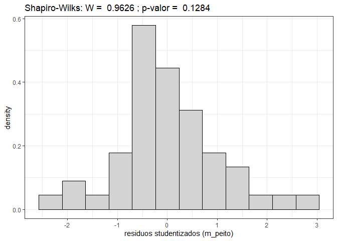<!-- --><!-- -->

    #> Analysis of Variance Table
    #> 
    #> Response: y
    #>           Df   Sum Sq Mean Sq F value    Pr(>F)    
    #> grupo      2 0.035020 0.01751  13.367 2.776e-05 ***
    #> Residuals 45 0.058948 0.00131                      
    #> ---
    #> Signif. codes:  0 '***' 0.001 '**' 0.01 '*' 0.05 '.' 0.1 ' ' 1
    #> 
    #> Study: modelo ~ "grupo"
    #> 
    #> LSD t Test for y 
    #> 
    #> Mean Square Error:  0.001309963 
    #> 
    #> grupo,  means and individual ( 95 %) CI
    #> 
    #>           y        std  r       LCL       UCL       Min       Max
    #> 1 0.3159650 0.02443725 16 0.2977407 0.3341893 0.2707959 0.3545994
    #> 2 0.2899188 0.04212206 16 0.2716945 0.3081431 0.1540426 0.3475556
    #> 3 0.2502696 0.03947712 16 0.2320453 0.2684940 0.1778607 0.3169935
    #> 
    #> Alpha: 0.05 ; DF Error: 45
    #> Critical Value of t: 2.014103 
    #> 
    #> least Significant Difference: 0.02577308 
    #> 
    #> Treatments with the same letter are not significantly different.
    #> 
    #>           y groups
    #> 1 0.3159650      a
    #> 2 0.2899188      b
    #> 3 0.2502696      c
    #> $statistics
    #>       MSerror Df      Mean       CV  t.value        LSD
    #>   0.001309963 45 0.2853845 12.68234 2.014103 0.02577308
    #> 
    #> $parameters
    #>         test p.ajusted name.t ntr alpha
    #>   Fisher-LSD      none  grupo   3  0.05
    #> 
    #> $means
    #>           y        std  r       LCL       UCL       Min       Max       Q25
    #> 1 0.3159650 0.02443725 16 0.2977407 0.3341893 0.2707959 0.3545994 0.3021824
    #> 2 0.2899188 0.04212206 16 0.2716945 0.3081431 0.1540426 0.3475556 0.2828728
    #> 3 0.2502696 0.03947712 16 0.2320453 0.2684940 0.1778607 0.3169935 0.2271739
    #>         Q50       Q75
    #> 1 0.3174445 0.3330079
    #> 2 0.2961256 0.3098659
    #> 3 0.2540822 0.2735440
    #> 
    #> $comparison
    #> NULL
    #> 
    #> $groups
    #>           y groups
    #> 1 0.3159650      a
    #> 2 0.2899188      b
    #> 3 0.2502696      c
    #> 
    #> attr(,"class")
    #> [1] "group"

<!-- --><!-- -->

    #> Analysis of Variance Table
    #> 
    #> Response: y
    #>           Df Sum Sq Mean Sq F value    Pr(>F)    
    #> grupo      2 553.89 276.943  45.416 1.602e-11 ***
    #> Residuals 45 274.41   6.098                      
    #> ---
    #> Signif. codes:  0 '***' 0.001 '**' 0.01 '*' 0.05 '.' 0.1 ' ' 1
    #> 
    #> Study: modelo ~ "grupo"
    #> 
    #> LSD t Test for y 
    #> 
    #> Mean Square Error:  6.097896 
    #> 
    #> grupo,  means and individual ( 95 %) CI
    #> 
    #>           y      std  r       LCL       UCL  Min   Max
    #> 1 13.973125 2.585121 16 12.729722 15.216528 9.68 17.62
    #> 2  8.757500 2.470305 16  7.514097 10.000903 4.00 13.00
    #> 3  5.750625 2.347005 16  4.507222  6.994028 2.00 11.80
    #> 
    #> Alpha: 0.05 ; DF Error: 45
    #> Critical Value of t: 2.014103 
    #> 
    #> least Significant Difference: 1.758437 
    #> 
    #> Treatments with the same letter are not significantly different.
    #> 
    #>           y groups
    #> 1 13.973125      a
    #> 2  8.757500      b
    #> 3  5.750625      c
    #> $statistics
    #>    MSerror Df    Mean       CV  t.value      LSD
    #>   6.097896 45 9.49375 26.01071 2.014103 1.758437
    #> 
    #> $parameters
    #>         test p.ajusted name.t ntr alpha
    #>   Fisher-LSD      none  grupo   3  0.05
    #> 
    #> $means
    #>           y      std  r       LCL       UCL  Min   Max     Q25    Q50    Q75
    #> 1 13.973125 2.585121 16 12.729722 15.216528 9.68 17.62 12.0000 14.465 16.000
    #> 2  8.757500 2.470305 16  7.514097 10.000903 4.00 13.00  7.1375  8.600 10.325
    #> 3  5.750625 2.347005 16  4.507222  6.994028 2.00 11.80  4.4575  5.590  7.000
    #> 
    #> $comparison
    #> NULL
    #> 
    #> $groups
    #>           y groups
    #> 1 13.973125      a
    #> 2  8.757500      b
    #> 3  5.750625      c
    #> 
    #> attr(,"class")
    #> [1] "group"

<!-- --><!-- -->

    #> Analysis of Variance Table
    #> 
    #> Response: y
    #>           Df     Sum Sq    Mean Sq F value  Pr(>F)  
    #> grupo      2 5.9370e-06 2.9683e-06  2.4255 0.09991 .
    #> Residuals 45 5.5071e-05 1.2238e-06                  
    #> ---
    #> Signif. codes:  0 '***' 0.001 '**' 0.01 '*' 0.05 '.' 0.1 ' ' 1
    #> 
    #> Study: modelo ~ "grupo"
    #> 
    #> LSD t Test for y 
    #> 
    #> Mean Square Error:  1.223792e-06 
    #> 
    #> grupo,  means and individual ( 95 %) CI
    #> 
    #>             y          std  r         LCL         UCL         Min         Max
    #> 1 0.004754620 0.0008218528 16 0.004197594 0.005311646 0.002636166 0.005997001
    #> 2 0.004156738 0.0009192036 16 0.003599712 0.004713764 0.002553191 0.005500550
    #> 3 0.003918598 0.0014666282 16 0.003361572 0.004475625 0.001243781 0.006789413
    #> 
    #> Alpha: 0.05 ; DF Error: 45
    #> Critical Value of t: 2.014103 
    #> 
    #> least Significant Difference: 0.0007877539 
    #> 
    #> Treatments with the same letter are not significantly different.
    #> 
    #>             y groups
    #> 1 0.004754620      a
    #> 2 0.004156738     ab
    #> 3 0.003918598      b
    #> $statistics
    #>        MSerror Df        Mean       CV  t.value          LSD
    #>   1.223792e-06 45 0.004276652 25.86723 2.014103 0.0007877539
    #> 
    #> $parameters
    #>         test p.ajusted name.t ntr alpha
    #>   Fisher-LSD      none  grupo   3  0.05
    #> 
    #> $means
    #>             y          std  r         LCL         UCL         Min         Max
    #> 1 0.004754620 0.0008218528 16 0.004197594 0.005311646 0.002636166 0.005997001
    #> 2 0.004156738 0.0009192036 16 0.003599712 0.004713764 0.002553191 0.005500550
    #> 3 0.003918598 0.0014666282 16 0.003361572 0.004475625 0.001243781 0.006789413
    #>           Q25         Q50         Q75
    #> 1 0.004351894 0.004794212 0.005274312
    #> 2 0.003405289 0.004160814 0.004949054
    #> 3 0.003021830 0.004348235 0.004904131
    #> 
    #> $comparison
    #> NULL
    #> 
    #> $groups
    #>             y groups
    #> 1 0.004754620      a
    #> 2 0.004156738     ab
    #> 3 0.003918598      b
    #> 
    #> attr(,"class")
    #> [1] "group"

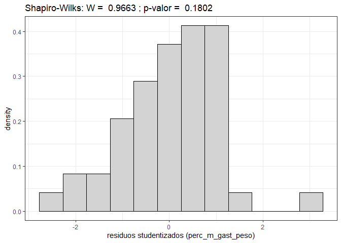<!-- --><!-- -->

    #> Analysis of Variance Table
    #> 
    #> Response: y
    #>           Df Sum Sq Mean Sq F value    Pr(>F)    
    #> grupo      2 345.04 172.521  9.9027 0.0002729 ***
    #> Residuals 45 783.98  17.422                      
    #> ---
    #> Signif. codes:  0 '***' 0.001 '**' 0.01 '*' 0.05 '.' 0.1 ' ' 1
    #> 
    #> Study: modelo ~ "grupo"
    #> 
    #> LSD t Test for y 
    #> 
    #> Mean Square Error:  17.42168 
    #> 
    #> grupo,  means and individual ( 95 %) CI
    #> 
    #>          y      std  r       LCL       UCL  Min   Max
    #> 1 12.28813 4.907862 16 10.186444 14.389806 4.18 20.51
    #> 2  8.37625 4.226494 16  6.274569 10.477931 2.00 15.16
    #> 3  5.76375 3.211645 16  3.662069  7.865431 2.40 15.54
    #> 
    #> Alpha: 0.05 ; DF Error: 45
    #> Critical Value of t: 2.014103 
    #> 
    #> least Significant Difference: 2.972225 
    #> 
    #> Treatments with the same letter are not significantly different.
    #> 
    #>          y groups
    #> 1 12.28813      a
    #> 2  8.37625      b
    #> 3  5.76375      b
    #> $statistics
    #>    MSerror Df     Mean       CV  t.value      LSD
    #>   17.42168 45 8.809375 47.38052 2.014103 2.972225
    #> 
    #> $parameters
    #>         test p.ajusted name.t ntr alpha
    #>   Fisher-LSD      none  grupo   3  0.05
    #> 
    #> $means
    #>          y      std  r       LCL       UCL  Min   Max     Q25   Q50     Q75
    #> 1 12.28813 4.907862 16 10.186444 14.389806 4.18 20.51 10.0000 12.00 15.5350
    #> 2  8.37625 4.226494 16  6.274569 10.477931 2.00 15.16  4.0825  8.50 11.5350
    #> 3  5.76375 3.211645 16  3.662069  7.865431 2.40 15.54  4.0000  4.84  6.7925
    #> 
    #> $comparison
    #> NULL
    #> 
    #> $groups
    #>          y groups
    #> 1 12.28813      a
    #> 2  8.37625      b
    #> 3  5.76375      b
    #> 
    #> attr(,"class")
    #> [1] "group"

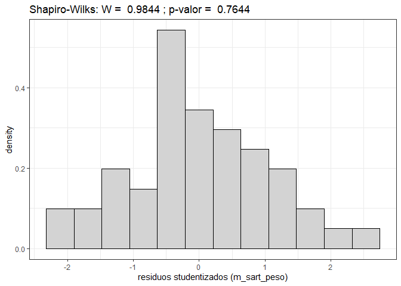<!-- -->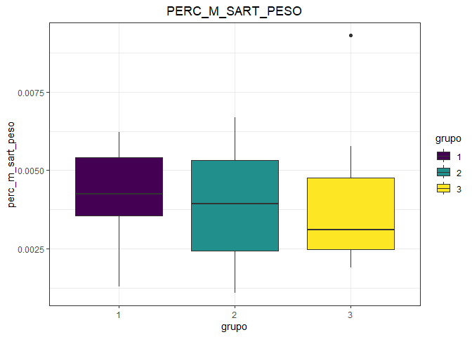<!-- -->

    #> Analysis of Variance Table
    #> 
    #> Response: y
    #>           Df   Sum Sq    Mean Sq F value Pr(>F)
    #> grupo      2 9.08e-07 4.5387e-07  0.1469 0.8638
    #> Residuals 45 1.39e-04 3.0889e-06               
    #> 
    #> Study: modelo ~ "grupo"
    #> 
    #> LSD t Test for y 
    #> 
    #> Mean Square Error:  3.088853e-06 
    #> 
    #> grupo,  means and individual ( 95 %) CI
    #> 
    #>             y         std  r         LCL         UCL         Min         Max
    #> 1 0.004172176 0.001544226 16 0.003287222 0.005057129 0.001302181 0.006210191
    #> 2 0.003955947 0.001819059 16 0.003070993 0.004840900 0.001103753 0.006687023
    #> 3 0.003840378 0.001890225 16 0.002955424 0.004725331 0.001898734 0.009294258
    #> 
    #> Alpha: 0.05 ; DF Error: 45
    #> Critical Value of t: 2.014103 
    #> 
    #> least Significant Difference: 0.001251513 
    #> 
    #> Treatments with the same letter are not significantly different.
    #> 
    #>             y groups
    #> 1 0.004172176      a
    #> 2 0.003955947      a
    #> 3 0.003840378      a
    #> $statistics
    #>        MSerror Df      Mean       CV  t.value         LSD
    #>   3.088853e-06 45 0.0039895 44.05347 2.014103 0.001251513
    #> 
    #> $parameters
    #>         test p.ajusted name.t ntr alpha
    #>   Fisher-LSD      none  grupo   3  0.05
    #> 
    #> $means
    #>             y         std  r         LCL         UCL         Min         Max
    #> 1 0.004172176 0.001544226 16 0.003287222 0.005057129 0.001302181 0.006210191
    #> 2 0.003955947 0.001819059 16 0.003070993 0.004840900 0.001103753 0.006687023
    #> 3 0.003840378 0.001890225 16 0.002955424 0.004725331 0.001898734 0.009294258
    #>           Q25         Q50         Q75
    #> 1 0.003559911 0.004244346 0.005417826
    #> 2 0.002448512 0.003931545 0.005312455
    #> 3 0.002479169 0.003119407 0.004757672
    #> 
    #> $comparison
    #> NULL
    #> 
    #> $groups
    #>             y groups
    #> 1 0.004172176      a
    #> 2 0.003955947      a
    #> 3 0.003840378      a
    #> 
    #> attr(,"class")
    #> [1] "group"

<!-- --><!-- -->

    #> Analysis of Variance Table
    #> 
    #> Response: y
    #>           Df Sum Sq Mean Sq F value    Pr(>F)    
    #> grupo      2 2378.6 1189.32  9.0638 0.0004924 ***
    #> Residuals 45 5904.7  131.22                      
    #> ---
    #> Signif. codes:  0 '***' 0.001 '**' 0.01 '*' 0.05 '.' 0.1 ' ' 1
    #> 
    #> Study: modelo ~ "grupo"
    #> 
    #> LSD t Test for y 
    #> 
    #> Mean Square Error:  131.2163 
    #> 
    #> grupo,  means and individual ( 95 %) CI
    #> 
    #>          y       std  r      LCL      UCL Min   Max
    #> 1 57.05750  7.172165 16 51.28963 62.82537  44 70.00
    #> 2 47.28312 14.759924 16 41.51525 53.05100  30 98.00
    #> 3 39.86812 11.151395 16 34.10025 45.63600  22 60.86
    #> 
    #> Alpha: 0.05 ; DF Error: 45
    #> Critical Value of t: 2.014103 
    #> 
    #> least Significant Difference: 8.157004 
    #> 
    #> Treatments with the same letter are not significantly different.
    #> 
    #>          y groups
    #> 1 57.05750      a
    #> 2 47.28312      b
    #> 3 39.86812      b
    #> $statistics
    #>    MSerror Df     Mean       CV  t.value      LSD
    #>   131.2163 45 48.06958 23.82997 2.014103 8.157004
    #> 
    #> $parameters
    #>         test p.ajusted name.t ntr alpha
    #>   Fisher-LSD      none  grupo   3  0.05
    #> 
    #> $means
    #>          y       std  r      LCL      UCL Min   Max     Q25    Q50    Q75
    #> 1 57.05750  7.172165 16 51.28963 62.82537  44 70.00 53.5475 56.485 60.500
    #> 2 47.28312 14.759924 16 41.51525 53.05100  30 98.00 40.4425 44.225 47.075
    #> 3 39.86812 11.151395 16 34.10025 45.63600  22 60.86 33.9300 40.945 46.460
    #> 
    #> $comparison
    #> NULL
    #> 
    #> $groups
    #>          y groups
    #> 1 57.05750      a
    #> 2 47.28312      b
    #> 3 39.86812      b
    #> 
    #> attr(,"class")
    #> [1] "group"

<!-- --><!-- -->

    #> Analysis of Variance Table
    #> 
    #> Response: y
    #>           Df    Sum Sq    Mean Sq F value  Pr(>F)  
    #> grupo      2 0.0004477 0.00022383  2.9152 0.06449 .
    #> Residuals 45 0.0034551 0.00007678                  
    #> ---
    #> Signif. codes:  0 '***' 0.001 '**' 0.01 '*' 0.05 '.' 0.1 ' ' 1
    #> 
    #> Study: modelo ~ "grupo"
    #> 
    #> LSD t Test for y 
    #> 
    #> Mean Square Error:  7.677996e-05 
    #> 
    #> grupo,  means and individual ( 95 %) CI
    #> 
    #>            y         std  r        LCL        UCL        Min        Max
    #> 1 0.01941009 0.002263279 16 0.01499798 0.02382219 0.01662102 0.02413793
    #> 2 0.02398422 0.013426045 16 0.01957212 0.02839633 0.01276596 0.07227139
    #> 3 0.02682319 0.006705130 16 0.02241109 0.03123530 0.01797386 0.03804473
    #> 
    #> Alpha: 0.05 ; DF Error: 45
    #> Critical Value of t: 2.014103 
    #> 
    #> least Significant Difference: 0.006239657 
    #> 
    #> Treatments with the same letter are not significantly different.
    #> 
    #>            y groups
    #> 3 0.02682319      a
    #> 2 0.02398422     ab
    #> 1 0.01941009      b
    #> $statistics
    #>        MSerror Df       Mean       CV  t.value         LSD
    #>   7.677996e-05 45 0.02340583 37.43689 2.014103 0.006239657
    #> 
    #> $parameters
    #>         test p.ajusted name.t ntr alpha
    #>   Fisher-LSD      none  grupo   3  0.05
    #> 
    #> $means
    #>            y         std  r        LCL        UCL        Min        Max
    #> 1 0.01941009 0.002263279 16 0.01499798 0.02382219 0.01662102 0.02413793
    #> 2 0.02398422 0.013426045 16 0.01957212 0.02839633 0.01276596 0.07227139
    #> 3 0.02682319 0.006705130 16 0.02241109 0.03123530 0.01797386 0.03804473
    #>          Q25        Q50        Q75
    #> 1 0.01789370 0.01866454 0.02094627
    #> 2 0.01919492 0.02033749 0.02150909
    #> 3 0.02154409 0.02540734 0.03176041
    #> 
    #> $comparison
    #> NULL
    #> 
    #> $groups
    #>            y groups
    #> 3 0.02682319      a
    #> 2 0.02398422     ab
    #> 1 0.01941009      b
    #> 
    #> attr(,"class")
    #> [1] "group"

<!-- --><!-- -->

    #> Analysis of Variance Table
    #> 
    #> Response: y
    #>           Df Sum Sq Mean Sq F value    Pr(>F)    
    #> grupo      2 114.42  57.210  8.2649 0.0008767 ***
    #> Residuals 45 311.49   6.922                      
    #> ---
    #> Signif. codes:  0 '***' 0.001 '**' 0.01 '*' 0.05 '.' 0.1 ' ' 1
    #> 
    #> Study: modelo ~ "grupo"
    #> 
    #> LSD t Test for y 
    #> 
    #> Mean Square Error:  6.921968 
    #> 
    #> grupo,  means and individual ( 95 %) CI
    #> 
    #>           y      std  r       LCL      UCL   Min   Max
    #> 1 13.353750 2.892701 16 12.028992 14.67851 10.00 19.45
    #> 2 10.880625 2.731265 16  9.555867 12.20538  6.00 14.76
    #> 3  9.639375 2.222247 16  8.314617 10.96413  5.99 14.86
    #> 
    #> Alpha: 0.05 ; DF Error: 45
    #> Critical Value of t: 2.014103 
    #> 
    #> least Significant Difference: 1.873491 
    #> 
    #> Treatments with the same letter are not significantly different.
    #> 
    #>           y groups
    #> 1 13.353750      a
    #> 2 10.880625      b
    #> 3  9.639375      b
    #> $statistics
    #>    MSerror Df     Mean      CV  t.value      LSD
    #>   6.921968 45 11.29125 23.3009 2.014103 1.873491
    #> 
    #> $parameters
    #>         test p.ajusted name.t ntr alpha
    #>   Fisher-LSD      none  grupo   3  0.05
    #> 
    #> $means
    #>           y      std  r       LCL      UCL   Min   Max     Q25    Q50     Q75
    #> 1 13.353750 2.892701 16 12.028992 14.67851 10.00 19.45 11.5075 12.220 15.7000
    #> 2 10.880625 2.731265 16  9.555867 12.20538  6.00 14.76  9.5975 11.060 12.7175
    #> 3  9.639375 2.222247 16  8.314617 10.96413  5.99 14.86  8.0000  9.735 10.7525
    #> 
    #> $comparison
    #> NULL
    #> 
    #> $groups
    #>           y groups
    #> 1 13.353750      a
    #> 2 10.880625      b
    #> 3  9.639375      b
    #> 
    #> attr(,"class")
    #> [1] "group"

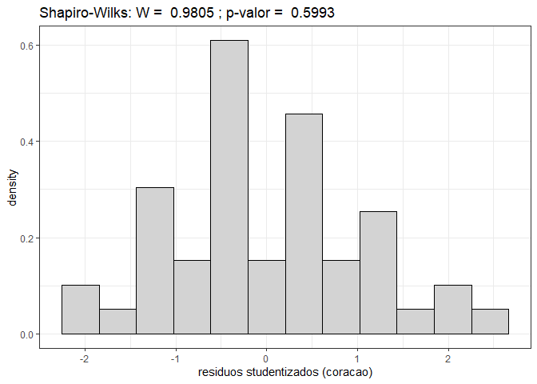<!-- --><!-- -->

    #> Analysis of Variance Table
    #> 
    #> Response: y
    #>           Df     Sum Sq    Mean Sq F value    Pr(>F)    
    #> grupo      2 3.0768e-05 1.5384e-05  12.155 6.018e-05 ***
    #> Residuals 45 5.6955e-05 1.2657e-06                      
    #> ---
    #> Signif. codes:  0 '***' 0.001 '**' 0.01 '*' 0.05 '.' 0.1 ' ' 1
    #> 
    #> Study: modelo ~ "grupo"
    #> 
    #> LSD t Test for y 
    #> 
    #> Mean Square Error:  1.265676e-06 
    #> 
    #> grupo,  means and individual ( 95 %) CI
    #> 
    #>             y          std  r         LCL         UCL         Min         Max
    #> 1 0.004529617 0.0008840665 16 0.003963139 0.005096095 0.003347134 0.006637168
    #> 2 0.005274460 0.0014227295 16 0.004707982 0.005840938 0.002553191 0.007726269
    #> 3 0.006473159 0.0009956377 16 0.005906681 0.007039637 0.004747475 0.008556999
    #> 
    #> Alpha: 0.05 ; DF Error: 45
    #> Critical Value of t: 2.014103 
    #> 
    #> least Significant Difference: 0.0008011208 
    #> 
    #> Treatments with the same letter are not significantly different.
    #> 
    #>             y groups
    #> 3 0.006473159      a
    #> 2 0.005274460      b
    #> 1 0.004529617      b
    #> $statistics
    #>        MSerror Df        Mean       CV  t.value          LSD
    #>   1.265676e-06 45 0.005425745 20.73489 2.014103 0.0008011208
    #> 
    #> $parameters
    #>         test p.ajusted name.t ntr alpha
    #>   Fisher-LSD      none  grupo   3  0.05
    #> 
    #> $means
    #>             y          std  r         LCL         UCL         Min         Max
    #> 1 0.004529617 0.0008840665 16 0.003963139 0.005096095 0.003347134 0.006637168
    #> 2 0.005274460 0.0014227295 16 0.004707982 0.005840938 0.002553191 0.007726269
    #> 3 0.006473159 0.0009956377 16 0.005906681 0.007039637 0.004747475 0.008556999
    #>           Q25         Q50         Q75
    #> 1 0.003841852 0.004468736 0.004796020
    #> 2 0.004364039 0.005097031 0.006421474
    #> 3 0.006065237 0.006304274 0.006824314
    #> 
    #> $comparison
    #> NULL
    #> 
    #> $groups
    #>             y groups
    #> 3 0.006473159      a
    #> 2 0.005274460      b
    #> 1 0.004529617      b
    #> 
    #> attr(,"class")
    #> [1] "group"

<!-- --><!-- -->

    #> Analysis of Variance Table
    #> 
    #> Response: y
    #>           Df Sum Sq Mean Sq F value    Pr(>F)    
    #> grupo      2 12.140  6.0701  11.544 8.978e-05 ***
    #> Residuals 45 23.662  0.5258                      
    #> ---
    #> Signif. codes:  0 '***' 0.001 '**' 0.01 '*' 0.05 '.' 0.1 ' ' 1
    #> 
    #> Study: modelo ~ "grupo"
    #> 
    #> LSD t Test for y 
    #> 
    #> Mean Square Error:  0.5258204 
    #> 
    #> grupo,  means and individual ( 95 %) CI
    #> 
    #>          y       std  r      LCL      UCL Min  Max
    #> 1 3.067500 0.8968872 16 2.702376 3.432624   2 4.24
    #> 2 1.963750 0.5840534 16 1.598626 2.328874   1 3.72
    #> 3 2.041875 0.6572186 16 1.676751 2.406999   1 3.51
    #> 
    #> Alpha: 0.05 ; DF Error: 45
    #> Critical Value of t: 2.014103 
    #> 
    #> least Significant Difference: 0.5163634 
    #> 
    #> Treatments with the same letter are not significantly different.
    #> 
    #>          y groups
    #> 1 3.067500      a
    #> 3 2.041875      b
    #> 2 1.963750      b
    #> $statistics
    #>     MSerror Df     Mean       CV  t.value       LSD
    #>   0.5258204 45 2.357708 30.75591 2.014103 0.5163634
    #> 
    #> $parameters
    #>         test p.ajusted name.t ntr alpha
    #>   Fisher-LSD      none  grupo   3  0.05
    #> 
    #> $means
    #>          y       std  r      LCL      UCL Min  Max    Q25   Q50  Q75
    #> 1 3.067500 0.8968872 16 2.702376 3.432624   2 4.24 2.0000 3.005 4.00
    #> 2 1.963750 0.5840534 16 1.598626 2.328874   1 3.72 1.9000 2.000 2.00
    #> 3 2.041875 0.6572186 16 1.676751 2.406999   1 3.51 1.6575 2.000 2.52
    #> 
    #> $comparison
    #> NULL
    #> 
    #> $groups
    #>          y groups
    #> 1 3.067500      a
    #> 3 2.041875      b
    #> 2 1.963750      b
    #> 
    #> attr(,"class")
    #> [1] "group"

<!-- --><!-- -->

    #> Analysis of Variance Table
    #> 
    #> Response: y
    #>           Df     Sum Sq    Mean Sq F value   Pr(>F)   
    #> grupo      2 1.5918e-06 7.9591e-07  6.9478 0.002346 **
    #> Residuals 45 5.1550e-06 1.1456e-07                    
    #> ---
    #> Signif. codes:  0 '***' 0.001 '**' 0.01 '*' 0.05 '.' 0.1 ' ' 1
    #> 
    #> Study: modelo ~ "grupo"
    #> 
    #> LSD t Test for y 
    #> 
    #> Mean Square Error:  1.145561e-07 
    #> 
    #> grupo,  means and individual ( 95 %) CI
    #> 
    #>              y          std  r          LCL         UCL          Min
    #> 1 0.0010432095 0.0003135056 16 0.0008727855 0.001213634 0.0006514658
    #> 2 0.0009545583 0.0002932919 16 0.0007841343 0.001124982 0.0004255319
    #> 3 0.0013774862 0.0003992021 16 0.0012070622 0.001547910 0.0006218905
    #>           Max
    #> 1 0.001546790
    #> 2 0.001613883
    #> 3 0.002387755
    #> 
    #> Alpha: 0.05 ; DF Error: 45
    #> Critical Value of t: 2.014103 
    #> 
    #> least Significant Difference: 0.000241016 
    #> 
    #> Treatments with the same letter are not significantly different.
    #> 
    #>              y groups
    #> 3 0.0013774862      a
    #> 1 0.0010432095      b
    #> 2 0.0009545583      b
    #> $statistics
    #>        MSerror Df        Mean       CV  t.value         LSD
    #>   1.145561e-07 45 0.001125085 30.08319 2.014103 0.000241016
    #> 
    #> $parameters
    #>         test p.ajusted name.t ntr alpha
    #>   Fisher-LSD      none  grupo   3  0.05
    #> 
    #> $means
    #>              y          std  r          LCL         UCL          Min
    #> 1 0.0010432095 0.0003135056 16 0.0008727855 0.001213634 0.0006514658
    #> 2 0.0009545583 0.0002932919 16 0.0007841343 0.001124982 0.0004255319
    #> 3 0.0013774862 0.0003992021 16 0.0012070622 0.001547910 0.0006218905
    #>           Max          Q25          Q50         Q75
    #> 1 0.001546790 0.0007587727 0.0009375294 0.001288448
    #> 2 0.001613883 0.0008333741 0.0009250694 0.001038386
    #> 3 0.002387755 0.0012040027 0.0013880049 0.001570087
    #> 
    #> $comparison
    #> NULL
    #> 
    #> $groups
    #>              y groups
    #> 3 0.0013774862      a
    #> 1 0.0010432095      b
    #> 2 0.0009545583      b
    #> 
    #> attr(,"class")
    #> [1] "group"

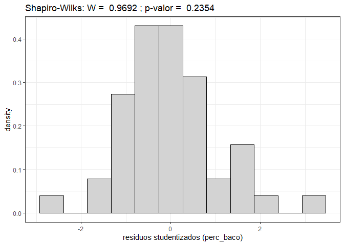<!-- --><!-- -->

    #> Analysis of Variance Table
    #> 
    #> Response: y
    #>           Df Sum Sq Mean Sq F value   Pr(>F)    
    #> grupo      2 299.07 149.534  17.824 1.99e-06 ***
    #> Residuals 45 377.52   8.389                     
    #> ---
    #> Signif. codes:  0 '***' 0.001 '**' 0.01 '*' 0.05 '.' 0.1 ' ' 1
    #> 
    #> Study: modelo ~ "grupo"
    #> 
    #> LSD t Test for y 
    #> 
    #> Mean Square Error:  8.389266 
    #> 
    #> grupo,  means and individual ( 95 %) CI
    #> 
    #>          y      std  r      LCL      UCL Min   Max
    #> 1 17.81250 2.252150 16 16.35408 19.27092  14 21.17
    #> 2 12.53063 3.357004 16 11.07220 13.98905   2 16.00
    #> 3 12.50437 2.970883 16 11.04595 13.96280   8 18.13
    #> 
    #> Alpha: 0.05 ; DF Error: 45
    #> Critical Value of t: 2.014103 
    #> 
    #> least Significant Difference: 2.062523 
    #> 
    #> Treatments with the same letter are not significantly different.
    #> 
    #>          y groups
    #> 1 17.81250      a
    #> 2 12.53063      b
    #> 3 12.50437      b
    #> $statistics
    #>    MSerror Df    Mean       CV  t.value      LSD
    #>   8.389266 45 14.2825 20.27952 2.014103 2.062523
    #> 
    #> $parameters
    #>         test p.ajusted name.t ntr alpha
    #>   Fisher-LSD      none  grupo   3  0.05
    #> 
    #> $means
    #>          y      std  r      LCL      UCL Min   Max    Q25    Q50     Q75
    #> 1 17.81250 2.252150 16 16.35408 19.27092  14 21.17 16.000 18.000 19.7650
    #> 2 12.53063 3.357004 16 11.07220 13.98905   2 16.00 11.565 13.680 14.2000
    #> 3 12.50437 2.970883 16 11.04595 13.96280   8 18.13 10.480 11.885 14.1025
    #> 
    #> $comparison
    #> NULL
    #> 
    #> $groups
    #>          y groups
    #> 1 17.81250      a
    #> 2 12.53063      b
    #> 3 12.50437      b
    #> 
    #> attr(,"class")
    #> [1] "group"

<!-- --><!-- -->

    #> Analysis of Variance Table
    #> 
    #> Response: y
    #>           Df     Sum Sq    Mean Sq F value    Pr(>F)    
    #> grupo      2 6.2103e-05 3.1052e-05  17.305 2.664e-06 ***
    #> Residuals 45 8.0748e-05 1.7944e-06                      
    #> ---
    #> Signif. codes:  0 '***' 0.001 '**' 0.01 '*' 0.05 '.' 0.1 ' ' 1
    #> 
    #> Study: modelo ~ "grupo"
    #> 
    #> LSD t Test for y 
    #> 
    #> Mean Square Error:  1.794395e-06 
    #> 
    #> grupo,  means and individual ( 95 %) CI
    #> 
    #>             y          std  r         LCL         UCL         Min         Max
    #> 1 0.006039221 0.0004922036 16 0.005364723 0.006713719 0.005038217 0.006795017
    #> 2 0.005972738 0.0016998773 16 0.005298240 0.006647236 0.001474926 0.008537887
    #> 3 0.008418215 0.0015004460 16 0.007743717 0.009092713 0.006121979 0.011320346
    #> 
    #> Alpha: 0.05 ; DF Error: 45
    #> Critical Value of t: 2.014103 
    #> 
    #> least Significant Difference: 0.0009538845 
    #> 
    #> Treatments with the same letter are not significantly different.
    #> 
    #>             y groups
    #> 3 0.008418215      a
    #> 1 0.006039221      b
    #> 2 0.005972738      b
    #> $statistics
    #>        MSerror Df        Mean       CV  t.value          LSD
    #>   1.794395e-06 45 0.006810058 19.67018 2.014103 0.0009538845
    #> 
    #> $parameters
    #>         test p.ajusted name.t ntr alpha
    #>   Fisher-LSD      none  grupo   3  0.05
    #> 
    #> $means
    #>             y          std  r         LCL         UCL         Min         Max
    #> 1 0.006039221 0.0004922036 16 0.005364723 0.006713719 0.005038217 0.006795017
    #> 2 0.005972738 0.0016998773 16 0.005298240 0.006647236 0.001474926 0.008537887
    #> 3 0.008418215 0.0015004460 16 0.007743717 0.009092713 0.006121979 0.011320346
    #>           Q25         Q50         Q75
    #> 1 0.005762787 0.006038161 0.006329599
    #> 2 0.005441607 0.006140426 0.007100319
    #> 3 0.007568392 0.008316482 0.009260274
    #> 
    #> $comparison
    #> NULL
    #> 
    #> $groups
    #>             y groups
    #> 3 0.008418215      a
    #> 1 0.006039221      b
    #> 2 0.005972738      b
    #> 
    #> attr(,"class")
    #> [1] "group"

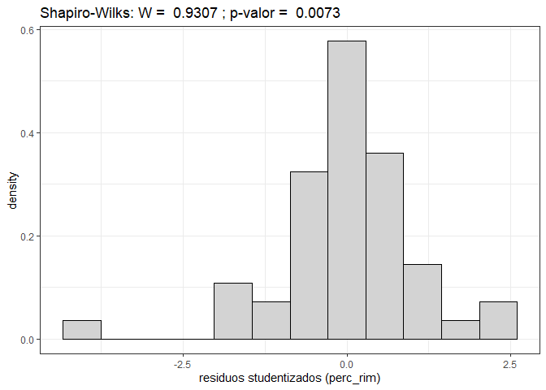<!-- --><!-- -->

    #> Analysis of Variance Table
    #> 
    #> Response: y
    #>           Df Sum Sq Mean Sq F value    Pr(>F)    
    #> grupo      2 499.16 249.580  44.154 2.443e-11 ***
    #> Residuals 45 254.36   5.652                      
    #> ---
    #> Signif. codes:  0 '***' 0.001 '**' 0.01 '*' 0.05 '.' 0.1 ' ' 1
    #> 
    #> Study: modelo ~ "grupo"
    #> 
    #> LSD t Test for y 
    #> 
    #> Mean Square Error:  5.652418 
    #> 
    #> grupo,  means and individual ( 95 %) CI
    #> 
    #>          y      std  r       LCL      UCL   Min   Max
    #> 1 17.26813 2.769292 16 16.071002 18.46525 13.28 24.00
    #> 2 11.68125 2.363613 16 10.484127 12.87837  8.00 14.95
    #> 3  9.63875 1.923957 16  8.441627 10.83587  6.32 13.38
    #> 
    #> Alpha: 0.05 ; DF Error: 45
    #> Critical Value of t: 2.014103 
    #> 
    #> least Significant Difference: 1.692988 
    #> 
    #> Treatments with the same letter are not significantly different.
    #> 
    #>          y groups
    #> 1 17.26813      a
    #> 2 11.68125      b
    #> 3  9.63875      c
    #> $statistics
    #>    MSerror Df     Mean       CV  t.value      LSD
    #>   5.652418 45 12.86271 18.48352 2.014103 1.692988
    #> 
    #> $parameters
    #>         test p.ajusted name.t ntr alpha
    #>   Fisher-LSD      none  grupo   3  0.05
    #> 
    #> $means
    #>          y      std  r       LCL      UCL   Min   Max    Q25    Q50     Q75
    #> 1 17.26813 2.769292 16 16.071002 18.46525 13.28 24.00 16.000 16.170 18.0000
    #> 2 11.68125 2.363613 16 10.484127 12.87837  8.00 14.95 10.000 12.195 13.8125
    #> 3  9.63875 1.923957 16  8.441627 10.83587  6.32 13.38  8.615  9.620 10.2625
    #> 
    #> $comparison
    #> NULL
    #> 
    #> $groups
    #>          y groups
    #> 1 17.26813      a
    #> 2 11.68125      b
    #> 3  9.63875      c
    #> 
    #> attr(,"class")
    #> [1] "group"

<!-- -->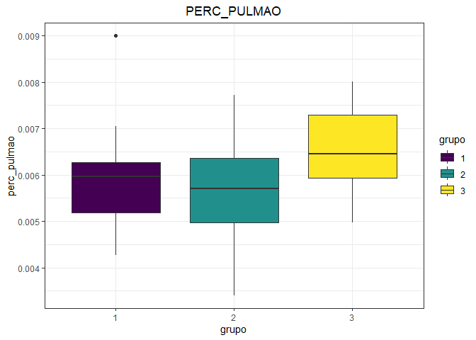<!-- -->

    #> Analysis of Variance Table
    #> 
    #> Response: y
    #>           Df     Sum Sq    Mean Sq F value  Pr(>F)  
    #> grupo      2 6.4460e-06 3.2230e-06  2.7792 0.07277 .
    #> Residuals 45 5.2187e-05 1.1597e-06                  
    #> ---
    #> Signif. codes:  0 '***' 0.001 '**' 0.01 '*' 0.05 '.' 0.1 ' ' 1
    #> 
    #> Study: modelo ~ "grupo"
    #> 
    #> LSD t Test for y 
    #> 
    #> Mean Square Error:  1.159701e-06 
    #> 
    #> grupo,  means and individual ( 95 %) CI
    #> 
    #>             y          std  r         LCL         UCL         Min         Max
    #> 1 0.005911021 0.0011333208 16 0.005368777 0.006453265 0.004270096 0.008995502
    #> 2 0.005635008 0.0011039504 16 0.005092764 0.006177252 0.003404255 0.007726269
    #> 3 0.006512731 0.0009879168 16 0.005970487 0.007054975 0.004975124 0.008002392
    #> 
    #> Alpha: 0.05 ; DF Error: 45
    #> Critical Value of t: 2.014103 
    #> 
    #> least Significant Difference: 0.0007668488 
    #> 
    #> Treatments with the same letter are not significantly different.
    #> 
    #>             y groups
    #> 3 0.006512731      a
    #> 1 0.005911021     ab
    #> 2 0.005635008      b
    #> $statistics
    #>        MSerror Df        Mean       CV  t.value          LSD
    #>   1.159701e-06 45 0.006019587 17.88983 2.014103 0.0007668488
    #> 
    #> $parameters
    #>         test p.ajusted name.t ntr alpha
    #>   Fisher-LSD      none  grupo   3  0.05
    #> 
    #> $means
    #>             y          std  r         LCL         UCL         Min         Max
    #> 1 0.005911021 0.0011333208 16 0.005368777 0.006453265 0.004270096 0.008995502
    #> 2 0.005635008 0.0011039504 16 0.005092764 0.006177252 0.003404255 0.007726269
    #> 3 0.006512731 0.0009879168 16 0.005970487 0.007054975 0.004975124 0.008002392
    #>           Q25         Q50         Q75
    #> 1 0.005190967 0.005968720 0.006273877
    #> 2 0.004973131 0.005709072 0.006368178
    #> 3 0.005926777 0.006449792 0.007297585
    #> 
    #> $comparison
    #> NULL
    #> 
    #> $groups
    #>             y groups
    #> 3 0.006512731      a
    #> 1 0.005911021     ab
    #> 2 0.005635008      b
    #> 
    #> attr(,"class")
    #> [1] "group"

<!-- --><!-- -->

    #> Analysis of Variance Table
    #> 
    #> Response: y
    #>           Df Sum Sq Mean Sq F value    Pr(>F)    
    #> grupo      2 33.002 16.5012  8.1002 0.0009893 ***
    #> Residuals 45 91.672  2.0371                      
    #> ---
    #> Signif. codes:  0 '***' 0.001 '**' 0.01 '*' 0.05 '.' 0.1 ' ' 1
    #> 
    #> Study: modelo ~ "grupo"
    #> 
    #> LSD t Test for y 
    #> 
    #> Mean Square Error:  2.037145 
    #> 
    #> grupo,  means and individual ( 95 %) CI
    #> 
    #>          y      std  r    LCL     UCL Min  Max
    #> 1 4.999375 1.900075 16 4.2807 5.71805   2 9.27
    #> 2 3.926875 1.200398 16 3.2082 4.64555   2 8.00
    #> 3 2.969375 1.029657 16 2.2507 3.68805   1 4.44
    #> 
    #> Alpha: 0.05 ; DF Error: 45
    #> Critical Value of t: 2.014103 
    #> 
    #> least Significant Difference: 1.01636 
    #> 
    #> Treatments with the same letter are not significantly different.
    #> 
    #>          y groups
    #> 1 4.999375      a
    #> 2 3.926875      b
    #> 3 2.969375      b
    #> $statistics
    #>    MSerror Df     Mean       CV  t.value     LSD
    #>   2.037145 45 3.965208 35.99523 2.014103 1.01636
    #> 
    #> $parameters
    #>         test p.ajusted name.t ntr alpha
    #>   Fisher-LSD      none  grupo   3  0.05
    #> 
    #> $means
    #>          y      std  r    LCL     UCL Min  Max    Q25   Q50   Q75
    #> 1 4.999375 1.900075 16 4.2807 5.71805   2 9.27 4.0000 5.045 6.000
    #> 2 3.926875 1.200398 16 3.2082 4.64555   2 8.00 3.5875 3.885 4.000
    #> 3 2.969375 1.029657 16 2.2507 3.68805   1 4.44 2.0000 3.060 3.895
    #> 
    #> $comparison
    #> NULL
    #> 
    #> $groups
    #>          y groups
    #> 1 4.999375      a
    #> 2 3.926875      b
    #> 3 2.969375      b
    #> 
    #> attr(,"class")
    #> [1] "group"

<!-- -->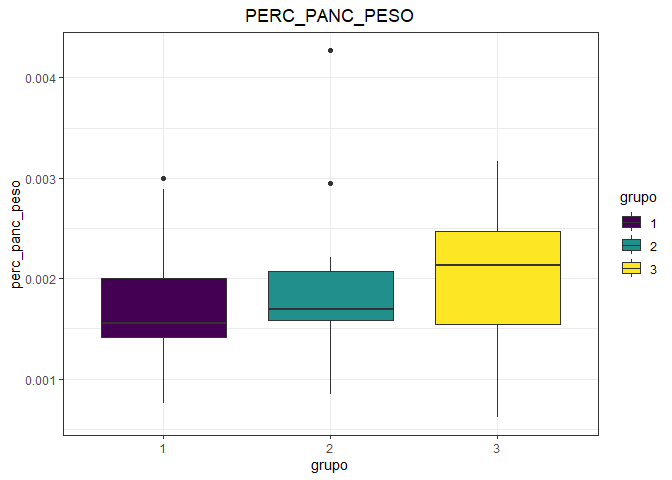<!-- -->

    #> Analysis of Variance Table
    #> 
    #> Response: y
    #>           Df     Sum Sq    Mean Sq F value Pr(>F)
    #> grupo      2 8.9030e-07 4.4515e-07  0.8912 0.4173
    #> Residuals 45 2.2477e-05 4.9948e-07               
    #> 
    #> Study: modelo ~ "grupo"
    #> 
    #> LSD t Test for y 
    #> 
    #> Mean Square Error:  4.994847e-07 
    #> 
    #> grupo,  means and individual ( 95 %) CI
    #> 
    #>             y          std  r         LCL         UCL          Min         Max
    #> 1 0.001703616 0.0006463975 16 0.001347753 0.002059479 0.0007550019 0.002998501
    #> 2 0.001945600 0.0007673291 16 0.001589737 0.002301463 0.0008510638 0.004268943
    #> 3 0.002023474 0.0007013063 16 0.001667611 0.002379337 0.0006218905 0.003164557
    #> 
    #> Alpha: 0.05 ; DF Error: 45
    #> Critical Value of t: 2.014103 
    #> 
    #> least Significant Difference: 0.0005032663 
    #> 
    #> Treatments with the same letter are not significantly different.
    #> 
    #>             y groups
    #> 3 0.002023474      a
    #> 2 0.001945600      a
    #> 1 0.001703616      a
    #> $statistics
    #>        MSerror Df        Mean       CV  t.value          LSD
    #>   4.994847e-07 45 0.001890897 37.37604 2.014103 0.0005032663
    #> 
    #> $parameters
    #>         test p.ajusted name.t ntr alpha
    #>   Fisher-LSD      none  grupo   3  0.05
    #> 
    #> $means
    #>             y          std  r         LCL         UCL          Min         Max
    #> 1 0.001703616 0.0006463975 16 0.001347753 0.002059479 0.0007550019 0.002998501
    #> 2 0.001945600 0.0007673291 16 0.001589737 0.002301463 0.0008510638 0.004268943
    #> 3 0.002023474 0.0007013063 16 0.001667611 0.002379337 0.0006218905 0.003164557
    #>           Q25         Q50         Q75
    #> 1 0.001415089 0.001557315 0.002005366
    #> 2 0.001582747 0.001692479 0.002076773
    #> 3 0.001540731 0.002135016 0.002466474
    #> 
    #> $comparison
    #> NULL
    #> 
    #> $groups
    #>             y groups
    #> 3 0.002023474      a
    #> 2 0.001945600      a
    #> 1 0.001703616      a
    #> 
    #> attr(,"class")
    #> [1] "group"

<!-- --><!-- -->

    #> Analysis of Variance Table
    #> 
    #> Response: y
    #>           Df Sum Sq Mean Sq F value    Pr(>F)    
    #> grupo      2 1741.9  870.95  11.854 7.321e-05 ***
    #> Residuals 45 3306.3   73.47                      
    #> ---
    #> Signif. codes:  0 '***' 0.001 '**' 0.01 '*' 0.05 '.' 0.1 ' ' 1
    #> 
    #> Study: modelo ~ "grupo"
    #> 
    #> LSD t Test for y 
    #> 
    #> Mean Square Error:  73.47244 
    #> 
    #> grupo,  means and individual ( 95 %) CI
    #> 
    #>          y       std  r      LCL      UCL Min   Max
    #> 1 48.23063 10.029761 16 43.91460 52.54665  30 68.00
    #> 2 40.25625  5.878393 16 35.94022 44.57228  28 50.00
    #> 3 33.49125  9.233942 16 29.17522 37.80728  20 51.49
    #> 
    #> Alpha: 0.05 ; DF Error: 45
    #> Critical Value of t: 2.014103 
    #> 
    #> least Significant Difference: 6.103782 
    #> 
    #> Treatments with the same letter are not significantly different.
    #> 
    #>          y groups
    #> 1 48.23063      a
    #> 2 40.25625      b
    #> 3 33.49125      c
    #> $statistics
    #>    MSerror Df     Mean      CV  t.value      LSD
    #>   73.47244 45 40.65937 21.0815 2.014103 6.103782
    #> 
    #> $parameters
    #>         test p.ajusted name.t ntr alpha
    #>   Fisher-LSD      none  grupo   3  0.05
    #> 
    #> $means
    #>          y       std  r      LCL      UCL Min   Max    Q25    Q50     Q75
    #> 1 48.23063 10.029761 16 43.91460 52.54665  30 68.00 41.725 50.000 54.0225
    #> 2 40.25625  5.878393 16 35.94022 44.57228  28 50.00 37.015 38.935 44.3650
    #> 3 33.49125  9.233942 16 29.17522 37.80728  20 51.49 26.905 32.000 39.6100
    #> 
    #> $comparison
    #> NULL
    #> 
    #> $groups
    #>          y groups
    #> 1 48.23063      a
    #> 2 40.25625      b
    #> 3 33.49125      c
    #> 
    #> attr(,"class")
    #> [1] "group"

<!-- --><!-- -->

    #> Analysis of Variance Table
    #> 
    #> Response: y
    #>           Df     Sum Sq    Mean Sq F value    Pr(>F)    
    #> grupo      2 0.00031153 1.5576e-04  9.1633 0.0004588 ***
    #> Residuals 45 0.00076494 1.6999e-05                      
    #> ---
    #> Signif. codes:  0 '***' 0.001 '**' 0.01 '*' 0.05 '.' 0.1 ' ' 1
    #> 
    #> Study: modelo ~ "grupo"
    #> 
    #> LSD t Test for y 
    #> 
    #> Mean Square Error:  1.699872e-05 
    #> 
    #> grupo,  means and individual ( 95 %) CI
    #> 
    #>            y         std  r        LCL        UCL        Min        Max
    #> 1 0.01636054 0.003168401 16 0.01428453 0.01843656 0.01255493 0.02186495
    #> 2 0.01963158 0.003938695 16 0.01755557 0.02170759 0.01191489 0.02668090
    #> 3 0.02259834 0.005044211 16 0.02052233 0.02467436 0.01243781 0.02962601
    #> 
    #> Alpha: 0.05 ; DF Error: 45
    #> Critical Value of t: 2.014103 
    #> 
    #> least Significant Difference: 0.002935924 
    #> 
    #> Treatments with the same letter are not significantly different.
    #> 
    #>            y groups
    #> 3 0.02259834      a
    #> 2 0.01963158      b
    #> 1 0.01636054      c
    #> $statistics
    #>        MSerror Df       Mean       CV  t.value         LSD
    #>   1.699872e-05 45 0.01953016 21.11069 2.014103 0.002935924
    #> 
    #> $parameters
    #>         test p.ajusted name.t ntr alpha
    #>   Fisher-LSD      none  grupo   3  0.05
    #> 
    #> $means
    #>            y         std  r        LCL        UCL        Min        Max
    #> 1 0.01636054 0.003168401 16 0.01428453 0.01843656 0.01255493 0.02186495
    #> 2 0.01963158 0.003938695 16 0.01755557 0.02170759 0.01191489 0.02668090
    #> 3 0.02259834 0.005044211 16 0.02052233 0.02467436 0.01243781 0.02962601
    #>          Q25        Q50        Q75
    #> 1 0.01349940 0.01642553 0.01857629
    #> 2 0.01682653 0.01917678 0.02209961
    #> 3 0.02048088 0.02214562 0.02670447
    #> 
    #> $comparison
    #> NULL
    #> 
    #> $groups
    #>            y groups
    #> 3 0.02259834      a
    #> 2 0.01963158      b
    #> 1 0.01636054      c
    #> 
    #> attr(,"class")
    #> [1] "group"

<!-- -->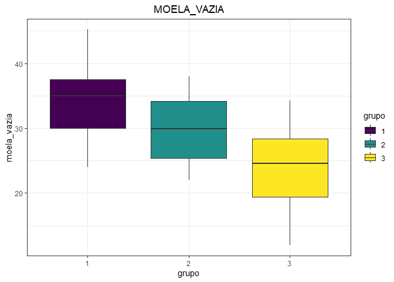<!-- -->

    #> Analysis of Variance Table
    #> 
    #> Response: y
    #>           Df Sum Sq Mean Sq F value    Pr(>F)    
    #> grupo      2  937.0  468.50  13.081 3.324e-05 ***
    #> Residuals 45 1611.7   35.81                      
    #> ---
    #> Signif. codes:  0 '***' 0.001 '**' 0.01 '*' 0.05 '.' 0.1 ' ' 1
    #> 
    #> Study: modelo ~ "grupo"
    #> 
    #> LSD t Test for y 
    #> 
    #> Mean Square Error:  35.81452 
    #> 
    #> grupo,  means and individual ( 95 %) CI
    #> 
    #>          y      std  r      LCL      UCL Min   Max
    #> 1 34.54812 5.864218 16 31.53476 37.56149  24 45.18
    #> 2 29.56875 5.514589 16 26.55539 32.58211  22 38.00
    #> 3 23.73688 6.530224 16 20.72351 26.75024  12 34.30
    #> 
    #> Alpha: 0.05 ; DF Error: 45
    #> Critical Value of t: 2.014103 
    #> 
    #> least Significant Difference: 4.261538 
    #> 
    #> Treatments with the same letter are not significantly different.
    #> 
    #>          y groups
    #> 1 34.54812      a
    #> 2 29.56875      b
    #> 3 23.73688      c
    #> $statistics
    #>    MSerror Df     Mean       CV  t.value      LSD
    #>   35.81452 45 29.28458 20.43575 2.014103 4.261538
    #> 
    #> $parameters
    #>         test p.ajusted name.t ntr alpha
    #>   Fisher-LSD      none  grupo   3  0.05
    #> 
    #> $means
    #>          y      std  r      LCL      UCL Min   Max     Q25    Q50     Q75
    #> 1 34.54812 5.864218 16 31.53476 37.56149  24 45.18 30.0150 34.990 37.5350
    #> 2 29.56875 5.514589 16 26.55539 32.58211  22 38.00 25.3350 29.875 34.1775
    #> 3 23.73688 6.530224 16 20.72351 26.75024  12 34.30 19.4175 24.545 28.3650
    #> 
    #> $comparison
    #> NULL
    #> 
    #> $groups
    #>          y groups
    #> 1 34.54812      a
    #> 2 29.56875      b
    #> 3 23.73688      c
    #> 
    #> attr(,"class")
    #> [1] "group"

<!-- --><!-- -->

    #> Analysis of Variance Table
    #> 
    #> Response: y
    #>           Df     Sum Sq    Mean Sq F value    Pr(>F)    
    #> grupo      2 0.00015015 7.5076e-05  9.5517 0.0003487 ***
    #> Residuals 45 0.00035370 7.8600e-06                      
    #> ---
    #> Signif. codes:  0 '***' 0.001 '**' 0.01 '*' 0.05 '.' 0.1 ' ' 1
    #> 
    #> Study: modelo ~ "grupo"
    #> 
    #> LSD t Test for y 
    #> 
    #> Mean Square Error:  7.859984e-06 
    #> 
    #> grupo,  means and individual ( 95 %) CI
    #> 
    #>            y         std  r        LCL        UCL         Min        Max
    #> 1 0.01168659 0.001444147 16 0.01027492 0.01309826 0.009422473 0.01452733
    #> 2 0.01433593 0.002981193 16 0.01292427 0.01574760 0.009361702 0.02027748
    #> 3 0.01597985 0.003550617 16 0.01456818 0.01739152 0.007462687 0.02007519
    #> 
    #> Alpha: 0.05 ; DF Error: 45
    #> Critical Value of t: 2.014103 
    #> 
    #> least Significant Difference: 0.0019964 
    #> 
    #> Treatments with the same letter are not significantly different.
    #> 
    #>            y groups
    #> 3 0.01597985      a
    #> 2 0.01433593      a
    #> 1 0.01168659      b
    #> $statistics
    #>        MSerror Df       Mean       CV  t.value       LSD
    #>   7.859984e-06 45 0.01400079 20.02434 2.014103 0.0019964
    #> 
    #> $parameters
    #>         test p.ajusted name.t ntr alpha
    #>   Fisher-LSD      none  grupo   3  0.05
    #> 
    #> $means
    #>            y         std  r        LCL        UCL         Min        Max
    #> 1 0.01168659 0.001444147 16 0.01027492 0.01309826 0.009422473 0.01452733
    #> 2 0.01433593 0.002981193 16 0.01292427 0.01574760 0.009361702 0.02027748
    #> 3 0.01597985 0.003550617 16 0.01456818 0.01739152 0.007462687 0.02007519
    #>          Q25        Q50        Q75
    #> 1 0.01057901 0.01166253 0.01265998
    #> 2 0.01257058 0.01405124 0.01557605
    #> 3 0.01386160 0.01636907 0.01901578
    #> 
    #> $comparison
    #> NULL
    #> 
    #> $groups
    #>            y groups
    #> 3 0.01597985      a
    #> 2 0.01433593      a
    #> 1 0.01168659      b
    #> 
    #> attr(,"class")
    #> [1] "group"

<!-- --><!-- -->

    #> Analysis of Variance Table
    #> 
    #> Response: y
    #>           Df Sum Sq Mean Sq F value  Pr(>F)  
    #> grupo      2  64.79  32.394  4.2663 0.02011 *
    #> Residuals 45 341.68   7.593                  
    #> ---
    #> Signif. codes:  0 '***' 0.001 '**' 0.01 '*' 0.05 '.' 0.1 ' ' 1
    #> 
    #> Study: modelo ~ "grupo"
    #> 
    #> LSD t Test for y 
    #> 
    #> Mean Square Error:  7.592948 
    #> 
    #> grupo,  means and individual ( 95 %) CI
    #> 
    #>          y      std  r      LCL       UCL Min   Max
    #> 1 10.33062 2.779457 16 8.943144 11.718106   6 15.00
    #> 2  7.72375 2.646517 16 6.336269  9.111231   4 14.00
    #> 3  8.03875 2.837149 16 6.651269  9.426231   4 13.91
    #> 
    #> Alpha: 0.05 ; DF Error: 45
    #> Critical Value of t: 2.014103 
    #> 
    #> least Significant Difference: 1.962194 
    #> 
    #> Treatments with the same letter are not significantly different.
    #> 
    #>          y groups
    #> 1 10.33062      a
    #> 3  8.03875      b
    #> 2  7.72375      b
    #> $statistics
    #>    MSerror Df     Mean       CV  t.value      LSD
    #>   7.592948 45 8.697708 31.68111 2.014103 1.962194
    #> 
    #> $parameters
    #>         test p.ajusted name.t ntr alpha
    #>   Fisher-LSD      none  grupo   3  0.05
    #> 
    #> $means
    #>          y      std  r      LCL       UCL Min   Max    Q25    Q50     Q75
    #> 1 10.33062 2.779457 16 8.943144 11.718106   6 15.00 8.0000 10.370 12.0000
    #> 2  7.72375 2.646517 16 6.336269  9.111231   4 14.00 5.9975  7.795  8.0650
    #> 3  8.03875 2.837149 16 6.651269  9.426231   4 13.91 5.8500  8.640  9.9825
    #> 
    #> $comparison
    #> NULL
    #> 
    #> $groups
    #>          y groups
    #> 1 10.33062      a
    #> 3  8.03875      b
    #> 2  7.72375      b
    #> 
    #> attr(,"class")
    #> [1] "group"

<!-- --><!-- -->

    #> Analysis of Variance Table
    #> 
    #> Response: y
    #>           Df     Sum Sq    Mean Sq F value    Pr(>F)    
    #> grupo      2 3.3424e-05 1.6712e-05  8.2557 0.0008826 ***
    #> Residuals 45 9.1093e-05 2.0243e-06                      
    #> ---
    #> Signif. codes:  0 '***' 0.001 '**' 0.01 '*' 0.05 '.' 0.1 ' ' 1
    #> 
    #> Study: modelo ~ "grupo"
    #> 
    #> LSD t Test for y 
    #> 
    #> Mean Square Error:  2.024285e-06 
    #> 
    #> grupo,  means and individual ( 95 %) CI
    #> 
    #>             y         std  r         LCL         UCL         Min         Max
    #> 1 0.003532264 0.001075378 16 0.002815861 0.004248667 0.002264151 0.006172840
    #> 2 0.003739419 0.001360982 16 0.003023016 0.004455823 0.001702128 0.007470651
    #> 3 0.005396895 0.001750470 16 0.004680492 0.006113298 0.002487562 0.010036075
    #> 
    #> Alpha: 0.05 ; DF Error: 45
    #> Critical Value of t: 2.014103 
    #> 
    #> least Significant Difference: 0.001013147 
    #> 
    #> Treatments with the same letter are not significantly different.
    #> 
    #>             y groups
    #> 3 0.005396895      a
    #> 2 0.003739419      b
    #> 1 0.003532264      b
    #> $statistics
    #>        MSerror Df        Mean       CV  t.value         LSD
    #>   2.024285e-06 45 0.004222859 33.69219 2.014103 0.001013147
    #> 
    #> $parameters
    #>         test p.ajusted name.t ntr alpha
    #>   Fisher-LSD      none  grupo   3  0.05
    #> 
    #> $means
    #>             y         std  r         LCL         UCL         Min         Max
    #> 1 0.003532264 0.001075378 16 0.002815861 0.004248667 0.002264151 0.006172840
    #> 2 0.003739419 0.001360982 16 0.003023016 0.004455823 0.001702128 0.007470651
    #> 3 0.005396895 0.001750470 16 0.004680492 0.006113298 0.002487562 0.010036075
    #>           Q25         Q50         Q75
    #> 1 0.002906945 0.003149209 0.004361848
    #> 2 0.003047371 0.003365031 0.004057325
    #> 3 0.004437822 0.005691461 0.006151928
    #> 
    #> $comparison
    #> NULL
    #> 
    #> $groups
    #>             y groups
    #> 3 0.005396895      a
    #> 2 0.003739419      b
    #> 1 0.003532264      b
    #> 
    #> attr(,"class")
    #> [1] "group"

<!-- --><!-- -->

    #> Analysis of Variance Table
    #> 
    #> Response: y
    #>           Df Sum Sq Mean Sq F value Pr(>F)
    #> grupo      2  45.77  22.883  1.8407 0.1705
    #> Residuals 45 559.42  12.432               
    #> 
    #> Study: modelo ~ "grupo"
    #> 
    #> LSD t Test for y 
    #> 
    #> Mean Square Error:  12.43162 
    #> 
    #> grupo,  means and individual ( 95 %) CI
    #> 
    #>          y      std  r       LCL      UCL Min   Max
    #> 1 12.51688 2.743603 16 10.741518 14.29223   6 18.00
    #> 2 10.83688 3.486952 16  9.061518 12.61223   6 20.78
    #> 3 10.20250 4.196267 16  8.427143 11.97786   4 17.41
    #> 
    #> Alpha: 0.05 ; DF Error: 45
    #> Critical Value of t: 2.014103 
    #> 
    #> least Significant Difference: 2.510733 
    #> 
    #> Treatments with the same letter are not significantly different.
    #> 
    #>          y groups
    #> 1 12.51688      a
    #> 2 10.83688      a
    #> 3 10.20250      a
    #> $statistics
    #>    MSerror Df     Mean       CV  t.value      LSD
    #>   12.43162 45 11.18542 31.52185 2.014103 2.510733
    #> 
    #> $parameters
    #>         test p.ajusted name.t ntr alpha
    #>   Fisher-LSD      none  grupo   3  0.05
    #> 
    #> $means
    #>          y      std  r       LCL      UCL Min   Max     Q25   Q50     Q75
    #> 1 12.51688 2.743603 16 10.741518 14.29223   6 18.00 11.4575 12.00 14.0475
    #> 2 10.83688 3.486952 16  9.061518 12.61223   6 20.78  9.0750 10.00 11.5275
    #> 3 10.20250 4.196267 16  8.427143 11.97786   4 17.41  7.5000 10.46 13.2325
    #> 
    #> $comparison
    #> NULL
    #> 
    #> $groups
    #>          y groups
    #> 1 12.51688      a
    #> 2 10.83688      a
    #> 3 10.20250      a
    #> 
    #> attr(,"class")
    #> [1] "group"

<!-- -->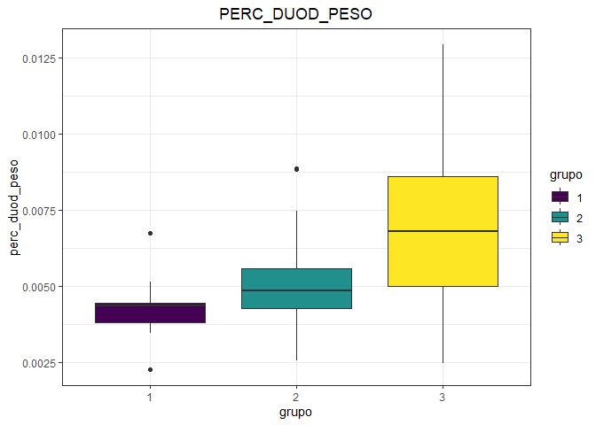<!-- -->

    #> Analysis of Variance Table
    #> 
    #> Response: y
    #>           Df     Sum Sq    Mean Sq F value   Pr(>F)   
    #> grupo      2 6.1903e-05 3.0952e-05  7.0923 0.002102 **
    #> Residuals 45 1.9639e-04 4.3641e-06                    
    #> ---
    #> Signif. codes:  0 '***' 0.001 '**' 0.01 '*' 0.05 '.' 0.1 ' ' 1
    #> 
    #> Study: modelo ~ "grupo"
    #> 
    #> LSD t Test for y 
    #> 
    #> Mean Square Error:  4.364142e-06 
    #> 
    #> grupo,  means and individual ( 95 %) CI
    #> 
    #>             y          std  r         LCL         UCL         Min         Max
    #> 1 0.004249785 0.0009263701 16 0.003197893 0.005301677 0.002264151 0.006746627
    #> 2 0.005280093 0.0017820584 16 0.004228201 0.006331985 0.002553191 0.008880342
    #> 3 0.007002636 0.0030097395 16 0.005950744 0.008054528 0.002453988 0.012932331
    #> 
    #> Alpha: 0.05 ; DF Error: 45
    #> Critical Value of t: 2.014103 
    #> 
    #> least Significant Difference: 0.0014876 
    #> 
    #> Treatments with the same letter are not significantly different.
    #> 
    #>             y groups
    #> 3 0.007002636      a
    #> 2 0.005280093      b
    #> 1 0.004249785      b
    #> $statistics
    #>        MSerror Df        Mean       CV  t.value       LSD
    #>   4.364142e-06 45 0.005510838 37.90808 2.014103 0.0014876
    #> 
    #> $parameters
    #>         test p.ajusted name.t ntr alpha
    #>   Fisher-LSD      none  grupo   3  0.05
    #> 
    #> $means
    #>             y          std  r         LCL         UCL         Min         Max
    #> 1 0.004249785 0.0009263701 16 0.003197893 0.005301677 0.002264151 0.006746627
    #> 2 0.005280093 0.0017820584 16 0.004228201 0.006331985 0.002553191 0.008880342
    #> 3 0.007002636 0.0030097395 16 0.005950744 0.008054528 0.002453988 0.012932331
    #>           Q25         Q50         Q75
    #> 1 0.003802141 0.004357739 0.004451087
    #> 2 0.004259880 0.004845602 0.005575116
    #> 3 0.004979976 0.006810815 0.008612762
    #> 
    #> $comparison
    #> NULL
    #> 
    #> $groups
    #>             y groups
    #> 3 0.007002636      a
    #> 2 0.005280093      b
    #> 1 0.004249785      b
    #> 
    #> attr(,"class")
    #> [1] "group"

<!-- --><!-- -->

    #> Analysis of Variance Table
    #> 
    #> Response: y
    #>           Df  Sum Sq Mean Sq F value    Pr(>F)    
    #> grupo      2  89.379  44.690   8.354 0.0008215 ***
    #> Residuals 45 240.726   5.349                      
    #> ---
    #> Signif. codes:  0 '***' 0.001 '**' 0.01 '*' 0.05 '.' 0.1 ' ' 1
    #> 
    #> Study: modelo ~ "grupo"
    #> 
    #> LSD t Test for y 
    #> 
    #> Mean Square Error:  5.349464 
    #> 
    #> grupo,  means and individual ( 95 %) CI
    #> 
    #>          y      std  r      LCL      UCL Min   Max
    #> 1 7.455000 3.217705 16 6.290400 8.619600   2 13.00
    #> 2 4.909375 1.755686 16 3.744775 6.073975   2  9.67
    #> 3 4.306250 1.616271 16 3.141650 5.470850   2  6.84
    #> 
    #> Alpha: 0.05 ; DF Error: 45
    #> Critical Value of t: 2.014103 
    #> 
    #> least Significant Difference: 1.646994 
    #> 
    #> Treatments with the same letter are not significantly different.
    #> 
    #>          y groups
    #> 1 7.455000      a
    #> 2 4.909375      b
    #> 3 4.306250      b
    #> $statistics
    #>    MSerror Df     Mean       CV  t.value      LSD
    #>   5.349464 45 5.556875 41.62215 2.014103 1.646994
    #> 
    #> $parameters
    #>         test p.ajusted name.t ntr alpha
    #>   Fisher-LSD      none  grupo   3  0.05
    #> 
    #> $means
    #>          y      std  r      LCL      UCL Min   Max    Q25   Q50    Q75
    #> 1 7.455000 3.217705 16 6.290400 8.619600   2 13.00 6.0000 6.230 8.8400
    #> 2 4.909375 1.755686 16 3.744775 6.073975   2  9.67 4.0000 4.305 6.0000
    #> 3 4.306250 1.616271 16 3.141650 5.470850   2  6.84 2.9525 4.755 5.3475
    #> 
    #> $comparison
    #> NULL
    #> 
    #> $groups
    #>          y groups
    #> 1 7.455000      a
    #> 2 4.909375      b
    #> 3 4.306250      b
    #> 
    #> attr(,"class")
    #> [1] "group"

<!-- --><!-- -->

    #> Analysis of Variance Table
    #> 
    #> Response: y
    #>           Df     Sum Sq    Mean Sq F value Pr(>F)
    #> grupo      2 3.0690e-06 1.5347e-06  1.6999 0.1942
    #> Residuals 45 4.0629e-05 9.0287e-07               
    #> 
    #> Study: modelo ~ "grupo"
    #> 
    #> LSD t Test for y 
    #> 
    #> Mean Square Error:  9.028668e-07 
    #> 
    #> grupo,  means and individual ( 95 %) CI
    #> 
    #>             y          std  r         LCL         UCL          Min         Max
    #> 1 0.002483608 0.0009176315 16 0.002005161 0.002962055 0.0007547170 0.004114650
    #> 2 0.002348757 0.0007169087 16 0.001870310 0.002827204 0.0008510638 0.004114894
    #> 3 0.002939753 0.0011630110 16 0.002461306 0.003418200 0.0012269939 0.005283757
    #> 
    #> Alpha: 0.05 ; DF Error: 45
    #> Critical Value of t: 2.014103 
    #> 
    #> least Significant Difference: 0.0006766259 
    #> 
    #> Treatments with the same letter are not significantly different.
    #> 
    #>             y groups
    #> 3 0.002939753      a
    #> 1 0.002483608      a
    #> 2 0.002348757      a
    #> $statistics
    #>        MSerror Df        Mean       CV  t.value          LSD
    #>   9.028668e-07 45 0.002590706 36.67699 2.014103 0.0006766259
    #> 
    #> $parameters
    #>         test p.ajusted name.t ntr alpha
    #>   Fisher-LSD      none  grupo   3  0.05
    #> 
    #> $means
    #>             y          std  r         LCL         UCL          Min         Max
    #> 1 0.002483608 0.0009176315 16 0.002005161 0.002962055 0.0007547170 0.004114650
    #> 2 0.002348757 0.0007169087 16 0.001870310 0.002827204 0.0008510638 0.004114894
    #> 3 0.002939753 0.0011630110 16 0.002461306 0.003418200 0.0012269939 0.005283757
    #>           Q25         Q50         Q75
    #> 1 0.001926712 0.002292596 0.003003933
    #> 2 0.002009624 0.002203863 0.002667324
    #> 3 0.002177977 0.003018203 0.003616869
    #> 
    #> $comparison
    #> NULL
    #> 
    #> $groups
    #>             y groups
    #> 3 0.002939753      a
    #> 1 0.002483608      a
    #> 2 0.002348757      a
    #> 
    #> attr(,"class")
    #> [1] "group"

<!-- --><!-- -->

    #> Analysis of Variance Table
    #> 
    #> Response: y
    #>           Df Sum Sq Mean Sq F value    Pr(>F)    
    #> grupo      2 2708.5 1354.26  10.037 0.0002486 ***
    #> Residuals 45 6071.4  134.92                      
    #> ---
    #> Signif. codes:  0 '***' 0.001 '**' 0.01 '*' 0.05 '.' 0.1 ' ' 1
    #> 
    #> Study: modelo ~ "grupo"
    #> 
    #> LSD t Test for y 
    #> 
    #> Mean Square Error:  134.9206 
    #> 
    #> grupo,  means and individual ( 95 %) CI
    #> 
    #>          y      std  r      LCL      UCL Min   Max
    #> 1 49.37750  9.54787 16 43.52878 55.22622  38 68.88
    #> 2 40.41562 11.37598 16 34.56690 46.26435  20 64.14
    #> 3 30.97938 13.57156 16 25.13065 36.82810  10 58.88
    #> 
    #> Alpha: 0.05 ; DF Error: 45
    #> Critical Value of t: 2.014103 
    #> 
    #> least Significant Difference: 8.271342 
    #> 
    #> Treatments with the same letter are not significantly different.
    #> 
    #>          y groups
    #> 1 49.37750      a
    #> 2 40.41562      b
    #> 3 30.97938      c
    #> $statistics
    #>    MSerror Df    Mean       CV  t.value      LSD
    #>   134.9206 45 40.2575 28.85309 2.014103 8.271342
    #> 
    #> $parameters
    #>         test p.ajusted name.t ntr alpha
    #>   Fisher-LSD      none  grupo   3  0.05
    #> 
    #> $means
    #>          y      std  r      LCL      UCL Min   Max     Q25    Q50     Q75
    #> 1 49.37750  9.54787 16 43.52878 55.22622  38 68.88 42.0825 46.000 57.4925
    #> 2 40.41562 11.37598 16 34.56690 46.26435  20 64.14 34.8150 39.335 43.8875
    #> 3 30.97938 13.57156 16 25.13065 36.82810  10 58.88 17.5175 34.995 39.2150
    #> 
    #> $comparison
    #> NULL
    #> 
    #> $groups
    #>          y groups
    #> 1 49.37750      a
    #> 2 40.41562      b
    #> 3 30.97938      c
    #> 
    #> attr(,"class")
    #> [1] "group"

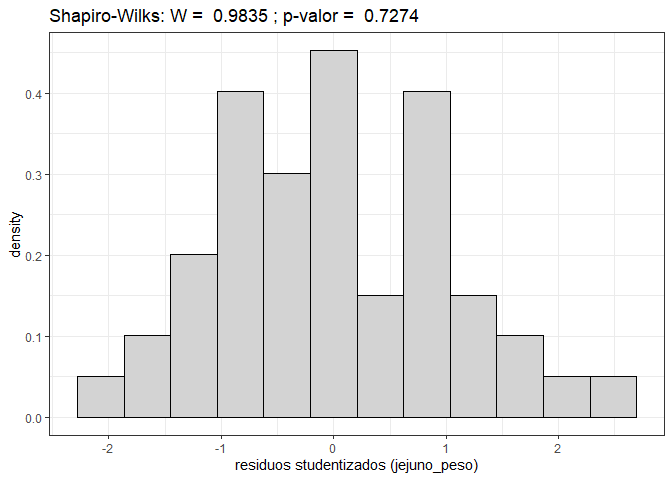<!-- --><!-- -->

    #> Analysis of Variance Table
    #> 
    #> Response: y
    #>           Df     Sum Sq    Mean Sq F value Pr(>F)
    #> grupo      2 0.00014431 7.2154e-05  1.7239 0.1899
    #> Residuals 45 0.00188343 4.1854e-05               
    #> 
    #> Study: modelo ~ "grupo"
    #> 
    #> LSD t Test for y 
    #> 
    #> Mean Square Error:  4.185396e-05 
    #> 
    #> grupo,  means and individual ( 95 %) CI
    #> 
    #>            y         std  r        LCL        UCL         Min        Max
    #> 1 0.01681199 0.003163026 16 0.01355445 0.02006953 0.012600239 0.02339623
    #> 2 0.01964553 0.005816723 16 0.01638799 0.02290307 0.008510638 0.02949853
    #> 3 0.02096868 0.009040071 16 0.01771113 0.02422622 0.006218905 0.03813472
    #> 
    #> Alpha: 0.05 ; DF Error: 45
    #> Critical Value of t: 2.014103 
    #> 
    #> least Significant Difference: 0.00460686 
    #> 
    #> Treatments with the same letter are not significantly different.
    #> 
    #>            y groups
    #> 3 0.02096868      a
    #> 2 0.01964553      a
    #> 1 0.01681199      a
    #> $statistics
    #>        MSerror Df       Mean      CV  t.value        LSD
    #>   4.185396e-05 45 0.01914207 33.7971 2.014103 0.00460686
    #> 
    #> $parameters
    #>         test p.ajusted name.t ntr alpha
    #>   Fisher-LSD      none  grupo   3  0.05
    #> 
    #> $means
    #>            y         std  r        LCL        UCL         Min        Max
    #> 1 0.01681199 0.003163026 16 0.01355445 0.02006953 0.012600239 0.02339623
    #> 2 0.01964553 0.005816723 16 0.01638799 0.02290307 0.008510638 0.02949853
    #> 3 0.02096868 0.009040071 16 0.01771113 0.02422622 0.006218905 0.03813472
    #>          Q25        Q50        Q75
    #> 1 0.01420179 0.01641186 0.01852926
    #> 2 0.01640999 0.01859949 0.02273035
    #> 3 0.01270255 0.02209148 0.02472954
    #> 
    #> $comparison
    #> NULL
    #> 
    #> $groups
    #>            y groups
    #> 3 0.02096868      a
    #> 2 0.01964553      a
    #> 1 0.01681199      a
    #> 
    #> attr(,"class")
    #> [1] "group"

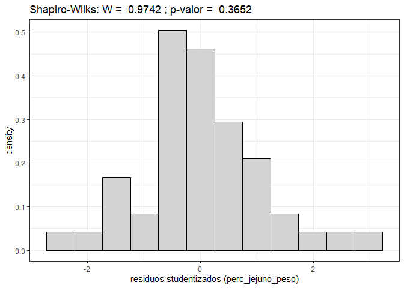<!-- --><!-- -->

    #> Analysis of Variance Table
    #> 
    #> Response: y
    #>           Df Sum Sq Mean Sq F value    Pr(>F)    
    #> grupo      2  11609  5804.4  18.718 1.215e-06 ***
    #> Residuals 45  13954   310.1                      
    #> ---
    #> Signif. codes:  0 '***' 0.001 '**' 0.01 '*' 0.05 '.' 0.1 ' ' 1
    #> 
    #> Study: modelo ~ "grupo"
    #> 
    #> LSD t Test for y 
    #> 
    #> Mean Square Error:  310.0988 
    #> 
    #> grupo,  means and individual ( 95 %) CI
    #> 
    #>          y      std  r      LCL      UCL   Min   Max
    #> 1 62.90125 18.15692 16 54.03435 71.76815 38.48 90.00
    #> 2 36.60563 11.62372 16 27.73873 45.47252 16.00 54.14
    #> 3 25.88437 21.57572 16 17.01748 34.75127  2.00 87.66
    #> 
    #> Alpha: 0.05 ; DF Error: 45
    #> Critical Value of t: 2.014103 
    #> 
    #> least Significant Difference: 12.53969 
    #> 
    #> Treatments with the same letter are not significantly different.
    #> 
    #>          y groups
    #> 1 62.90125      a
    #> 2 36.60563      b
    #> 3 25.88437      b
    #> $statistics
    #>    MSerror Df     Mean       CV  t.value      LSD
    #>   310.0988 45 41.79708 42.13122 2.014103 12.53969
    #> 
    #> $parameters
    #>         test p.ajusted name.t ntr alpha
    #>   Fisher-LSD      none  grupo   3  0.05
    #> 
    #> $means
    #>          y      std  r      LCL      UCL   Min   Max     Q25    Q50     Q75
    #> 1 62.90125 18.15692 16 54.03435 71.76815 38.48 90.00 47.5000 63.090 76.5825
    #> 2 36.60563 11.62372 16 27.73873 45.47252 16.00 54.14 30.3875 37.395 47.2275
    #> 3 25.88437 21.57572 16 17.01748 34.75127  2.00 87.66 11.7950 22.395 32.4450
    #> 
    #> $comparison
    #> NULL
    #> 
    #> $groups
    #>          y groups
    #> 1 62.90125      a
    #> 2 36.60563      b
    #> 3 25.88437      b
    #> 
    #> attr(,"class")
    #> [1] "group"

<!-- --><!-- -->

    #> Analysis of Variance Table
    #> 
    #> Response: y
    #>           Df    Sum Sq    Mean Sq F value Pr(>F)
    #> grupo      2 0.0001908 9.5405e-05  1.3165 0.2782
    #> Residuals 45 0.0032611 7.2468e-05               
    #> 
    #> Study: modelo ~ "grupo"
    #> 
    #> LSD t Test for y 
    #> 
    #> Mean Square Error:  7.246785e-05 
    #> 
    #> grupo,  means and individual ( 95 %) CI
    #> 
    #>            y         std  r        LCL        UCL         Min        Max
    #> 1 0.02128884 0.005712573 16 0.01700243 0.02557526 0.011987539 0.03244838
    #> 2 0.01763841 0.005449149 16 0.01335199 0.02192483 0.006808511 0.02759382
    #> 3 0.01665395 0.012452986 16 0.01236753 0.02094037 0.001865672 0.05043728
    #> 
    #> Alpha: 0.05 ; DF Error: 45
    #> Critical Value of t: 2.014103 
    #> 
    #> least Significant Difference: 0.00606191 
    #> 
    #> Treatments with the same letter are not significantly different.
    #> 
    #>            y groups
    #> 1 0.02128884      a
    #> 2 0.01763841      a
    #> 3 0.01665395      a
    #> $statistics
    #>        MSerror Df       Mean       CV  t.value        LSD
    #>   7.246785e-05 45 0.01852707 45.94794 2.014103 0.00606191
    #> 
    #> $parameters
    #>         test p.ajusted name.t ntr alpha
    #>   Fisher-LSD      none  grupo   3  0.05
    #> 
    #> $means
    #>            y         std  r        LCL        UCL         Min        Max
    #> 1 0.02128884 0.005712573 16 0.01700243 0.02557526 0.011987539 0.03244838
    #> 2 0.01763841 0.005449149 16 0.01335199 0.02192483 0.006808511 0.02759382
    #> 3 0.01665395 0.012452986 16 0.01236753 0.02094037 0.001865672 0.05043728
    #>           Q25        Q50        Q75
    #> 1 0.017999205 0.02084642 0.02299480
    #> 2 0.014499963 0.01796119 0.02069741
    #> 3 0.009564175 0.01454642 0.02217803
    #> 
    #> $comparison
    #> NULL
    #> 
    #> $groups
    #>            y groups
    #> 1 0.02128884      a
    #> 2 0.01763841      a
    #> 3 0.01665395      a
    #> 
    #> attr(,"class")
    #> [1] "group"

<!-- -->

# DXA - 29 -07 (2).xlsx

``` r
dados <- read_xlsx("data/DXA - 29 -07 (2).xlsx",na="NA") %>% 
  clean_names()
glimpse(dados)
#> Rows: 48
#> Columns: 9
#> $ grupo            <dbl> 1, 1, 1, 1, 1, 1, 1, 1, 1, 1, 1, 1, 1, 1, 1, 1, 2, 2,~
#> $ repeticao        <dbl> 1, 2, 3, 4, 5, 6, 7, 8, 9, 10, 11, 12, 13, 14, 15, 16~
#> $ sexo             <chr> "Macho", "Macho", "Macho", "Macho", "Macho", "Macho",~
#> $ linhagem         <chr> "Ross", "Ross", "Ross", "Ross", "Cobb", "Cobb", "Cobb~
#> $ peso             <dbl> 3.140, 3.342, 3.186, 2.668, 3.070, 2.586, 2.900, 2.64~
#> $ dmo              <dbl> 0.13, 0.15, 0.12, 0.13, 0.13, 0.15, 0.12, 0.15, 0.13,~
#> $ cont_min_ossea   <dbl> 44.30, 52.41, 38.52, 41.06, 36.70, 43.12, 33.50, 40.3~
#> $ massa_de_gordura <dbl> 642.8, 691.1, 649.9, 596.0, 451.6, 456.6, 417.2, 435.~
#> $ massa_magra      <dbl> 2554.5, 3391.0, 2584.8, 2517.4, 2161.6, 2554.6, 2518.~
```

``` r
variaveis <- dados[5:length(dados)] %>% names()
grupo <-dados %>% pull(grupo) %>% as_factor()
```

## Anova

``` r
for(i in seq_along(variaveis)){
  nome_var <- variaveis[i]
  da <- dados %>% select(grupo, nome_var) %>% drop_na()
  grupo <- da  %>% pull(grupo) %>% as_factor()
  y <- da %>% pull(nome_var)
  my_boxplot <- tibble(grupo, y) %>% 
    ggplot(aes(grupo, y, fill=grupo)) +
    geom_boxplot() +
    theme_bw()+
    labs(y=nome_var, title = str_to_upper(nome_var)) +
    scale_fill_viridis_d()+
    theme(plot.title = element_text(hjust=.5))
  print(my_boxplot)
  
  modelo <- aov(y ~grupo)
  print(anova(modelo))
  
  teste_t <- LSD.test(modelo,"grupo",console = TRUE)
  print(teste_t)
    rs <- rstudent(modelo)
  my_hist <- tibble(rs) %>% 
    ggplot(aes(x=rs, y=..density..)) +
    geom_histogram(bins=12,color="black",fill="lightgray") +
    theme_bw() +
    labs(title= paste("Shapiro-Wilks: W = ", 
                      shapiro.test(rs)$statistic %>% round(digits = 4),
                      "; p-valor = ",
                      shapiro.test(rs)$p.value %>% round(digits = 4)
                      ),
         x=paste0("residuos studentizados (",nome_var,")"))
  print(my_hist)
}
```

<!-- -->

    #> Analysis of Variance Table
    #> 
    #> Response: y
    #>           Df  Sum Sq Mean Sq F value    Pr(>F)    
    #> grupo      2 17.5045  8.7523  98.645 < 2.2e-16 ***
    #> Residuals 45  3.9926  0.0887                      
    #> ---
    #> Signif. codes:  0 '***' 0.001 '**' 0.01 '*' 0.05 '.' 0.1 ' ' 1
    #> 
    #> Study: modelo ~ "grupo"
    #> 
    #> LSD t Test for y 
    #> 
    #> Mean Square Error:  0.08872514 
    #> 
    #> grupo,  means and individual ( 95 %) CI
    #> 
    #>          y       std  r      LCL      UCL   Min   Max
    #> 1 2.957063 0.3647588 16 2.807078 3.107047 2.268 3.672
    #> 2 2.090187 0.2866680 16 1.940203 2.240172 1.356 2.420
    #> 3 1.485625 0.2257163 16 1.335641 1.635609 1.022 1.812
    #> 
    #> Alpha: 0.05 ; DF Error: 45
    #> Critical Value of t: 2.014103 
    #> 
    #> least Significant Difference: 0.2121095 
    #> 
    #> Treatments with the same letter are not significantly different.
    #> 
    #>          y groups
    #> 1 2.957063      a
    #> 2 2.090187      b
    #> 3 1.485625      c
    #> $statistics
    #>      MSerror Df     Mean       CV  t.value       LSD
    #>   0.08872514 45 2.177625 13.67856 2.014103 0.2121095
    #> 
    #> $parameters
    #>         test p.ajusted name.t ntr alpha
    #>   Fisher-LSD      none  grupo   3  0.05
    #> 
    #> $means
    #>          y       std  r      LCL      UCL   Min   Max     Q25   Q50   Q75
    #> 1 2.957063 0.3647588 16 2.807078 3.107047 2.268 3.672 2.66350 2.985 3.192
    #> 2 2.090187 0.2866680 16 1.940203 2.240172 1.356 2.420 1.94225 2.162 2.340
    #> 3 1.485625 0.2257163 16 1.335641 1.635609 1.022 1.812 1.31600 1.507 1.672
    #> 
    #> $comparison
    #> NULL
    #> 
    #> $groups
    #>          y groups
    #> 1 2.957063      a
    #> 2 2.090187      b
    #> 3 1.485625      c
    #> 
    #> attr(,"class")
    #> [1] "group"

<!-- --><!-- -->

    #> Analysis of Variance Table
    #> 
    #> Response: y
    #>           Df    Sum Sq    Mean Sq F value  Pr(>F)  
    #> grupo      2 0.0014542 0.00072708  4.2286 0.02076 *
    #> Residuals 45 0.0077375 0.00017194                  
    #> ---
    #> Signif. codes:  0 '***' 0.001 '**' 0.01 '*' 0.05 '.' 0.1 ' ' 1
    #> 
    #> Study: modelo ~ "grupo"
    #> 
    #> LSD t Test for y 
    #> 
    #> Mean Square Error:  0.0001719444 
    #> 
    #> grupo,  means and individual ( 95 %) CI
    #> 
    #>          y        std  r       LCL       UCL  Min  Max
    #> 1 0.133125 0.01195478 16 0.1265224 0.1397276 0.11 0.15
    #> 2 0.120625 0.01436141 16 0.1140224 0.1272276 0.08 0.14
    #> 3 0.122500 0.01290994 16 0.1158974 0.1291026 0.09 0.14
    #> 
    #> Alpha: 0.05 ; DF Error: 45
    #> Critical Value of t: 2.014103 
    #> 
    #> least Significant Difference: 0.009337505 
    #> 
    #> Treatments with the same letter are not significantly different.
    #> 
    #>          y groups
    #> 1 0.133125      a
    #> 3 0.122500      b
    #> 2 0.120625      b
    #> $statistics
    #>        MSerror Df      Mean       CV  t.value         LSD
    #>   0.0001719444 45 0.1254167 10.45536 2.014103 0.009337505
    #> 
    #> $parameters
    #>         test p.ajusted name.t ntr alpha
    #>   Fisher-LSD      none  grupo   3  0.05
    #> 
    #> $means
    #>          y        std  r       LCL       UCL  Min  Max    Q25  Q50    Q75
    #> 1 0.133125 0.01195478 16 0.1265224 0.1397276 0.11 0.15 0.1275 0.13 0.1400
    #> 2 0.120625 0.01436141 16 0.1140224 0.1272276 0.08 0.14 0.1200 0.12 0.1225
    #> 3 0.122500 0.01290994 16 0.1158974 0.1291026 0.09 0.14 0.1200 0.12 0.1300
    #> 
    #> $comparison
    #> NULL
    #> 
    #> $groups
    #>          y groups
    #> 1 0.133125      a
    #> 3 0.122500      b
    #> 2 0.120625      b
    #> 
    #> attr(,"class")
    #> [1] "group"

<!-- --><!-- -->

    #> Analysis of Variance Table
    #> 
    #> Response: y
    #>           Df Sum Sq Mean Sq F value    Pr(>F)    
    #> grupo      2 2568.9  1284.5  38.114 2.071e-10 ***
    #> Residuals 45 1516.5    33.7                      
    #> ---
    #> Signif. codes:  0 '***' 0.001 '**' 0.01 '*' 0.05 '.' 0.1 ' ' 1
    #> 
    #> Study: modelo ~ "grupo"
    #> 
    #> LSD t Test for y 
    #> 
    #> Mean Square Error:  33.70081 
    #> 
    #> grupo,  means and individual ( 95 %) CI
    #> 
    #>          y      std  r      LCL      UCL   Min   Max
    #> 1 40.15937 6.040759 16 37.23629 43.08246 27.79 52.41
    #> 2 27.62562 4.924108 16 24.70254 30.54871 16.10 36.16
    #> 3 22.80125 6.353331 16 19.87816 25.72434 13.96 33.89
    #> 
    #> Alpha: 0.05 ; DF Error: 45
    #> Critical Value of t: 2.014103 
    #> 
    #> least Significant Difference: 4.133871 
    #> 
    #> Treatments with the same letter are not significantly different.
    #> 
    #>          y groups
    #> 1 40.15937      a
    #> 2 27.62562      b
    #> 3 22.80125      c
    #> $statistics
    #>    MSerror Df     Mean       CV  t.value      LSD
    #>   33.70081 45 30.19542 19.22557 2.014103 4.133871
    #> 
    #> $parameters
    #>         test p.ajusted name.t ntr alpha
    #>   Fisher-LSD      none  grupo   3  0.05
    #> 
    #> $means
    #>          y      std  r      LCL      UCL   Min   Max     Q25    Q50     Q75
    #> 1 40.15937 6.040759 16 37.23629 43.08246 27.79 52.41 36.2225 40.700 44.2625
    #> 2 27.62562 4.924108 16 24.70254 30.54871 16.10 36.16 25.5725 27.855 29.6175
    #> 3 22.80125 6.353331 16 19.87816 25.72434 13.96 33.89 18.0350 21.215 28.4450
    #> 
    #> $comparison
    #> NULL
    #> 
    #> $groups
    #>          y groups
    #> 1 40.15937      a
    #> 2 27.62562      b
    #> 3 22.80125      c
    #> 
    #> attr(,"class")
    #> [1] "group"

<!-- --><!-- -->

    #> Analysis of Variance Table
    #> 
    #> Response: y
    #>           Df Sum Sq Mean Sq F value    Pr(>F)    
    #> grupo      2 892148  446074  45.721 1.449e-11 ***
    #> Residuals 45 439045    9757                      
    #> ---
    #> Signif. codes:  0 '***' 0.001 '**' 0.01 '*' 0.05 '.' 0.1 ' ' 1
    #> 
    #> Study: modelo ~ "grupo"
    #> 
    #> LSD t Test for y 
    #> 
    #> Mean Square Error:  9756.553 
    #> 
    #> grupo,  means and individual ( 95 %) CI
    #> 
    #>          y       std  r      LCL      UCL   Min   Max
    #> 1 590.1375 118.89026 16 540.4016 639.8734 417.2 757.0
    #> 2 369.0625  80.09372 16 319.3266 418.7984 217.6 473.8
    #> 3 262.8438  93.37965 16 213.1079 312.5796 126.6 542.2
    #> 
    #> Alpha: 0.05 ; DF Error: 45
    #> Critical Value of t: 2.014103 
    #> 
    #> least Significant Difference: 70.33718 
    #> 
    #> Treatments with the same letter are not significantly different.
    #> 
    #>          y groups
    #> 1 590.1375      a
    #> 2 369.0625      b
    #> 3 262.8438      c
    #> $statistics
    #>    MSerror Df     Mean       CV  t.value      LSD
    #>   9756.553 45 407.3479 24.24838 2.014103 70.33718
    #> 
    #> $parameters
    #>         test p.ajusted name.t ntr alpha
    #>   Fisher-LSD      none  grupo   3  0.05
    #> 
    #> $means
    #>          y       std  r      LCL      UCL   Min   Max     Q25    Q50     Q75
    #> 1 590.1375 118.89026 16 540.4016 639.8734 417.2 757.0 455.350 619.40 668.675
    #> 2 369.0625  80.09372 16 319.3266 418.7984 217.6 473.8 360.975 375.90 415.500
    #> 3 262.8438  93.37965 16 213.1079 312.5796 126.6 542.2 207.325 247.15 291.450
    #> 
    #> $comparison
    #> NULL
    #> 
    #> $groups
    #>          y groups
    #> 1 590.1375      a
    #> 2 369.0625      b
    #> 3 262.8438      c
    #> 
    #> attr(,"class")
    #> [1] "group"

<!-- --><!-- -->

    #> Analysis of Variance Table
    #> 
    #> Response: y
    #>           Df   Sum Sq Mean Sq F value    Pr(>F)    
    #> grupo      2 14928080 7464040   91.69 < 2.2e-16 ***
    #> Residuals 45  3663224   81405                      
    #> ---
    #> Signif. codes:  0 '***' 0.001 '**' 0.01 '*' 0.05 '.' 0.1 ' ' 1
    #> 
    #> Study: modelo ~ "grupo"
    #> 
    #> LSD t Test for y 
    #> 
    #> Mean Square Error:  81404.97 
    #> 
    #> grupo,  means and individual ( 95 %) CI
    #> 
    #>          y      std  r      LCL      UCL    Min    Max
    #> 1 2486.981 364.6258 16 2343.317 2630.645 1883.6 3391.0
    #> 2 1568.281 288.6471 16 1424.617 1711.945 1078.9 1955.7
    #> 3 1152.131 167.1699 16 1008.467 1295.795  880.4 1492.5
    #> 
    #> Alpha: 0.05 ; DF Error: 45
    #> Critical Value of t: 2.014103 
    #> 
    #> least Significant Difference: 203.1712 
    #> 
    #> Treatments with the same letter are not significantly different.
    #> 
    #>          y groups
    #> 1 2486.981      a
    #> 2 1568.281      b
    #> 3 1152.131      c
    #> $statistics
    #>    MSerror Df     Mean       CV  t.value      LSD
    #>   81404.97 45 1735.798 16.43714 2.014103 203.1712
    #> 
    #> $parameters
    #>         test p.ajusted name.t ntr alpha
    #>   Fisher-LSD      none  grupo   3  0.05
    #> 
    #> $means
    #>          y      std  r      LCL      UCL    Min    Max     Q25     Q50      Q75
    #> 1 2486.981 364.6258 16 2343.317 2630.645 1883.6 3391.0 2204.90 2525.45 2594.575
    #> 2 1568.281 288.6471 16 1424.617 1711.945 1078.9 1955.7 1465.05 1581.85 1753.575
    #> 3 1152.131 167.1699 16 1008.467 1295.795  880.4 1492.5 1047.00 1138.50 1236.900
    #> 
    #> $comparison
    #> NULL
    #> 
    #> $groups
    #>          y groups
    #> 1 2486.981      a
    #> 2 1568.281      b
    #> 3 1152.131      c
    #> 
    #> attr(,"class")
    #> [1] "group"

<!-- -->

# Medidas e peso dos membros - 27-07

``` r
dados <- read_xlsx("data/Medidas e peso dos membros - 27-07.xlsx",na="NA") %>% 
  clean_names()
glimpse(dados)
#> Rows: 48
#> Columns: 14
#> $ grupo                  <dbl> 1, 1, 1, 1, 1, 1, 1, 1, 1, 1, 1, 1, 1, 1, 1, 1,~
#> $ repeticao              <dbl> 1, 2, 3, 4, 5, 6, 7, 8, 9, 10, 11, 12, 13, 14, ~
#> $ sexo                   <chr> "Macho", "Macho", "Macho", "Macho", "Macho", "M~
#> $ linhagem               <chr> "Ross", "Ross", "Ross", "Ross", "Cobb", "Cobb",~
#> $ p_tibia                <dbl> 24.80, 35.30, 22.90, 25.30, NA, 31.20, NA, 25.2~
#> $ p_femur                <dbl> 15.60, 23.30, 15.30, 16.20, NA, 20.50, NA, 16.9~
#> $ c_tibia                <dbl> 13.0, 13.0, 10.9, 12.4, NA, 13.0, 11.0, 11.4, 1~
#> $ d_diafise_tibia        <dbl> 3.8, 3.5, 3.0, 4.0, NA, 3.9, 2.7, 3.0, 3.7, 2.7~
#> $ d_epifise_prox_tibia   <dbl> 8.9, 10.2, 9.8, 11.0, NA, 9.5, 8.1, 8.4, 8.3, 6~
#> $ d_epifise_distal_tibia <dbl> 7.8, 9.4, 9.0, 8.5, NA, 9.0, 7.9, 8.0, 7.5, 7.3~
#> $ c_do_femur             <dbl> 9.0, 8.8, 8.2, 8.0, NA, 8.0, 7.8, 8.3, 7.6, 7.0~
#> $ d_diafise_femur        <dbl> 3.9, 4.0, 3.0, 3.6, NA, 4.0, 3.7, 3.2, 3.5, 3.0~
#> $ d_epifise_prox_femur   <dbl> 7.0, 8.3, 7.9, 8.0, NA, 7.5, 7.3, 7.3, 7.3, 6.3~
#> $ d_epifise_distal_femur <dbl> 7.8, 9.2, 9.0, 9.1, NA, 9.0, 8.0, 8.0, 7.7, 5.8~
```

``` r
variaveis <- dados[5:length(dados)] %>% names()
grupo <-dados %>% pull(grupo) %>% as_factor()
```

## Anova

``` r
for(i in seq_along(variaveis)){
  nome_var <- variaveis[i]
  da <- dados %>% select(grupo, nome_var) %>% drop_na()
  grupo <- da  %>% pull(grupo) %>% as_factor()
  y <- da %>% pull(nome_var)
  my_boxplot <- tibble(grupo, y) %>% 
    ggplot(aes(grupo, y, fill=grupo)) +
    geom_boxplot() +
    theme_bw()+
    labs(y=nome_var, title = str_to_upper(nome_var)) +
    scale_fill_viridis_d()+
    theme(plot.title = element_text(hjust=.5))
  print(my_boxplot)
  
  modelo <- aov(y ~grupo)
  print(anova(modelo))
  
  teste_t <- LSD.test(modelo,"grupo",console = TRUE)
  print(teste_t)
    rs <- rstudent(modelo)
  my_hist <- tibble(rs) %>% 
    ggplot(aes(x=rs, y=..density..)) +
    geom_histogram(bins=12,color="black",fill="lightgray") +
    theme_bw() +
    labs(title= paste("Shapiro-Wilks: W = ", 
                      shapiro.test(rs)$statistic %>% round(digits = 4),
                      "; p-valor = ",
                      shapiro.test(rs)$p.value %>% round(digits = 4)
                      ),
         x=paste0("residuos studentizados (",nome_var,")"))
  print(my_hist)
}
```

<!-- -->

    #> Analysis of Variance Table
    #> 
    #> Response: y
    #>           Df Sum Sq Mean Sq F value    Pr(>F)    
    #> grupo      2 289.74 144.870  8.8592 0.0006342 ***
    #> Residuals 41 670.46  16.353                      
    #> ---
    #> Signif. codes:  0 '***' 0.001 '**' 0.01 '*' 0.05 '.' 0.1 ' ' 1
    #> 
    #> Study: modelo ~ "grupo"
    #> 
    #> LSD t Test for y 
    #> 
    #> Mean Square Error:  16.35259 
    #> 
    #> grupo,  means and individual ( 95 %) CI
    #> 
    #>          y      std  r      LCL      UCL  Min  Max
    #> 1 23.53857 5.102408 14 21.35593 25.72121 14.8 35.3
    #> 2 18.52857 3.155495 14 16.34593 20.71121 12.9 24.5
    #> 3 17.68688 3.674813 16 15.64520 19.72855 10.0 24.3
    #> 
    #> Alpha: 0.05 ; DF Error: 41
    #> Critical Value of t: 2.019541 
    #> 
    #> Groups according to probability of means differences and alpha level( 0.05 )
    #> 
    #> Treatments with the same letter are not significantly different.
    #> 
    #>          y groups
    #> 1 23.53857      a
    #> 2 18.52857      b
    #> 3 17.68688      b
    #> $statistics
    #>    MSerror Df     Mean      CV
    #>   16.35259 41 19.81659 20.4063
    #> 
    #> $parameters
    #>         test p.ajusted name.t ntr alpha
    #>   Fisher-LSD      none  grupo   3  0.05
    #> 
    #> $means
    #>          y      std  r      LCL      UCL  Min  Max     Q25    Q50    Q75
    #> 1 23.53857 5.102408 14 21.35593 25.72121 14.8 35.3 21.0325 22.615 25.115
    #> 2 18.52857 3.155495 14 16.34593 20.71121 12.9 24.5 16.7750 18.875 20.375
    #> 3 17.68688 3.674813 16 15.64520 19.72855 10.0 24.3 15.0500 18.480 20.085
    #> 
    #> $comparison
    #> NULL
    #> 
    #> $groups
    #>          y groups
    #> 1 23.53857      a
    #> 2 18.52857      b
    #> 3 17.68688      b
    #> 
    #> attr(,"class")
    #> [1] "group"

<!-- --><!-- -->

    #> Analysis of Variance Table
    #> 
    #> Response: y
    #>           Df  Sum Sq Mean Sq F value  Pr(>F)  
    #> grupo      2  63.156 31.5780  5.0185 0.01123 *
    #> Residuals 41 257.983  6.2923                  
    #> ---
    #> Signif. codes:  0 '***' 0.001 '**' 0.01 '*' 0.05 '.' 0.1 ' ' 1
    #> 
    #> Study: modelo ~ "grupo"
    #> 
    #> LSD t Test for y 
    #> 
    #> Mean Square Error:  6.292279 
    #> 
    #> grupo,  means and individual ( 95 %) CI
    #> 
    #>          y      std  r      LCL      UCL   Min   Max
    #> 1 14.97857 3.609847 14 13.62465 16.33249 10.74 23.30
    #> 2 13.34214 1.973198 14 11.98822 14.69606 10.60 18.80
    #> 3 12.07188 1.590908 16 10.80540 13.33835  8.80 14.25
    #> 
    #> Alpha: 0.05 ; DF Error: 41
    #> Critical Value of t: 2.019541 
    #> 
    #> Groups according to probability of means differences and alpha level( 0.05 )
    #> 
    #> Treatments with the same letter are not significantly different.
    #> 
    #>          y groups
    #> 1 14.97857      a
    #> 2 13.34214     ab
    #> 3 12.07188      b
    #> $statistics
    #>    MSerror Df     Mean       CV
    #>   6.292279 41 13.40091 18.71844
    #> 
    #> $parameters
    #>         test p.ajusted name.t ntr alpha
    #>   Fisher-LSD      none  grupo   3  0.05
    #> 
    #> $means
    #>          y      std  r      LCL      UCL   Min   Max    Q25   Q50    Q75
    #> 1 14.97857 3.609847 14 13.62465 16.33249 10.74 23.30 12.025 15.30 16.070
    #> 2 13.34214 1.973198 14 11.98822 14.69606 10.60 18.80 12.385 13.15 13.970
    #> 3 12.07188 1.590908 16 10.80540 13.33835  8.80 14.25 10.875 12.00 13.075
    #> 
    #> $comparison
    #> NULL
    #> 
    #> $groups
    #>          y groups
    #> 1 14.97857      a
    #> 2 13.34214     ab
    #> 3 12.07188      b
    #> 
    #> attr(,"class")
    #> [1] "group"

<!-- --><!-- -->

    #> Analysis of Variance Table
    #> 
    #> Response: y
    #>           Df Sum Sq Mean Sq F value    Pr(>F)    
    #> grupo      2 32.898 16.4489  16.625 6.003e-06 ***
    #> Residuals 39 38.586  0.9894                      
    #> ---
    #> Signif. codes:  0 '***' 0.001 '**' 0.01 '*' 0.05 '.' 0.1 ' ' 1
    #> 
    #> Study: modelo ~ "grupo"
    #> 
    #> LSD t Test for y 
    #> 
    #> Mean Square Error:  0.9893926 
    #> 
    #> grupo,  means and individual ( 95 %) CI
    #> 
    #>          y       std  r       LCL      UCL  Min  Max
    #> 1 11.88571 0.9670392 14 11.348002 12.42343 10.0 13.0
    #> 2 10.19167 1.2695442 12  9.610871 10.77246  6.6 11.6
    #> 3  9.90000 0.7615773 16  9.397016 10.40298  8.5 11.1
    #> 
    #> Alpha: 0.05 ; DF Error: 39
    #> Critical Value of t: 2.022691 
    #> 
    #> Groups according to probability of means differences and alpha level( 0.05 )
    #> 
    #> Treatments with the same letter are not significantly different.
    #> 
    #>          y groups
    #> 1 11.88571      a
    #> 2 10.19167      b
    #> 3  9.90000      b
    #> $statistics
    #>     MSerror Df     Mean       CV
    #>   0.9893926 39 10.64524 9.343916
    #> 
    #> $parameters
    #>         test p.ajusted name.t ntr alpha
    #>   Fisher-LSD      none  grupo   3  0.05
    #> 
    #> $means
    #>          y       std  r       LCL      UCL  Min  Max   Q25   Q50    Q75
    #> 1 11.88571 0.9670392 14 11.348002 12.42343 10.0 13.0 11.05 12.15 12.700
    #> 2 10.19167 1.2695442 12  9.610871 10.77246  6.6 11.6 10.00 10.50 10.750
    #> 3  9.90000 0.7615773 16  9.397016 10.40298  8.5 11.1  9.45  9.70 10.525
    #> 
    #> $comparison
    #> NULL
    #> 
    #> $groups
    #>          y groups
    #> 1 11.88571      a
    #> 2 10.19167      b
    #> 3  9.90000      b
    #> 
    #> attr(,"class")
    #> [1] "group"

<!-- --><!-- -->

    #> Analysis of Variance Table
    #> 
    #> Response: y
    #>           Df Sum Sq Mean Sq F value Pr(>F)
    #> grupo      2 0.6964 0.34821  1.7303 0.1906
    #> Residuals 39 7.8486 0.20125               
    #> 
    #> Study: modelo ~ "grupo"
    #> 
    #> LSD t Test for y 
    #> 
    #> Mean Square Error:  0.2012454 
    #> 
    #> grupo,  means and individual ( 95 %) CI
    #> 
    #>          y       std  r      LCL      UCL Min Max
    #> 1 3.228571 0.5060079 14 2.986062 3.471081 2.3 4.0
    #> 2 2.925000 0.3441062 12 2.663060 3.186940 2.4 3.6
    #> 3 2.987500 0.4631414 16 2.760653 3.214347 2.5 4.0
    #> 
    #> Alpha: 0.05 ; DF Error: 39
    #> Critical Value of t: 2.022691 
    #> 
    #> Groups according to probability of means differences and alpha level( 0.05 )
    #> 
    #> Treatments with the same letter are not significantly different.
    #> 
    #>          y groups
    #> 1 3.228571      a
    #> 3 2.987500      a
    #> 2 2.925000      a
    #> $statistics
    #>     MSerror Df Mean       CV
    #>   0.2012454 39 3.05 14.70832
    #> 
    #> $parameters
    #>         test p.ajusted name.t ntr alpha
    #>   Fisher-LSD      none  grupo   3  0.05
    #> 
    #> $means
    #>          y       std  r      LCL      UCL Min Max   Q25  Q50   Q75
    #> 1 3.228571 0.5060079 14 2.986062 3.471081 2.3 4.0 2.925 3.20 3.650
    #> 2 2.925000 0.3441062 12 2.663060 3.186940 2.4 3.6 2.800 2.90 3.025
    #> 3 2.987500 0.4631414 16 2.760653 3.214347 2.5 4.0 2.675 2.95 3.200
    #> 
    #> $comparison
    #> NULL
    #> 
    #> $groups
    #>          y groups
    #> 1 3.228571      a
    #> 3 2.987500      a
    #> 2 2.925000      a
    #> 
    #> attr(,"class")
    #> [1] "group"

<!-- --><!-- -->

    #> Analysis of Variance Table
    #> 
    #> Response: y
    #>           Df Sum Sq Mean Sq F value   Pr(>F)    
    #> grupo      2 15.225  7.6126   12.32 7.13e-05 ***
    #> Residuals 39 24.099  0.6179                     
    #> ---
    #> Signif. codes:  0 '***' 0.001 '**' 0.01 '*' 0.05 '.' 0.1 ' ' 1
    #> 
    #> Study: modelo ~ "grupo"
    #> 
    #> LSD t Test for y 
    #> 
    #> Mean Square Error:  0.6179182 
    #> 
    #> grupo,  means and individual ( 95 %) CI
    #> 
    #>          y       std  r      LCL      UCL Min  Max
    #> 1 8.935714 1.0767523 14 8.510771 9.360658 6.9 11.0
    #> 2 7.583333 0.5797073 12 7.124342 8.042325 6.2  8.4
    #> 3 7.725000 0.5960984 16 7.327502 8.122498 7.0  8.9
    #> 
    #> Alpha: 0.05 ; DF Error: 39
    #> Critical Value of t: 2.022691 
    #> 
    #> Groups according to probability of means differences and alpha level( 0.05 )
    #> 
    #> Treatments with the same letter are not significantly different.
    #> 
    #>          y groups
    #> 1 8.935714      a
    #> 3 7.725000      b
    #> 2 7.583333      b
    #> $statistics
    #>     MSerror Df     Mean       CV
    #>   0.6179182 39 8.088095 9.718947
    #> 
    #> $parameters
    #>         test p.ajusted name.t ntr alpha
    #>   Fisher-LSD      none  grupo   3  0.05
    #> 
    #> $means
    #>          y       std  r      LCL      UCL Min  Max   Q25 Q50   Q75
    #> 1 8.935714 1.0767523 14 8.510771 9.360658 6.9 11.0 8.325 9.0 9.575
    #> 2 7.583333 0.5797073 12 7.124342 8.042325 6.2  8.4 7.300 7.6 7.900
    #> 3 7.725000 0.5960984 16 7.327502 8.122498 7.0  8.9 7.225 7.8 8.025
    #> 
    #> $comparison
    #> NULL
    #> 
    #> $groups
    #>          y groups
    #> 1 8.935714      a
    #> 3 7.725000      b
    #> 2 7.583333      b
    #> 
    #> attr(,"class")
    #> [1] "group"

<!-- --><!-- -->

    #> Analysis of Variance Table
    #> 
    #> Response: y
    #>           Df Sum Sq Mean Sq F value    Pr(>F)    
    #> grupo      2 11.858  5.9289  20.533 8.099e-07 ***
    #> Residuals 39 11.261  0.2887                      
    #> ---
    #> Signif. codes:  0 '***' 0.001 '**' 0.01 '*' 0.05 '.' 0.1 ' ' 1
    #> 
    #> Study: modelo ~ "grupo"
    #> 
    #> LSD t Test for y 
    #> 
    #> Mean Square Error:  0.2887477 
    #> 
    #> grupo,  means and individual ( 95 %) CI
    #> 
    #>          y       std  r      LCL      UCL Min Max
    #> 1 8.142857 0.6913913 14 7.852371 8.433343 7.0 9.4
    #> 2 6.825000 0.5065480 12 6.511240 7.138760 6.0 7.7
    #> 3 7.281250 0.3850866 16 7.009525 7.552975 6.7 8.0
    #> 
    #> Alpha: 0.05 ; DF Error: 39
    #> Critical Value of t: 2.022691 
    #> 
    #> Groups according to probability of means differences and alpha level( 0.05 )
    #> 
    #> Treatments with the same letter are not significantly different.
    #> 
    #>          y groups
    #> 1 8.142857      a
    #> 3 7.281250      b
    #> 2 6.825000      c
    #> $statistics
    #>     MSerror Df     Mean       CV
    #>   0.2887477 39 7.438095 7.224329
    #> 
    #> $parameters
    #>         test p.ajusted name.t ntr alpha
    #>   Fisher-LSD      none  grupo   3  0.05
    #> 
    #> $means
    #>          y       std  r      LCL      UCL Min Max  Q25  Q50   Q75
    #> 1 8.142857 0.6913913 14 7.852371 8.433343 7.0 9.4 7.65 8.15 8.475
    #> 2 6.825000 0.5065480 12 6.511240 7.138760 6.0 7.7 6.65 6.85 7.100
    #> 3 7.281250 0.3850866 16 7.009525 7.552975 6.7 8.0 7.15 7.30 7.300
    #> 
    #> $comparison
    #> NULL
    #> 
    #> $groups
    #>          y groups
    #> 1 8.142857      a
    #> 3 7.281250      b
    #> 2 6.825000      c
    #> 
    #> attr(,"class")
    #> [1] "group"

<!-- --><!-- -->

    #> Analysis of Variance Table
    #> 
    #> Response: y
    #>           Df Sum Sq Mean Sq F value    Pr(>F)    
    #> grupo      2 9.1268  4.5634  18.002 2.895e-06 ***
    #> Residuals 39 9.8865  0.2535                      
    #> ---
    #> Signif. codes:  0 '***' 0.001 '**' 0.01 '*' 0.05 '.' 0.1 ' ' 1
    #> 
    #> Study: modelo ~ "grupo"
    #> 
    #> LSD t Test for y 
    #> 
    #> Mean Square Error:  0.2535005 
    #> 
    #> grupo,  means and individual ( 95 %) CI
    #> 
    #>          y       std  r      LCL      UCL Min Max
    #> 1 8.135714 0.5108171 14 7.863535 8.407893 7.0 9.0
    #> 2 7.500000 0.2828427 12 7.206013 7.793987 7.2 8.2
    #> 3 7.031250 0.6117938 16 6.776650 7.285850 5.8 8.3
    #> 
    #> Alpha: 0.05 ; DF Error: 39
    #> Critical Value of t: 2.022691 
    #> 
    #> Groups according to probability of means differences and alpha level( 0.05 )
    #> 
    #> Treatments with the same letter are not significantly different.
    #> 
    #>          y groups
    #> 1 8.135714      a
    #> 2 7.500000      b
    #> 3 7.031250      c
    #> $statistics
    #>     MSerror Df     Mean       CV
    #>   0.2535005 39 7.533333 6.683473
    #> 
    #> $parameters
    #>         test p.ajusted name.t ntr alpha
    #>   Fisher-LSD      none  grupo   3  0.05
    #> 
    #> $means
    #>          y       std  r      LCL      UCL Min Max  Q25 Q50   Q75
    #> 1 8.135714 0.5108171 14 7.863535 8.407893 7.0 9.0 7.90 8.1 8.475
    #> 2 7.500000 0.2828427 12 7.206013 7.793987 7.2 8.2 7.30 7.4 7.625
    #> 3 7.031250 0.6117938 16 6.776650 7.285850 5.8 8.3 6.65 7.1 7.300
    #> 
    #> $comparison
    #> NULL
    #> 
    #> $groups
    #>          y groups
    #> 1 8.135714      a
    #> 2 7.500000      b
    #> 3 7.031250      c
    #> 
    #> attr(,"class")
    #> [1] "group"

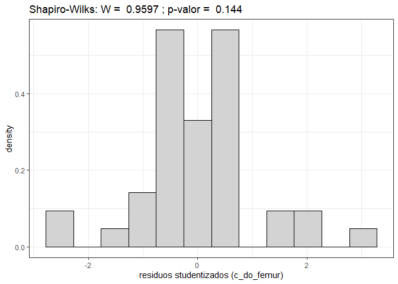<!-- --><!-- -->

    #> Analysis of Variance Table
    #> 
    #> Response: y
    #>           Df Sum Sq Mean Sq F value  Pr(>F)  
    #> grupo      2 0.8945 0.44726  4.5145 0.01724 *
    #> Residuals 39 3.8638 0.09907                  
    #> ---
    #> Signif. codes:  0 '***' 0.001 '**' 0.01 '*' 0.05 '.' 0.1 ' ' 1
    #> 
    #> Study: modelo ~ "grupo"
    #> 
    #> LSD t Test for y 
    #> 
    #> Mean Square Error:  0.09907204 
    #> 
    #> grupo,  means and individual ( 95 %) CI
    #> 
    #>          y       std  r      LCL      UCL Min Max
    #> 1 3.585714 0.3324898 14 3.415561 3.755868 3.0 4.0
    #> 2 3.241667 0.2745520 12 3.057880 3.425454 2.9 3.8
    #> 3 3.312500 0.3263434 16 3.153336 3.471664 2.5 4.0
    #> 
    #> Alpha: 0.05 ; DF Error: 39
    #> Critical Value of t: 2.022691 
    #> 
    #> Groups according to probability of means differences and alpha level( 0.05 )
    #> 
    #> Treatments with the same letter are not significantly different.
    #> 
    #>          y groups
    #> 1 3.585714      a
    #> 3 3.312500      b
    #> 2 3.241667      b
    #> $statistics
    #>      MSerror Df     Mean       CV
    #>   0.09907204 39 3.383333 9.303166
    #> 
    #> $parameters
    #>         test p.ajusted name.t ntr alpha
    #>   Fisher-LSD      none  grupo   3  0.05
    #> 
    #> $means
    #>          y       std  r      LCL      UCL Min Max   Q25  Q50  Q75
    #> 1 3.585714 0.3324898 14 3.415561 3.755868 3.0 4.0 3.425 3.65 3.80
    #> 2 3.241667 0.2745520 12 3.057880 3.425454 2.9 3.8 3.000 3.20 3.35
    #> 3 3.312500 0.3263434 16 3.153336 3.471664 2.5 4.0 3.175 3.40 3.50
    #> 
    #> $comparison
    #> NULL
    #> 
    #> $groups
    #>          y groups
    #> 1 3.585714      a
    #> 3 3.312500      b
    #> 2 3.241667      b
    #> 
    #> attr(,"class")
    #> [1] "group"

<!-- --><!-- -->

    #> Analysis of Variance Table
    #> 
    #> Response: y
    #>           Df  Sum Sq Mean Sq F value   Pr(>F)   
    #> grupo      2  7.8472  3.9236  7.0092 0.002509 **
    #> Residuals 39 21.8312  0.5598                    
    #> ---
    #> Signif. codes:  0 '***' 0.001 '**' 0.01 '*' 0.05 '.' 0.1 ' ' 1
    #> 
    #> Study: modelo ~ "grupo"
    #> 
    #> LSD t Test for y 
    #> 
    #> Mean Square Error:  0.5597734 
    #> 
    #> grupo,  means and individual ( 95 %) CI
    #> 
    #>          y       std  r      LCL      UCL Min Max
    #> 1 7.392857 0.5413150 14 6.988401 7.797313 6.3 8.3
    #> 2 6.525000 0.5241877 12 6.088137 6.961863 5.5 7.3
    #> 3 6.443750 0.9999792 16 6.065416 6.822084 4.8 7.8
    #> 
    #> Alpha: 0.05 ; DF Error: 39
    #> Critical Value of t: 2.022691 
    #> 
    #> Groups according to probability of means differences and alpha level( 0.05 )
    #> 
    #> Treatments with the same letter are not significantly different.
    #> 
    #>          y groups
    #> 1 7.392857      a
    #> 2 6.525000      b
    #> 3 6.443750      b
    #> $statistics
    #>     MSerror Df     Mean       CV
    #>   0.5597734 39 6.783333 11.02968
    #> 
    #> $parameters
    #>         test p.ajusted name.t ntr alpha
    #>   Fisher-LSD      none  grupo   3  0.05
    #> 
    #> $means
    #>          y       std  r      LCL      UCL Min Max   Q25  Q50  Q75
    #> 1 7.392857 0.5413150 14 6.988401 7.797313 6.3 8.3 7.125 7.30 7.80
    #> 2 6.525000 0.5241877 12 6.088137 6.961863 5.5 7.3 6.225 6.55 6.85
    #> 3 6.443750 0.9999792 16 6.065416 6.822084 4.8 7.8 5.800 6.40 7.50
    #> 
    #> $comparison
    #> NULL
    #> 
    #> $groups
    #>          y groups
    #> 1 7.392857      a
    #> 2 6.525000      b
    #> 3 6.443750      b
    #> 
    #> attr(,"class")
    #> [1] "group"

<!-- --><!-- -->

    #> Analysis of Variance Table
    #> 
    #> Response: y
    #>           Df Sum Sq Mean Sq F value    Pr(>F)    
    #> grupo      2 13.886  6.9432  13.232 4.107e-05 ***
    #> Residuals 39 20.463  0.5247                      
    #> ---
    #> Signif. codes:  0 '***' 0.001 '**' 0.01 '*' 0.05 '.' 0.1 ' ' 1
    #> 
    #> Study: modelo ~ "grupo"
    #> 
    #> LSD t Test for y 
    #> 
    #> Mean Square Error:  0.5247039 
    #> 
    #> grupo,  means and individual ( 95 %) CI
    #> 
    #>          y       std  r      LCL      UCL Min Max
    #> 1 8.107143 0.9084766 14 7.715561 8.498725 5.8 9.2
    #> 2 7.016667 0.5967081 12 6.593710 7.439624 5.9 7.9
    #> 3 6.812500 0.6227627 16 6.446209 7.178791 6.0 8.0
    #> 
    #> Alpha: 0.05 ; DF Error: 39
    #> Critical Value of t: 2.022691 
    #> 
    #> Groups according to probability of means differences and alpha level( 0.05 )
    #> 
    #> Treatments with the same letter are not significantly different.
    #> 
    #>          y groups
    #> 1 8.107143      a
    #> 2 7.016667      b
    #> 3 6.812500      b
    #> $statistics
    #>     MSerror Df     Mean       CV
    #>   0.5247039 39 7.302381 9.919566
    #> 
    #> $parameters
    #>         test p.ajusted name.t ntr alpha
    #>   Fisher-LSD      none  grupo   3  0.05
    #> 
    #> $means
    #>          y       std  r      LCL      UCL Min Max   Q25  Q50   Q75
    #> 1 8.107143 0.9084766 14 7.715561 8.498725 5.8 9.2 7.850 8.10 8.850
    #> 2 7.016667 0.5967081 12 6.593710 7.439624 5.9 7.9 6.675 7.15 7.325
    #> 3 6.812500 0.6227627 16 6.446209 7.178791 6.0 8.0 6.275 6.90 7.125
    #> 
    #> $comparison
    #> NULL
    #> 
    #> $groups
    #>          y groups
    #> 1 8.107143      a
    #> 2 7.016667      b
    #> 3 6.812500      b
    #> 
    #> attr(,"class")
    #> [1] "group"

<!-- -->
